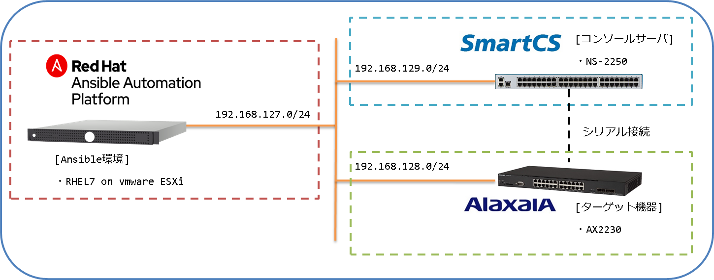

[↑目次に戻る](./README.md)
<br>
# 演習1.1　演習環境の確認
演習1.1では、本日のハンズオンの演習環境の確認を行います。
<br>

## 目次
本演習では以下を行います。

- [Step 1. 本ハンズオンの環境と情報を理解する](./1.1-preparing_for_the_exercise.md#step-1-本ハンズオンの環境と情報を理解する)
- [Step 2. RHELサーバーに接続する](./1.1-preparing_for_the_exercise.md#step-2-RHELサーバーに接続する)
- [Step 3. Ansibleのバージョンを確認する](./1.1-preparing_for_the_exercise.md#step-3-Ansibleのバージョンを確認する)
- [Step 4. Ansibleの設定情報を確認する](./1.1-preparing_for_the_exercise.md#step-4-Ansibleの設定情報を確認する)
- [Step 5. AnsibleのInventory情報を確認する](./1.1-preparing_for_the_exercise.md#step-5-AnsibleのInventory情報を確認する)
- [Step 6. SmartCSのバージョン情報を確認する](./1.1-preparing_for_the_exercise.md#step-6-SmartCSのバージョン情報を確認する)

<br>
<br>

### Step 1. 本ハンズオンの環境と情報を理解する

#### 演習構成図


#### ユーザ毎の環境
本ワークショップでは、参加者一人につき1環境を提供しています。<br>
各要素ごとの環境情報表は下記となります。
<br>
<br>

#### RHEL ( Ansible Controller ) 
Ansible Engine / Ansible Towerがインストールされているサーバーです。<br>
本ワークショップでは、このRHELサーバーから、各種操作やAnsible Playbookの実行を行ないます。

| 環境ID | RHEL IP | RHEL ユーザ ID | Password |  
|:---|:---|:---|:---|
| 2  | 192.168.127.2/24 | rhel02 | secret02 | 
| 3  | 192.168.127.3/24 | rhel03 | secret03 |
| 4  | 192.168.127.4/24 | rhel04 | secret04 |
| 5  | 192.168.127.5/24 | rhel05 | secret05 |
| 6  | 192.168.127.6/24 | rhel06 | secret06 |
| 7  | 192.168.127.7/24 | rhel07 | secret07 |
| 8  | 192.168.127.8/24 | rhel08 | secret08 |
| 9  | 192.168.127.9/24 | rhel09 | secret09 |
| 10 | 192.168.127.10/24 | rhel10 | secret10
| 11 | 192.168.127.11/24 | rhel11 | secret11 |

<br>
<br>

#### 操作対象のNW機器 ( Alaxala )
本セッションにおいて、SmartCS経由で設定変更を行う対象となるAlaxala NW機器です。<br>
Alaxalaは、国内NWベンダーのなかで初めてAnsibleに対応したベンダーです。

| 環境ID | Alaxala IP | default ユーザ ID | ユーザ ID<br> (初期設定後) | Password<br> (初期設定後) | Enable Password<br> (初期設定後) |
|:---|:---|:---|:---|:---|:---|
| 2  | 192.168.128.2/24 | operator | alaxala | secret2230 | secret2230 |
| 3  | 192.168.128.3/24 | operator | alaxala | secret2230 | secret2230 | 
| 4  | 192.168.128.4/24 | operator | alaxala | secret2230 | secret2230 |
| 5  | 192.168.128.5/24 | operator | alaxala | secret2230 | secret2230 |
| 6  | 192.168.128.6/24 | operator | alaxala | secret2230 | secret2230 |
| 7  | 192.168.128.7/24 | operator | alaxala | secret2230 | secret2230 |
| 8  | 192.168.128.8/24 | operator | alaxala | secret2230 | secret2230 |
| 9  | 192.168.128.9/24 | operator | alaxala | secret2230 | secret2230 |
| 10 | 192.168.128.10/24 | operator | alaxala | secret2230 | secret2230 |
| 11 | 192.168.128.11/24 | operator | alaxala | secret2230 | secret2230 |

※ALAXALA装置のIPアドレスは演習3.1にて設定します。ハンズオン開始時点では初期状態（未設定）となります。  

<br>
<br>

#### コンソールサーバ ( SmartCS )
コンソール接続を利用して複数のネットワーク機器などを遠隔から操作するためのコンソールサーバーです。<br>
後ほど各演習内で説明がありますが、SmartCSは用途/操作に合わせて<br>
- **ログインするユーザID** <br>
- **TCPポート番号** <br>
が異なります。
以下では、それぞれのケースにおけるパラメータを環境ごとに記載しています。

<br>
<br>

##### ① 手動での本体アクセス / Ansible経由でのコンソールアクセス
SmartCSはSmartCS自体の設定変更や情報取得を行う事が可能なユーザ**＜一般ユーザ＞** と、<br>
SmartCSに接続されているNW機器のコンソールにアクセスできるユーザ**＜ポートユーザ＞** を通常分けて管理しています。<br>
**userXX**というユーザは一般ユーザでもポートユーザでもない、**拡張ユーザ** というユーザグループに所属しており、<br>
SmartCSの設定変更・情報取得と、Ansible経由でコンソールアクセス用のコマンドを実行する事の両方が可能です。<br>
下記のパラメータは、<br>
- 手動でSmartCSにログインして装置設定を行う、情報取得を行う場合<br>
- Ansible経由で**smartcs_tty_command**モジュールを利用して、<br>
SmartCSに接続されている機器とコンソール経由のオペレーションをする場合<br>

に指定するパラメータとなります。

| 環境ID | SmartCS IP | TCPポート | tty番号 | 拡張ユーザ ID | Password | 
|:---|:---|:---|:---|:---|:---|
| 2  | 192.168.129.**2**/24 | 22 | 2  | user02 | secret02 | 
| 3  | 192.168.129.**2**/24 | 22 | 3  | user03 | secret03 | 
| 4  | 192.168.129.**2**/24 | 22 | 4  | user04 | secret04 | 
| 5  | 192.168.129.**2**/24 | 22 | 5  | user05 | secret05 | 
| 6  | 192.168.129.**2**/24 | 22 | 6  | user06 | secret06 | 
| 7  | 192.168.129.**3**/24 | 22 | 7  | user07 | secret07 | 
| 8  | 192.168.129.**3**/24 | 22 | 8  | user08 | secret08 | 
| 9  | 192.168.129.**3**/24 | 22 | 9  | user09 | secret09 | 
| 10 | 192.168.129.**3**/24 | 22 | 10 | user10 | secret10 | 
| 11 | 192.168.129.**3**/24 | 22 | 11 | user11 | secret11 | 

<br>
<br>

##### ② ダイレクトモード・ポートアクセス（手動）
SmartCSではあらかじめ設定された特定のポート番号を指定することで、直接目的の機器のコンソールに接続ができます。<br>
**portXX**というユーザIDは**ポートユーザ**というユーザグループに所属しており、<br>
SmartCSにシリアル経由で接続されているNW機器にログインする事ができるユーザとなります。<br>
下記のパラメータは、
- **手動でSmartCSのポート番号を指定して、前述のAlaxalaのコンソール接続を行う場合**<br>

に指定するパラメータとなります。

| 環境ID | SmartCS IP | TCPポート (RW) | TCPポート (RO) | ポートユーザ ID | Password | 
|:---|:---|:---|:---|:---|:---|
| 2  | 192.168.129.**2**/24 | 8302 | 8402 | port02 | secret02 | 
| 3  | 192.168.129.**2**/24 | 8303 | 8403 | port03 | secret03 | 
| 4  | 192.168.129.**2**/24 | 8304 | 8404 | port04 | secret04 | 
| 5  | 192.168.129.**2**/24 | 8305 | 8405 | port05 | secret05 | 
| 6  | 192.168.129.**2**/24 | 8306 | 8406 | port06 | secret06 | 
| 7  | 192.168.129.**3**/24 | 8307 | 8407 | port07 | secret07 | 
| 8  | 192.168.129.**3**/24 | 8308 | 8408 | port08 | secret08 | 
| 9  | 192.168.129.**3**/24 | 8309 | 8409 | port09 | secret09 | 
| 10 | 192.168.129.**3**/24 | 8310 | 8410 | port10 | secret10 | 
| 11 | 192.168.129.**3**/24 | 8311 | 8411 | port11 | secret11 | 

<br>
<br>

##### ③ ダイレクトモード・ポートアクセス時　（ Ansible経由 ）
SmartCSではあらかじめ設定された特定のポート番号を指定することで、直接目的の機器のコンソールに接続ができます。<br>
**portXX**というユーザIDは**ポートユーザ**というユーザグループに所属しており、<br>
SmartCSにシリアル経由で接続されているNW機器にログインする事ができるユーザとなります。<br>
SmartCSを介して他ベンダーモジュール（ax_command など）を実行する場合には、手動でポートアクセスをする場合と<br>
異なるTCPポート番号を指定する必要があります。<br>
下記のパラメータは、
- **AnsibleからSmartCS経由で他ベンダーモジュールを実行する場合**<br>

に指定するパラメータとなります。

| 環境ID | SmartCS IP | TCPポート | ポートユーザ ID | Password | 
|:---|:---|:---|:---|:---|
| 2  | 192.168.129.**2**/24 | 9302 | port02 | secret02 | 
| 3  | 192.168.129.**2**/24 | 9303 | port03 | secret03 | 
| 4  | 192.168.129.**2**/24 | 9304 | port04 | secret04 | 
| 5  | 192.168.129.**2**/24 | 9305 | port05 | secret05 | 
| 6  | 192.168.129.**2**/24 | 9306 | port06 | secret06 | 
| 7  | 192.168.129.**3**/24 | 9307 | port07 | secret07 | 
| 8  | 192.168.129.**3**/24 | 9308 | port08 | secret08 | 
| 9  | 192.168.129.**3**/24 | 9309 | port09 | secret09 | 
| 10 | 192.168.129.**3**/24 | 9310 | port10 | secret10 | 
| 11 | 192.168.129.**3**/24 | 9311 | port11 | secret11 | 

<br>

#### 配布資料のDL

- [環境構成図](./contents/pdf/document_Environment%20diagram.pdf)

- [ユーザ毎環境](.//contents/pdf/document_Environment_for_each_user.pdf)

<br>
<br>

### Step 2. RHELサーバーに接続する
次に、各自のRHELサーバーに接続してください。<br>

Windowsの場合は、TeraTerm や PuTTYなどのSSHクライアントを利用してください。<br>

MacOS / Linuxの場合は、Terminalからそれぞれの環境に合わせて次のようなコマンドを実施してください。<br>
環境ID：1の場合のコマンド例<br>
```
$ ssh rhel01@192.168.127.1
```

<br>
<br>

### Step 3. Ansibleのバージョンを確認する

次のコマンドを実行して、Ansibleの状態を確認しましょう。
```
$ ansible --version
```
以下のような出力となるはずです。
```
$ ansible --version
ansible 2.8.2
  config file = /home/rhel01/.ansible.cfg
  configured module search path = [u'/root/.ansible/plugins/modules', u'/usr/share/ansible/plugins/modules']
  ansible python module location = /usr/lib/python2.7/site-packages/ansible
  executable location = /usr/bin/ansible
  python version = 2.7.5 (default, Jun 11 2019, 14:33:56) [GCC 4.8.5 20150623 (Red Hat 4.8.5-39)]
$ 
```
Ansibleを使った演習（演習3、演習4）については以下のAnsibleバージョンで行います。<br>
※Ansibleのバージョンが`2.8.2`である事を確認して下さい。

また、SmartCS及びALAXLA用のAnsibleモジュールのバージョンについて、本演習では以下を使用します。

| S/W | バージョン |
|:---|:---|
|Ansible | 2.8.2 |
|SmartCS module for Ansible | 1.1 |
|AX modules for Ansible | 1.4 |

<br>

*config fileでは、このディレクトリでAnsibleコマンドを実行した場合に使用される、コンフィグファイルの場所を示しています。


<br>
<br>

### Step 4. Ansibleの設定情報を確認する

次のコマンドを実施して、Ansibleの設定ファイルを確認しましょう。

```
$ cat /home/<RHEL ユーザー名>/.ansible.cfg
```

結果は、以下のような出力となるはずです。

<code>.ansible.cfg</code>
```
$ cat /home/rhel01/.ansible.cfg
[defaults]
stdout_callback = yaml
connection = smart
timeout = 60
deprecation_warnings = False
host_key_checking = False
retry_files_enabled = False
inventory = /home/rhel01/hosts
```

*inventoryでは、Ansibleコマンド実行時に特に指定しなかった場合にデフォルトで利用されるインベントリのパスを示しています。

<br>
<br>

### Step 5. AnsibleのInventory情報を確認する
Ansibleにおける管理対象を登録するInventoryファイルを確認してみましょう。<br>

```
$ cat /home/<RHEL ユーザー名>/hosts
```

<code>/etc/<RHEL ユーザー名>/hosts</code>（#1ユーザの場合）  
  
```
$ cat /home/rhel01/hosts
[seiko]
smartcs ansible_host=192.168.129.1 ansible_user=user01 ansible_password=secret01

[alaxala]
ax ansible_host=192.168.128.1 ansible_user=alaxala ansible_password=secret2230 ansible_become_password=secret2230 smartcs_tty=1

[controll]
ansible ansible_host=192.168.127.1 ansible_user=rhel01 ansible_password=secret01

[seiko:vars]
ansible_connection=network_cli
ansible_network_os=smartcs

[alaxala:vars]
ansible_connection=network_cli
ansible_network_os=ax
```

このInventoryには、smartcs , ax , ansibleの3つのノードが登録されています。<br>
smartcsはseikoグループに所属し、 ipアドレス: 192.168.129.1 , ユーザID: user01 , パスワード: secret01として設定されています。<br>
また、[seiko:vars]の次に書かれている3つもsmartcsに設定されている変数（グループ変数）となります。
<br>
<br>

本ハンズオンでは、指示がない限りこのInventoryファイルを使用します。<br>
※本Inventoryは、デフォルトInventoryとして登録されています。デフォルトInventoryは、明示的に他のInventoryを指定しない限り、使用されます。<br>
Playbookを実行する際に<code>ansible-playbook -i <inventory> playbook.yml</code>とすると、特定のInventoryを指定できます。<br>
 
<br>
<br>

### Step 6. 使用するネットワーク機器のバージョン情報を確認する
RHELサーバーから次のコマンドを実行し、SmartCSの情報を確認しましょう。
<br>

■SmartCS（NS-2250-48）
```
$ ssh user01@smartcs
user01@smartcs's password: 
(1)NS-2250_Ansible_1> show version
System                : System Software Ver 2.1 (Build 2019-09-26)
Boot Status           : Reboot (05:80:00)
System Up Time        : 2020/01/10 14:15:49
Local MAC Address     : 00:80:15:42:00:08
Number of MAC Address : 2
Model                 : NS-2250-16 (16 port)
Serial No.            : 56000050
BootROM               : Ver 1.0
Main Board CPU        : e500v2 (533.333328MHz)
Main Memory           : 1025264 KBytes
Boot System           : main (Ver 2.1)
Boot Config           : internal startup1
Main System           : Ver 2.1
Backup System         : Ver 2.1
```
※`System`が`System Software Ver 2.1`である事を確認して下さい。<br>
※ smartcsやaxのIPアドレスは、各環境の/etc/hostsにも定義されています。<br>

<br>
<br>
以上で、演習 1.は終了です。
<br>
<br>

[ →演習2.1 SmartCSを介してALAXALA装置へコンソールアクセスする](./2.1-serial_connection_to_alaxala_via_smartcs.md)  
[↑目次に戻る](./README.md)
