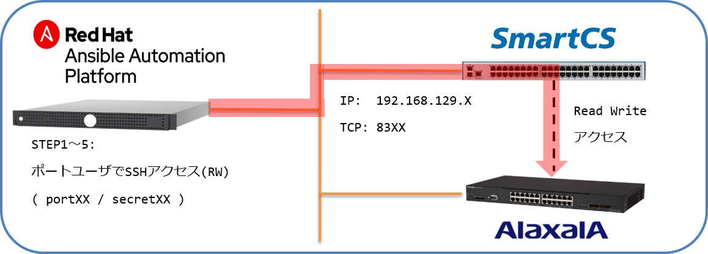
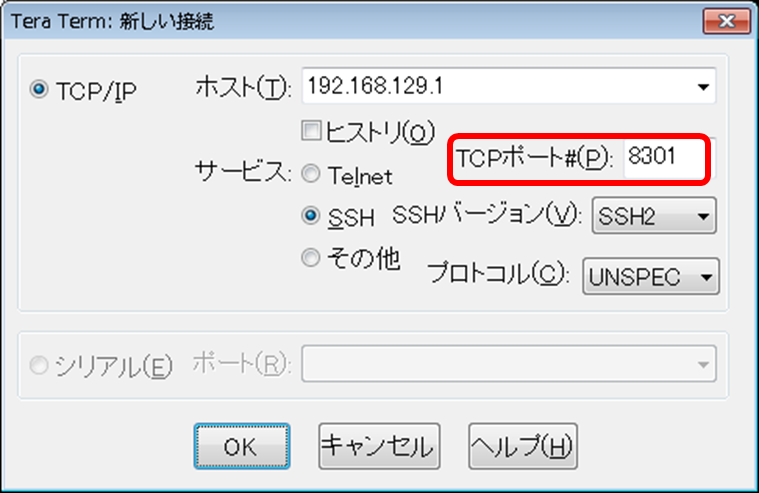
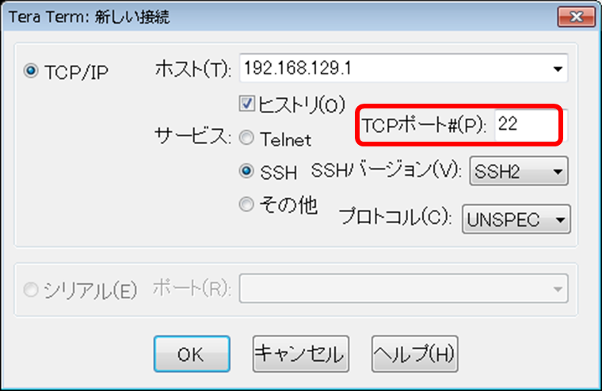

[↑目次に戻る](./README.md)
<br>
# 演習2.1　SmartCSを介してALAXALA装置へコンソールアクセスする

まずは、Ansibleを使わずに SmartCSを使ったコンソールアクセスのオペレーションについて理解を深めたいと思います。<br>
演習2.1では、SmartCSを使ってALAXALA装置へのコンソールアクセスを行います。<br>
※本演習はダイレクトモードで行います。<br>
<br>
<br>

> 注意  
SmartCS経由でALAXALA装置にコンソールアクセスをする場合、使用するターミナルソフトによっては意図しない文字列が出力される場合があります。  
例  
```
login: [48;1H
```
> 出力されてしまった場合、`BackSpace`などで不要な出力(上記例の場合)`[48;1H` を削除後に手順に記載されているオペレーションを行ってください。  

<br>
<br>

## 目次
本演習では以下を行います。
- STEP1. SmartCSのポートサーバーへノーマルモード(RW)でログインする
- STEP2. SmartCSを介してALAXALA装置へログインする
- STEP3. ALAXALA装置に対してコマンドを実行する
- STEP4. ALAXALA装置からログアウトする
- STEP5. SmartCSのシリアルセッションを終了する

<br>
<br>

## 用語解説
演習2.1で使用する、SmartCS特有の用語についての解説です。  

|用語 |解説 |
|:---|:---|
|ダイレクトモード |SmartCSを介してネットワーク機器のコンソールへアクセスするための方式の1つです。<br>Telnet/SSHでSmartCSへアクセスする際に、<br>シリアルポートに割り当てられたTCPポート番号を指定してアクセスします。<br>|
|シリアルポート(tty) |ネットワーク機器のコンソールを接続するためのSmartCS側のポートです。|
|ノーマルモード(RW) |SmartCSを介してネットワーク機器のコンソールへアクセスする際の権限の1つです。<br>ノーマルモードでアクセスすると、データの送信/受信をどちらも実施することが可能です。 |
|ポートサーバー |SmartCSを介して指定されたシリアルポートへアクセスするための、<br>SmartCS内部にあるサーバーです。 |
|ポートサーバー<br>メニュー|SmartCSを介して指定されたシリアルポートへアクセスする際に<br>表示されるメニューです。<br>ポートサーバーメニューから「接続開始」等の操作を選択します。 |
|ポートユーザ |SmartCSを介して指定されたシリアルポートへアクセスする際に<br>使用されるユーザのグループです。<br>本日のハンズオンではポートユーザグループに所属しているportXXを使用します。 |

<br>
<br>

### STEP1. SmartCSのポートサーバーにノーマルモード(RW)でログインする

ノーマルモード(RW)でSmartCSのポートサーバーへ接続し、ポートユーザでログインします。<br>
まず、Teratermなどのターミナルソフトを使用して、SSHでSmartCSへ接続します。<br>
TELNETでもSSHでもアクセスが可能ですが、本演習ではSSHでアクセスしたいと思います。<br>
※演習1.1に記載の[環境情報](./1.1-preparing_for_the_exercise.md#コンソールサーバ--smartcs-)を参考にしてTCPポート(SSH RW) 83xxというポート番号を指定してください。  

#### 演習環境


|接続先 |IP |TCPポート(RW) |ユーザID |Password| 備考 | 
|:---|:---|:---|:---|:---|:---|
|SmartCS |192.168.129.X |83XX |portXX|secretXX|ユーザ毎に割り当てられている<br>SmartCSのIP、Port<br>ユーザID、Password<br>を指定します<br>[**参考**](./1.1-preparing_for_the_exercise.md#-ダイレクトモード時手動)|

- Teratermを使って接続する例


- Linux上でCLIからSSHを使って接続する例
```
[rhel<X>@rhel ~]$ ssh port01@smartcs -p 8301
```

認証には、ポートユーザのユーザ、パスワードを入力してログインします。  
※演習1.1に記載の[環境情報](./1.1-preparing_for_the_exercise.md#-ダイレクトモード時手動)を参考にしてSmartCSのIP、ユーザID、Passwordを指定してください。  
ログインに成功すると、以下のようなポートサーバーメニューが表示されます。  

```
-- RW1 ------------------------
Host  : "NS-2250_Ansible_1"
Label : "AX-2230_1"
-------------------------------
1  : display Port Log
2  : display Port Log (LAST)
3  : start tty connection
4  : close telnet/ssh session
5  : show all commands
tty-1:rw>
```

<br>
<br>


### STEP2. SmartCSを介してALAXALA装置へログインする
ポートサーバーメニューからシリアルセッションを開始し、ALAXALA装置へログインを行います。
<br>
まず、`3  : start tty connection`を選択し、シリアルセッションを開始します。
<br>
続けてログインID`operator`を入力するとALAXALA装置にログインすることができます。
<br>

```
-- RW1 ------------------------
Host  : "NS-2250_Ansible_1"
Label : "AX-2230_1"
-------------------------------
1  : display Port Log
2  : display Port Log (LAST)
3  : start tty connection
4  : close telnet/ssh session
5  : show all commands
tty-1:rw> 3
Press "CTRL-A" to return this MENU.
Start tty connection
operator

Copyright (c) 2012-2019 ALAXALA Networks Corporation. All rights reserved.

> 
```

<br>
<br>


### STEP3. ALAXALA装置に対してコマンドを実行する
ALAXALA装置にログイン後、コマンドを実行します。<br>
`>`というプロンプトが表示されたら、`show version`コマンドを実行します。
```
> show version

Date 1980/04/10 03:41:23 UTC
Model: AX2230S-24T
S/W: OS-LT4 Ver. 2.9 (Build:04)
H/W: AX-2230-24T-B [CA022B24T000S0000C7S013:0]

> 
```

> 演習4.3でF/Wバージョンアップを行うので、ALAXALA装置のバージョンが以下であることを確認してください。
```
S/W: OS-LT4 Ver. 2.9 (Build:04)
```

ソフトウェアバージョンを確認したら、`enable`コマンドで管理者権限へ移行し`show running-config`を実行します。<br>
IPアドレスやユーザなどの設定がされておらず、工場出荷状態であることを確認します。<br>

```
> enable
# 
# show running-config
#configuration list for AX2230S-24T
!
vlan 1
  name "VLAN0001"
!
interface gigabitethernet 0/1
  switchport mode access
!
interface gigabitethernet 0/2
  switchport mode access
!
～(省略)～
!
interface gigabitethernet 0/27
  switchport mode access
!
interface gigabitethernet 0/28
  switchport mode access
!
interface vlan 1
!
# 
```

<br>
<br>

### STEP4. ALAXALA装置からログアウトする
オペレーションが完了したら、コンソールを初期状態に戻すためにログアウトを行います。<br>
`exit`コマンドを実行してALAXALA装置からログアウトします。<br>

```
# exit

login: 
```

<br>
<br>


### STEP5. SmartCSのシリアルセッションを終了する
ログアウト後はSmartCSを介したシリアルセッションを終了させます。<br>
ALAXALA装置からのログアウトが完了したら、Ctrl+Aを入力してポートサーバーメニューに戻ります。<br>
その後、`4  : close telnet/ssh session`を選択して終了します。<br>

```
login: 
-- RW1 ------------------------
Host  : "NS-2250_Ansible_1"
Label : "AX-2230_1"
-------------------------------
1  : display Port Log
2  : display Port Log (LAST)
3  : start tty connection
4  : close telnet/ssh session
5  : show all commands
tty-1:rw> 4
```

<br>
<br>


### 参考情報1.ダイレクトモードとセレクトモード
TCPポートを指定してネットワーク機器のコンソールに接続するモードを**ダイレクトモード**といいます。<br>
※SmartCS特有の用語となります<br>
演習2.1ではダイレクトモードでALAXALA装置にアクセスを行いました。<br>
- ダイレクトモード接続
```
[rhel<X>@rhel ~]$ ssh port01@smartcs -p 8301
Console Server Authentication.
port01@smartcs's password: 

-- RW1 ------------------------
Host  : "NS-2250_Ansible_1"
Label : "AX-2230_1"
-------------------------------
1  : display Port Log
2  : display Port Log (LAST)
3  : start tty connection
4  : close telnet/ssh session
5  : show all commands
tty-1:rw> 
```

SmartCSのシリアルポートにアクセスする際にもう1つアクセス方法があり、<br>
ログイン後に接続するシリアルポートを選択する接続モードとして**セレクトモード**があります。<br>

セレクトモードではSmartCSにアクセスした際の認証時に<br>
※（TELNETであればTCPポート23、SSHであればTCPポート22）<br>
ポートユーザでログインすると、アクセス可能なシリアルポートの一覧(ポートセレクトメニュー)を表示します。<br>
その後、接続したいポート番号(tty)を選択します。<br>

- Teratermを使ってセレクトモードで接続する例


- Linux上でCLIからSSHを使ってセレクトモードで接続する例
```
[rhel01@rhel7 ~]$ ssh port01@smartcs 
Console Server Authentication.
port01@smartcs's password: 

Host : "NS-2250_Ansible_1" 
login from 192.168.127.2
user (port01) Access TTY List
===========================================================================
 tty : Label                                RW     RO
---------------------------------------------------------------------------
   1 : AX-2230_1                              0      0
   2 :                                        0      0
---------------------------------------------------------------------------
Enter tty number to access serial port
 <ttyno>          : connect to serial port RW session ( 1  - 48  )
 <ttyno>r         : connect to serial port RO session ( 1r - 48r )
 l                : show tty list 
 l<ttyno>-<ttyno> : show a part of tty list
 d                : show detail tty list 
 d<ttyno>-<ttyno> : show a part of detail tty list
 h                : help message 
 e                : exit 
===========================================================================
tty> 1
```

1つのシリアルポートへのオペレーションが終了したら、切替文字コード(本ハンズオンでは`Ctrl+A`ですが、<br>
設定により変更可能)を入力することでポートサーバーメニューへ戻り、<br>
`0  : return Port Select Menu`を選択することでポートセレクトメニューへ戻ることができます。<br>
新たにターミナルを立ち上げ直すことなく、別のシリアルポートへアクセスを切り替えることが可能となります。<br>

```
> exit

login: 
-- RW1 ------------------------
Host  : "NS-2250_Ansible_1"
Label : "AX-2230_1"
-------------------------------
0  : return Port Select Menu
1  : display Port Log
2  : display Port Log (LAST)
3  : start tty connection
4  : close telnet/ssh session
5  : show all commands
tty-1:rw> 0
return Port Select Menu

Host : "NS-2250_Ansible_1" 
login from 192.168.127.2
user (port01) Access TTY List
===========================================================================
 tty : Label                                RW     RO
---------------------------------------------------------------------------
   1 : AX-2230_1                              0      0
   2 :                                        0      0
---------------------------------------------------------------------------
Enter tty number to access serial port
 <ttyno>          : connect to serial port RW session ( 1  - 48  )
 <ttyno>r         : connect to serial port RO session ( 1r - 48r )
 l                : show tty list 
 l<ttyno>-<ttyno> : show a part of tty list
 d                : show detail tty list 
 d<ttyno>-<ttyno> : show a part of detail tty list
 h                : help message 
 e                : exit 
===========================================================================
tty> 2
```

<br>
<br>

### 参考情報2. シリアルポートアクセス用のTCPポート番号
SmartCSのシリアルポートへの各アクセス方法において、<br>
シリアルポートに割り当てられているTCPポート番号の設定値下記の通りです。<br>
※デフォルトの設定値であり、それぞれ変更可能です。<br>

| 接続モード | プロトコル | セッション種別 | TCPポート |
| --- | --- | --- | --- |
| ダイレクトモード | Telnet | ノーマルモード(RW) | 8101～8148 |
| ダイレクトモード | Telnet | モニターモード(RO) | 8201～8248 |
| ダイレクトモード | SSH | ノーマルモード(RW) | 8301～8348 |
| ダイレクトモード | SSH | モニターモード(RO) | 8401～8448 |
| セレクトモード | Telnet | ノーマルモード(RW) | 23 |
| セレクトモード | Telnet | モニターモード(RO) | 23 |
| セレクトモード | SSH | ノーマルモード(RW) | 22 |
| セレクトモード | SSH | モニターモード(RO) | 22 |

<br>
<br>

### 参考情報3. ポートログの確認
SmartCSはシリアルポートにアクセスした時以外でも、常時ログを装置内に保存しています。<br>
※デフォルトで各ポート500KB、最大で１ポート8MBまで保存可能<br>
オペレーション時の入出力データ、接続している機器から自発的に出力されるデータ(再起動ログなど)は、<br>
ポートサーバーメニューから表示する事ができます。<br>
```
1  : display Port Log
2  : display Port Log (LAST)
```
- `1  : display Port Log`は、保存している全てのログを表示します。
- `2  : display Port Log (LAST)`は、保存しているログのうち、最新の訳5000文字を表示します。
```

-- RW1 ------------------------
Host  : "NS-2250_Ansible_1"
Label : "AX-2230_1"
-------------------------------
1  : display Port Log
2  : display Port Log (LAST)
3  : start tty connection
4  : close telnet/ssh session
5  : show all commands
tty-1:rw> 2

login: operator

Copyright (c) 2012-2019 ALAXALA Networks Corporation. All rights reserved.

> 
> set terminal pager disable
> show version
```

また、装置内に保存するだけでなく、FTP、MAIL、SYSLOG、NFSといった各プロトコルで<br>
ログを外部サーバに転送する事も可能です。

<br>
<br>


[→演習2.2 SmartCSを介したALAXALA装置へのコンソールアクセスを、別セッションでミラーリングする](./2.2-mirroring_operation_of_smartcs.md)  
[↑目次に戻る](./README.md)
