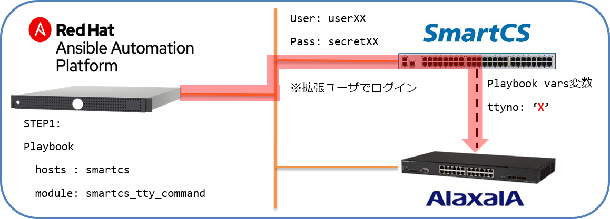
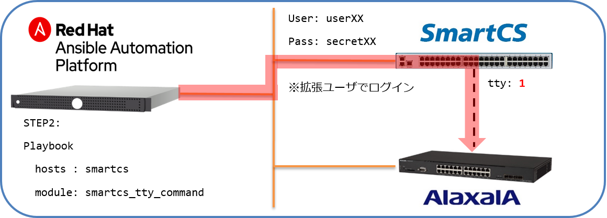
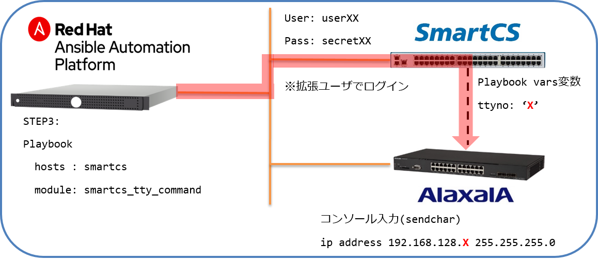

[↑目次に戻る](./README.md)
<br>
# 演習3.1 ALAXALA装置にSmartCS経由で初期設定を行う

演習3.1では、SmartCS経由でALAXALA装置の初期設定をAnsibleから行っていきます。<br>
これらの操作を通して、SmartCSモジュール(smartcs_tty_command)の基本的な使い方について理解を深めましょう。<br>
解説では、Ansibleからの操作と、手作業での操作を比較しながら解説をすすめます。

<br>
<br>

## 目次
本演習では以下を行います。 
- Step 1. smartcs_tty_command を使ったPlaybookを作成する
- Step 2. smartcs_tty_command を使ってALAXALA装置に初期設定（ユーザ登録）を行う
- Step 3. smartcs_tty_command を使ってALAXALA装置に初期設定（Ansibleリーチ）を行う

<br>
<br>

>> 注意  
<code>smartcs_tty_command</code>モジュールを使用して文字列の送受信を行う場合、  
文字列送信後にエラーが発生しても<code>ansible-playbook</code>でのコマンド(task)実行結果は<code>failed</code>**ではなく**、<code>ok</code>となります。<br>
コンソールの入出力がどこまで進んだかを返り値として確認する為（Ansibleのログとして出力する為）の、SmartCSモジュール本来の動作となります。<br>
このモジュールの動作（アウトプット）はオプションで切り替えが可能です。 <br>

<br>
<br>

### 事前準備

まずはじめに、演習3.1～3.4を通して、作成するPlaybookを保存し実行するためのディレクトリとして <code>exercise_3</code> を作成します。<br>
下記のコマンドを実施してください。<br>

```bash
[rhel<X>@rhel ~]$ mkdir exercise_3
[rhel<X>@rhel ~]$ cd exercise_3
```

<br>
<br>

### Step 1. smartcs_tty_command 使ったPlaybookを作成する

Step 1 では、<code>smartcs_tty_command</code>モジュールを使った基礎的なAnsibleのPlaybookを作成します。<br>
このPlaybookでは、SmartCS経由でALAXALA装置にログインし、<code>show version</code>を実行します。<br>
※取得した情報の表示については、後述で扱います。

<br>

>> 参考として、Ansibleを使わない場合の(一般的な手作業による)操作と出力は、以下のようなオペレーションとなります。<br>
**[次の操作は不要です]**
```
login: operator

Copyright (c) 2012-2019 ALAXALA Networks Corporation. All rights reserved.

> show version

Date 1980/04/28 23:44:49 UTC
Model: AX2230S-24T
S/W: OS-LT4 Ver. 2.9 (Build:04)
H/W: AX-2230-24T-B [CA022B24T000S0000C7S013:0]

> exit

login:
```

#### 上記（手動）のオペレーション内容の解説
※SmartCS経由でALAXALA装置にアクセスしたところから開始しています。
- **login: operator** : デフォルトユーザのID（operator）を入力してログインを実施します。
- **show version** : ALAXALA装置の<code>show version</code>コマンドを実行します。  
- **exit** : Alaxla機器で前述のoperatorアカウントからログアウトします。

<br>
<br>

#### Ansible Playbook の基礎
次に、Ansibleからの実行について確認していきましょう。

Playbookは、Ansibleにおいて管理対象のあるべき状態を記載するファイルです。<br>
このワークショップでは特に、操作対象に対して実施する手順を示したファイルとして使用します。<br>

<br>

Playbookは、YAML形式で書かれたテキストファイルとなっていて、基本的な要素として下記が含まれています。
- **---** : Playbook(YAML)の書式間を区切りとして扱われます。Ansibleで扱うYAML形式ファイルでは、頭に入れる様心がけましょう。
- **hosts** : 処理(taskなど)を実施する、操作対象を指定します。インベントリで定義されている対象を全体集合として、全体(all)や、特定のグループ、特定のホストを指定します。
- **vars** : Playbookの冒頭で変数(s)を定義します。
- **tasks** : Ansibleのモジュールを指定し必要なパラメータを指定することで実行される操作（あるべき姿）のリストを定義します。操作は、並んでいる順番に実施されます。

<br>

#### Playbookファイルの作成
次に、Playbookを作成していきます。ここでは、Linuxの基本的なツールであるvi(テキストエディタ)での操作で記載します。<br>
次のコマンドを実施し、ファイルを作成しましょう。

```bash
[rhel<X>@rhel ~]$ vi ax_show_version.yml
```
実行すると、ax_show_version.ymlというファイルが作成され、エディタ画面が表示されます。<br>
次に、**iキー**を押して **Insertモード** (挿入モード)に変更してください。<br>
モードが変更されたこと確認し(左下にモード名が表示されます)、下記の内容をエディタで記載してください。<br>
> 今回は、コピー＆ペーストでの実施をお勧めします。<br>

#### Playbook(ax_show_version.yml)
```yaml
---
- name: Execute ALAXALA show version command from console using SmartCS
  hosts: smartcs
  gather_facts: no
  
  vars:
  - tty_no: "{{ hostvars['ax']['smartcs_tty'] }}"
  
  tasks:
  - name: show version (ALAXALA command) 
    smartcs_tty_command:
      tty: '{{ tty_no }}'
      recvchar:
      - 'login: '
      - '> '
      sendchar:
      - 'operator'
      - 'show version'
      - 'exit'
```
入力が終わったら、[esc]キーを押して、Insertモードから抜けてください。<br>
モードが変更されたことを確認し、:wq と入力して（左下に:wqと表示されます。）、[Enter]キーを押してください。<br>
以上で、ファイルを保存し、エディターを終了します。<br>

<br>
<br>

#### Playbookの解説
- **hosts: smartcs** : Ansibleからみた操作対象としてSmartCSを指定しています。
- **gather_facts: no** : Facts情報の収集処理を実施しないように設定しています。AnsibleではPlaybookの冒頭で対象機器の情報を収集するという処理をデフォルトで実施する仕様となっています。今回は情報収集に対応しない対象なので、不要な処理を実施しないために記載しています。
- **tty_no: "{{ hostvars['ax']['smartcs_tty'] }}"** : 新たな変数として<code>tty_no</code>を定義しています。<code>"{{ hostvars['ax']['smartcs_tty'] }}"</code>が代入する値となっています。<code>hostvars</code>はインベントリで定義されている全てのホストとホストに定義された変数のマップを示す特殊な変数です。今回は<code>ax</code>ホストに定義されている<code>smartcs_tty</code>という値を指定しています。
- **{{ }}** : Ansibleにおいて、定義された変数の値呼び出す際の書式です。中括弧2つの中に変数名を記載します。
- **tasks:**  : tasksの中では、複数の処理を列挙することができますが、今回は1つのタスクのみ登録しています。
- **smartcs_tty_command** : (最初の)taskで指定するSmartCS用のモジュールです。

##### smartcs_tty_commmandモジュールのパラメータ
- **tty:** : SmartCSのどのポート番号に実際の操作対象（ALAXALA装置）が繋がっているかを指定します。
- **recvchar:** : <code>sendchar</code>オプションで送信した文字列を送信後、待ち受ける文字列を指定します。
- **sendchar:** : 送信する文字列を定義しています。リストの上から順に、1行ずつ文字列を送信します。

#### ポイント
- 今回は、SmartCSのセレクトモードで接続しています。
- 最終的に操作したい対象はALAXALA装置ですが、AnsibleからはSmartCSを指定して接続し、操作の結果としてALAXALA装置が指定の動作を行う様にPlaybookを作っています。
- <code>smartcs_tty_command</code>は、上記のように<code>recvchar</code>、<code>sendchar</code>オプションを使ってコンソールに対して送受信する文字列を制御するモジュールとなります。このモジュールを使う事で、SmartCSに接続されているネットワーク機器について、専用のモジュールが用意されていなくてもAnsible経由でのアクセスが可能となります。

#### 演習環境


<br>

#### Playbookの実行

>> Playbook実行時に、SmartCSのミラーリングの機能を使って対象のシリアルポートのオペレーション内容を表示させる事で、実際にAnsibleを実行してコンソール経由でコマンドが投入する様子を見る事が可能です。  
※Read Onlyのポート(SSHの場合はTCP:84xxを指定)を使用する事で安全に確認することができます。

<br>

それでは、上記のPlaybookを実行してみましょう。<br>
下記のコマンドを実施してください。

```bash
[rhel<X>@rhel ~]$ ansible-playbook ax_show_version.yml 
```

下記の様な結果になるはずです。

■実行結果例
```
PLAY [Execute ALAXALA show version command from console using SmartCS] ***********************************************

TASK [show version (ALAXALA command) ] **********************************************************************************
ok: [smartcs]

PLAY RECAP *******************************************************************************************
smartcs                    : ok=1    changed=0    unreachable=0    failed=0    skipped=0    rescued=0    ignored=0   
```

以上で、SmartCSモジュールを使った初めてのPlaybookの実行が終わりました。
<br>

### 実行結果の解説
- **PLAY** : Ansibleにおける処理と対象のセットです。( Ansibleでは、一つのPlaybookに複数のPlayを登録することができます。 )
- **TASK** : Ansibleで実施された途中結果は、Task毎＆対象ホスト毎に表示されます。一般的には<code>ok</code>や<code>changed</code>と出力される場合には成功していると見なされます。
- **PLAY RECAP** : Playbook全体を通した集計結果を表示しています。

### STEP2. smartcs_tty_command を使ってALAXALA装置に初期設定（ユーザ登録）を行う

このワークショップの環境においてALAXALA装置は、工場出荷時の状態で接続されています。<br>
そのため、Step 1の通り、ALAXALA装置のユーザー名やパスワードはデフォルトのままとなっています。<br>
Step 2では、ALAXALA装置の初期設定として、ユーザ名とパスワードの再登録をAnsible経由で<code>smartcs_tty_command</code>を使って実施します。  

>> 参考として、Ansibleを使わない場合の(一般的な手作業による)操作と出力は、以下のようなオペレーションとなります。<br>
**[次の操作は不要です]**
```
login: operator

Copyright (c) 2012-2019 ALAXALA Networks Corporation. All rights reserved.

> enable
# rename user
Changing username.
Old username:operator
New username:alaxala
# password
Changing local password for alaxala.
New password:
Retype new password:
# password enable-mode
Changing local password for admin.
New password:
Retype new password:
# exit

login:
```

上記のコンソールオペレーションを<code>smartcs_tty_command</code>を使い、Playbook化していきましょう。<br>
Playbook作成の条件は下記とします。
- ALAXALA装置の初期ユーザー: operator
- ALAXALA装置の変更後のユーザID:alaxala
- ALAXALA装置の変更後のパスワード:secret2230
- ALAXALA装置の変更後のEnableモードパスワード:secret2230

なお、初期パスワード以外はインベントリファイルのax host変数として既に定義してあります。<br>

#### 演習環境


それでは、<code>ax_initial_setting_v1_user.yml</code>というファイル名でPlaybookを作成しましょう。<br>
Playbookの内容は、下記の様になります。

#### Playbook(initial_setting_v1_user.yml)
```yaml
---
- name: user settings from console using SartCS
  hosts: smartcs
  gather_facts: no
  
  vars:
  - tty_no: "{{ hostvars['ax']['smartcs_tty'] }}"  
  - ax_init_user: 'operator'
  - ax_user: "{{ hostvars['ax']['ansible_user'] }}"
  - ax_password: "{{ hostvars['ax']['ansible_password'] }}"

  tasks:
  - name: rename login user and setting password
    smartcs_tty_command:
      tty: '{{ tty_no }}'
      custom_response: on
      custom_response_delete_nl: on
      recvchar:
      - 'login: '
      - 'Password: '
      - 'Old username:'
      - 'New username:'
      - 'New password:'
      - 'Retype new password:'
      - '> '
      - '# '
      - '!# '
      sendchar:
      - '{{ ax_init_user }}'
      - 'enable'
      - 'rename user'
      - '{{ ax_init_user }}'
      - '{{ ax_user }}'
      - 'password'
      - '{{ ax_password }}'
      - '{{ ax_password }}'
      - 'password enable-mode'
      - '{{ ax_password }}'
      - '{{ ax_password }}'
      - 'exit'
```

#### Playbookの解説
- **ax_init_user:** : ALAXALA装置の初期ユーザーです。工場出荷状態へのログインに利用します。
- **ax_user:** : ALAXALA装置に設定する新たなユーザーIDを定義しています。
- **ax_password** : ALAXALA装置に設定する新たなパスワードを定義しています。今回のワークショップでは、Enableモード用にも同じパスワードを利用します。

##### smartcs_tty_commmand モジュールのパラメータ
- **custom_response: on** :通常のstdout、stdout_linesに加え、コンソール経由で送受信した文字列を「送信文字列(executte_command)」「受信文字列(response)」に分けた辞書型の返り値を<code>stdout_lines_custom</code>として追加します。
- **custom_response_delete_nl: on** :<code>stdout_lines_custom</code>のresponseに含まれる返り値のうち、「改行のみ」の表示を削除して見やすくするオプションとなります。  

#### ポイント
- 今回のPlaybookも、最終的に操作したい対象はALAXALA装置ですが、AnsibleからはSmartCSを指定して接続し、操作の結果としてALAXALA装置が指定の動作を行う様にSmartCSのセレクトモードを活用したPlaybookとしています。


#### Playbookの実行
下記の様に、Playbookを実行してみましょう。
```bash
[rhel<X>@rhel ~]$ ansible-playbook initial_setting_v1_user.yml 
```
<br>

#### 実行結果例
結果は下記の様になります。
```
PLAY [user settings from console using SartCS] *******************************************************

TASK [rename login user and setting password] ********************************************************
ok: [smartcs]

PLAY RECAP *******************************************************************************************
smartcs                    : ok=1    changed=0    unreachable=0    failed=0    skipped=0    rescued=0    ignored=0   
```

<br>
<br>

### STEP3. smartcs_tty_command を使ってALAXALA装置に初期設定（Ansibleリーチ）を行う

続いて、 <code>smartcs_tty_command</code>を使ってALAXALA装置に、AnsibleからALAXALA装置に（SmartCSを通さずに）直接アクセスする設定を投入するPlaybookを作成します。 <br> 
ここでは、以下の設定を行います。  
- ALAXALA装置に、IPアドレスを設定
- ALAXALA装置に、デフォルトルート/デフォルトゲートウェイの設定
- ALAXALA装置に、SSHの有効化設定  
- ALAXALA装置に、リモートアクセスの許可（接続端末数）の設定  
- 上記で変更したALAXALA装置の設定の保存処理の実施

<br>

>> 参考として、Ansibleを使わない場合の(一般的な手作業による)操作と出力は、以下のようなオペレーションとなります。<br>
**[次の操作は不要です]**

```
login: alaxala
Password:

Copyright (c) 2012-2019 ALAXALA Networks Corporation. All rights reserved.

> enable
Password:
# configure
(config)# interface vlan 1
!(config-if)# ip address 192.168.128.2 255.255.255.0
!(config-if)# exit
!(config)# ip route 0.0.0.0 0.0.0.0 192.168.128.254
!(config)# ip ssh
!(config)# line vty 0 1
!(config-line)# transport input ssh
!(config-line)# save
(config-line)# exit
(config)# exit
# exit

login:
```

上記のコンソールオペレーションを<code>smartcs_tty_command</code>を使ってPlaybook化すると
以下のようなPlaybookとなります。

■演習環境



<br>

#### Playbook(initial_setting_v2_ansible_reach.yml )
```yaml
---
- name: ansible-reach settings from console using SmartCS
  hosts: smartcs
  gather_facts: no 

  vars:
  - tty_no: "{{ hostvars['ax']['smartcs_tty'] }}"  
  - ax_ipaddr: "{{ hostvars['ax']['ansible_host'] }}"
  - ax_user: "{{ hostvars['ax']['ansible_user'] }}"
  - ax_password: "{{ hostvars['ax']['ansible_password'] }}"
  
  - ax_subnet: '255.255.255.0'
  - ax_gateway: '192.168.128.254'

  tasks:
  - name: setting ipaddr and ssh
    smartcs_tty_command:
      tty: '{{ tty_no }}'
      custom_response: on
      custom_response_delete_nl: on
      recvchar:
      - 'login: '
      - 'Password:'
      - '> '
      - '# '
      - '(config)# '
      - '!(config)# '
      - '!(config-line)# '
      - '!(config-if)# '
      sendchar:
      - '{{ ax_user }}'
      - '{{ ax_password }}'
      - 'enable'
      - '{{ ax_password }}'
      - 'configure'
      - 'interface vlan 1'
      - 'ip address {{ ax_ipaddr }} {{ ax_subnet }}'
      - 'exit'
      - 'ip route 0.0.0.0 0.0.0.0 {{ ax_gateway }}'
      - 'ip ssh'
      - 'line vty 0 1'
      - 'transport input ssh'
      - 'save'
      - 'exit'
      - 'exit'
      - 'exit'
    register: result

  - name: 'register stdout_lines_custom'
    debug:
      msg: '{{ result.stdout_lines_custom }}'
```

#### Playbookの解説
- **ax_ipaddr** : ALAXALA装置に設定するIPアドレスとなります。今回は、前もってインベントリファイルと/etc/hostsに登録しています。 
- **ax_subnet** : ALAXALA装置に設定するIPのサブネットマスクとなります。
- **ax_gateway** : ALAXALA装置に設定するデフォルトゲートウェイとなります。

- **register: result** : <code>register</code>を利用すると、前述のtaskで出力されるアウトプットを、次に記述する(新規の)変数に保存します。
- **debug:** : 変数やパラメータなどをAnsibleのアウトプットとしてコンソールに表示するためのAnsibleモジュールです。

#### Playbookの実行
下記の様に、上記のPlaybookを実行してみましょう。
```bash
[rhel<X>@rhel ~]$ ansible-playbook initial_setting_v2_ansible_reach.yml
```

#### 実行結果例
実行結果は、下記の様になります。
```
PLAY [ansible-reach settings from console using SmartCS] ************************************************

TASK [setting ipaddr and ssh] ***************************************************************************
ok: [smartcs]

TASK [register stdout_lines_custom] *********************************************************************
ok: [smartcs] => {
    "msg": [
        {
            "execute_command": "alaxala",
            "response": [
                "Password:"
            ]
        },
        ～抜粋～
            "response": [
                "\u001b7\u001b[r\u001b[999;999H\u001b[6n\u001b8",
                "login:"
            ]
        }
    ]
}

PLAY RECAP **********************************************************************************************
smartcs                    : ok=2    changed=0    unreachable=0    failed=0    skipped=0    rescued=0    ignored=0   
```


今回のPlaybookでは、出力された返り値を<code>register</code>で変数<code>result</code>に登録し、Ansibleの実行結果として表示しています。<br> 
<code>smartcs_tty_commmand</code>モジュールの<code>custom_response: on</code>本オプションを付与する事で、従来は煩雑なコンソール経由で送信した文字列とその実行結果を分かりやすく表示することができます。
<br>
<br>
また、Step 2と3を利用することで、ALAXALA装置の初期設定をAnsibleから自動化できるようになります。
<br>
<br>

[→演習3.2 ALAXALA装置に追加設定を行う](./3.2-additional_setup_the_alaxala_device.md)    
[←演習2.3 SmartCSを介したシリアルセッション情報を確認する](./2.3-checking_serial_session_information_of_smartcs.md)  
[↑目次に戻る](./README.md)  

