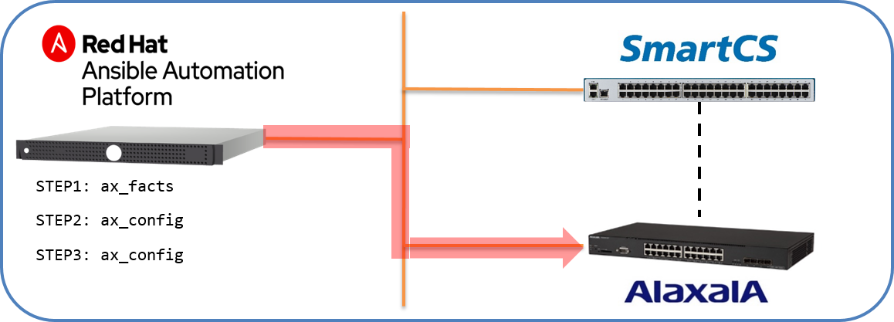

[↑目次に戻る](/README.md)
<br>
# 演習3.2　ALAXALA装置に追加設定を行う

## 目次
本演習では以下を行います。 
- STEP1. <code>ax_facts</code>を使って、ALAXALA装置にAnsibleからアクセスできる事の確認を行う  
- STEP2. <code>ax_config</code>を使って、ALAXALA装置にVLANの設定を行う  
- STEP3. <code>ax_config</code>と<code>with_items</code>を使って、ALAXALA装置に各種サーバの設定を行う（NTP、SNMP、SYSLOG）  


## 演習構成図


<br>
<br>

### STEP1. <code>ax_facts</code>を使って、ALAXALA装置にAnsibleからアクセスできる事の確認を行う

演習3.1でAnsibleからリーチ可能となったALAXALA機器に対して、<code>ax_facts</code>を使って接続確認を行います。

接続確認を行うPlaybookは以下となります。


■Playbook(ax_facts.yml)
```yaml
---
- name: gathering ax information
  hosts: ax
  gather_facts: no
  
  vars:
  - ansible_connection: network_cli
  - ansible_network_os: ax
  - ansible_become: yes
  - ansible_become_method: enable
  - ansible_become_pass: 'secret2230'

  tasks:
  - name: ax_facts all
    ax_facts:
      gather_subset: all
```

■Playbook内容の説明  

◇<code>name: ax_facts all</code>

- ax_facts:  
ALAXALA装置の情報を収集する為のモジュールとして<code>ax_facts</code>を利用します。
- gather_subset: all  
オプションに<code>all</code>を指定し、全ての情報を収集します。


■実行例  
```
$ ansible-playbook ax_facts.yml 
```

■実行結果例
```
PLAY [gathering ax information] **************************************************************************

TASK [ax_facts all] **************************************************************************************
ok: [ax]

PLAY RECAP ***********************************************************************************************
ax                         : ok=1    changed=0    unreachable=0    failed=0    skipped=0    rescued=0    ignored=0   
```
Playbookが実行され、演習3.1で初期設定を行ったALAXALA装置にアクセスする事ができました。  

より詳細な情報を表示して実行する場合、<code>-v</code>オプションを付与する事でコマンド実行後に取得した情報を表示させる事が可能です。

■実行例  
```
$ ansible-playbook -vvv ax_facts.yml 
```

■実行結果例
```
~一部抜粋~
        "ansible_net_model": "AX2230S-24T",
        "ansible_net_serialnum": "CA022B24T000S0000C7S013:0",
        "ansible_net_version": "2.9"
```

<br>
<br>

### STEP2. <code>ax_config</code>を使って、ALAXALA装置にVLANの設定を行う  

次は<code>ax_config</code>を使って追加の設定を行います。
設定する内容は以下となります。
- インターフェース0/2にVLAN設定を行う。  

上記を設定するPlaybookは以下となります。

■Playbook(add_vlan.yml)  
```yaml
---
- name: add vlan
  hosts: ax
  gather_facts: no 

  vars:
  - ansible_connection: network_cli
  - ansible_network_os: ax
  - ansible_command_timeout: 60
  - ansible_become: yes
  - ansible_become_method: enable
  - ansible_become_pass: 'secret2230'
  - vid: '2000'
  - ipaddr: '192.168.0.1'
  - netmask: '255.255.255.0'
  - portif : '0/2'

  tasks:
  - name: configure vlan
    ax_config:
      lines:
      - 'vlan {{ vid }}'
  
  - name: configure interface vlan <vid>
    ax_config:
      lines:
      - 'ip address {{ ipaddr }} {{ netmask }}'
      parents: 'interface vlan {{ vid }}'
  
  - name: vlan configuration to port
    ax_config:
      lines:
      - 'switchport mode trunk'
      - 'switchport trunk allowed vlan add {{ vid }}'
      parents: 'interface gigabitethernet {{ portif }}'
      save_when: modified
```
■Playbook内容の説明

◇<code>name: configure vlan</code>

- ax_config:  
ALAXALA装置のコンフィグレーションを設定する為のモジュールとして<code>ax_config</code>を利用します。

- lines:  
vlan {{ vid }}  
VLAN設定のコンフィグレーションリストを設定しています。  
VLAN番号はvarsで定義した変数(vid)を参照しています。  
<br>

◇<code>name: configure interface vlan <vid></code>
  
- lines:  
ip address {{ ipaddr }} {{ netmask }}  
ネットワーク装置にIPアドレスとサブネットマスクを設定しています。  
ipaddrとnetmaskはvarsで定義した変数(ipaddr, netmask)を参照しています。  

- parents: "interface vlan {{ vid }}"  
linesオプションで設定したコンフィグレーションリストを設定する階層のリストを設定します。  
IPアドレスとサブネットマスクを設定する階層として、interface vlan {{ vid }}を設定しています。  
VLAN番号はvarsで定義した変数(vid)を参照しています。  
<br>

◇<code>name: vlan configuration to port</code>

- lines:  
switchport mode trunk  
インタフェースをトランクモードに設定しています。  

- parents: "interface gigabitethernet {{ port }}"  
トランクモードを設定する階層として、interface gigabitethernet {{ port }}を指定しています。  
ポート番号はvarsで定義した変数(portif)参照しています。  

- lines:  
switchport trunk allowed vlan add {{ vid }}  
トランクポートにVLANを追加しています。  
追加するVLANのVLAN番号はvarsで定義した変数(vid)を参照しています。  

- parents: "interface gigabitethernet {{ port }}"  
VLANを追加する階層として、interface gigabitethernet {{ port }}を指定しています。  
ポート番号はvarsで定義した変数(portif)を参照しています。  

- save_when: modified  
コンフィグレーションの保存方式を指定するオプションです。  
modifiedを指定した場合、ランニングコンフィグとスタートアップコンフィグを比較して差分があるときにコンフィグレーションを保存します。  


■実行例  
```
$ ansible-playbook add_vlan.yml
```


■実行結果例  
```
PLAY [add vlan] *******************************************************************************************************************************

TASK [configure vlan] *************************************************************************************************************************
changed: [ax]

TASK [configure interface vlan <vid>] *********************************************************************************************************
changed: [ax]

TASK [vlan configuration to port] *************************************************************************************************************
changed: [ax]

PLAY RECAP ************************************************************************************************************************************
ax                         : ok=3    changed=3    unreachable=0    failed=0    skipped=0    rescued=0    ignored=0   

$ 
```
VLANの設定を行うことができました。


<br>
<br>


### STEP3. <code>ax_config</code>と<code>with_items</code>を使って、ALAXALA装置に各種サーバの設定を行う（NTP、SNMP、SYSLOG）  

次は<code>ax_config</code>と<code>with_items</code>利用して追加の設定を行います。  
CLIの中で、一部の値（サーバIPなど）のみ異なる設定を複数投入する場合などに有効な手法となります。  
設定する内容は以下となります。
- ホスト名の設定
- NTPサーバの設定  
- SNMPサーバの設定  
- SYSLOGサーバの設定

NTPサーバ、SNMPサーバ、SYSLOGサーバの設定について、設定項目のパラメータを定義した変数ファイルを利用します。  
演習3の作業を実施している<code>exercise_3</code>ディレクトリに、<code>host_vars</code>ディレクトリを作成し、ALAXALA装置が所属するグループ名の共通変数ファイルとして<code>ax.yml</code>という設定ファイルを作成します。  
```
$ mkdir host_vars
$ cd host_vars
$ vi ax.yml
```

■グループ変数ファイル(ax.yml)
```
---
ntp:
  server:
    - 192.168.127.2
    - 192.168.127.3

snmp:
  community:
    - name: public
      auth: ro
    - name: secret
      auth: rw

syslog:
  server:
    - 192.168.127.2
    - 192.168.127.3
```

<code>host_vars/ax.yml</code>を利用し、各種サーバを設定するPlaybookは以下の内容となります。  
<code>exercise_3</code>ディレクトリに戻り、Playbookを作成して実行します。  

■Playbook(add_config.yml)  
```yaml
---
- name: add hostname and server(ntp, snmp, syslog)
  hosts: ax
  gather_facts: no
  
  vars:
  - ansible_connection: network_cli
  - ansible_network_os: ax
  - ansible_become: yes
  - ansible_become_method: enable
  - ansible_become_pass: 'secret2230'

  tasks:
  - name: configure hostname
    ax_config:
      lines:
        - 'hostname AX2230'
      save_when: changed

  - name: configure ntp server
    ax_config:
      lines:
        - 'ntp client server {{ item }}'
      save_when: changed
    with_items: '{{ ntp.server }}'

  - name: configure snmp community
    ax_config:
      lines:
        - 'snmp-server community {{ item.name }} {{ item.auth }}'
      save_when: changed
    with_items: '{{ snmp.community }}'
  
  - name: configure syslog server
    ax_config:
      lines:
        - 'logging host {{ item }}'
      save_when: changed
    with_items: '{{ syslog.server }}'
```

■Playbook内容の説明  
- with_items:  
<code>host_vars/ax.yml</code>で定義した内容の中で定義した、ループ処理する要素を指定します。  

- save_when: changed  
Playbookの実行前後で、コンフィグに差分がある場合 設定を保存します。

■実行例  
```
$ ansible-playbook add_config.yml
```

■実行結果例    
```
PLAY [add hostname and server(ntp, snmp, syslog)] **********************************************

TASK [configure hostname] **********************************************************************
changed: [ax]

TASK [configure ntp server] ********************************************************************
changed: [ax] => (item=192.168.127.2)
changed: [ax] => (item=192.168.127.3)

TASK [configure snmp community] ****************************************************************
changed: [ax] => (item={'name': 'public', 'auth': 'ro'})
changed: [ax] => (item={'name': 'secret', 'auth': 'rw'})

TASK [configure syslog server] *****************************************************************
changed: [ax] => (item=192.168.127.2)
changed: [ax] => (item=192.168.127.3)

PLAY RECAP *************************************************************************************
ax                         : ok=4    changed=4    unreachable=0    failed=0    skipped=0    rescued=0    ignored=0   
```
ホスト名と各サーバの設定を行うことができました。  

<br>
<br>

#### 参考：グループ変数を使わず、Playbook内にvarsで定義する場合  

STEP3のPlaybookは、<code>host_vars/ax.yml</code>に設定する内容を記載していますが、１つのPlaybookにまとめる事もできます。  
その場合、varsに以下の変数を記載します。
```
  vars: 
  - ntp:
      server:
        - 192.168.127.2
        - 192.168.127.3
  - snmp:
      community:
        - name: public
          auth: ro
        - name: secret
          auth: rw
  - syslog:
      server:
        - 192.168.127.2
        - 192.168.127.3
```

1つのPlaybookに変数をまとめる事も上記のように定義する事で可能となります。  
ただできればSTEP3のように変数定義のファイルを分けておく方が、各パラメータに変更が発生した際にPlaybookの修正量が少なくなります。  

<br>
<br>

[→演習3.3 ALAXALA装置の設定情報を取得する](/3.3-get_alaxala_device_information.md)    
[←演習3.1 ALAXALA装置にSmartCS経由で初期設定を行う](/3.1-initial_setup_the_alaxala_device_via_smartcs.md)    
[↑目次に戻る](/README.md)  

