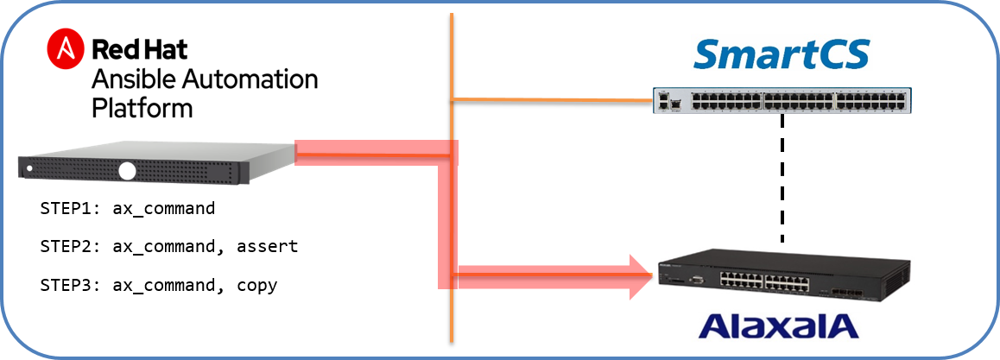

[↑目次に戻る](./README.md)
<br>
# 演習3.3　ALAXALA装置の設定情報を取得する

## 目次
本演習では以下を行います。 
- STEP1. <code>ax_command</code>を使ってALAXALA装置の設定情報を取得する
- STEP2. <code>copy</code>モジュールを利用して取得した情報をファイルとして保存する。
- STEP3. <code>assert</code>モジュールを利用した情報の確認


## 演習構成図


<br>
<br>

### STEP1. <code>ax_command</code>を使ってALAXALA装置の設定情報を取得する

演習3.2で設定した情報を<code>ax_command</code>を使って取得します。
設定情報を取得するPlaybookは以下の内容となります。

■Playbook(ax_commands.yml)
```yaml
---
- name: ax show commands
  hosts: ax
  gather_facts: no

  vars:
  - ansible_connection: network_cli
  - ansible_network_os: ax
  - ansible_become: yes
  - ansible_become_method: enable
  - ansible_become_pass: 'secret2230'

  tasks:
  - name: execute show commands
    ax_command:
      commands:
        - show version
        - show system
        - show interfaces gigabitethernet 0/1
        - show ip interface
        - show port
        - show vlan 
        - show access-filter
        - show ntp-client
        - show running-config
```

■Playbook内容の説明

◇<code>name: execute show commands</code>

- ax_command:  
ALAXALA装置でコマンドを実行し、その結果を取得する為のモジュールとなります。

- commands:  
実行するコマンドをリスト形式で指定します。


■実行例  
```
$ ansible-playbook ax_commands.yml -vvv
```
実行結果を詳細に表示する為、`-vvv`オプションを付与します。


■実行結果例  
```
PLAYBOOK: ax_commands.yml *******************************************************************************
1 plays in ax_commands.yml

PLAY [ax show commands] *********************************************************************************
META: ran handlers

TASK [execute show commands] ****************************************************************************

～抜粋～

    "stdout_lines": [
        [
            "Date 1980/05/06 00:38:59 UTC",
            "Model: AX2230S-24T",
            "S/W: OS-LT4 Ver. 2.9 (Build:04)",
            "H/W: AX-2230-24T-B [CA022B24T000S0000C7S013:0]"
        ],

～抜粋～
PLAY RECAP **********************************************************************************************
ax                         : ok=1    changed=0    unreachable=0    failed=0    skipped=0    rescued=0    ignored=0  
```
commandsで指定したCLIが実行され、その結果が取得できました。

<br>
<br>

### STEP2. `copy`モジュールを利用して取得した情報をファイルとして保存する。

STEP1で実行したコマンド結果について、<code>copy</code>モジュールを利用してローカルにファイルとして保存します。  
<code>commands</code>で指定しているコマンドの中で、  
- show running-config  
の実行結果を保存してみます。

STEP1のPlaybookに一部追記して作成します。


■Playbook(save_show-commands.yml)
```yaml
  tasks:
  - name: execute show commands
    ax_command:
      commands:
        - show version
        - show system
        - show interfaces gigabitethernet 0/1
        - show ip interface
        - show port
        - show vlan 
        - show access-filter
        - show ntp-client
        - show running-config
    register: result
  
  - name: save to localfile
    copy:
      content:  "{{ result.stdout_lines[8] | join('\n') }}"
      dest: ./ax_commands.txt
```
※task部分のみ抜粋しています。


■Playbook内容の説明

◇`name: execute show commands`
- regiseter: result  
ax_commandモジュールで指定した各コマンドの実行結果を、resultという変数に格納します。  

◇`name: save to localfile`
- [copy](https://docs.ansible.com/ansible/2.8/modules/copy_module.html)  
ファイルのコピーを行うモジュールとなります。
- content  
ファイル内容を指定します。  
`show running-config`を指定する為、Playbook実行結果として格納される`stdout_lines[8]`を指定します。
- dest  
コピー先（保存先）のファイル名を指定します。


■実行例
```
$ ansible-playbook save_show-commands.yml 
```

■実行結果例
```
PLAY [save show commands output to localfile] ******************************************************************

TASK [execute show commands] ***********************************************************************************
ok: [ax]

TASK [save to localfile] ***************************************************************************************
changed: [ax]

PLAY RECAP *****************************************************************************************************
ax                         : ok=2    changed=1    unreachable=0    failed=0    skipped=0    rescued=0    ignored=0   
```

`dest`で指定した出力先に、コマンドの実行結果が格納されている事を確認します。
```
$ cat ax_commands.txt 
!

vlan 1

  name "VLAN0001"
!
 ～抜粋～
!

line vty 0 1

  transport input ssh

!

ip ssh

!
```

#### 参考：コンフィグ情報の保存

STEP2の演習で行った通り、`copy`モジュールを使う事でAnsible経由で取得した情報をローカルにファイルとして保存する事ができます。  
ほぼ同様の手順となりますが、`show running-config`の情報を時刻付きのファイル名で保存する方法を参考として以下に記載します。
<br>
なお、以下のtasks以外の部分はSTEP2の演習で作成したplaybookから変更ありません。

■Playbook(save_running-config.yml)
```yaml
  tasks:
  - name: gather ax facts all
    ax_facts:
      gather_subset: all
  
  - name: save running-config to localfile
    copy:
      content:  "{{ ansible_net_config }}"
      dest: "./config_{{ ansible_net_hostname }}_{{ now(False, '%Y%m%d_%H%M%S') }}.txt"
```
■Playbook内容の説明

◇`name: gather ax facts all`
- gather_subset: all  
オプションに<code>all</code>を指定し、全ての情報を収集します。

◇`name: save running-config to localfile`
- content:  "{{ ansible_net_config }}"  
ファイル内容として、`ax_facts`で取得できる`ansible_net_config`を指定します。
- dest: './config_{{ ansible_net_hostname }}_{{ now(False, "%Y%m%d_%H%M%S") }}.txt'  
コピー先のファイル名として、  
`ansible_net_hostname`でホスト名を指定し、  
`now(False, "%Y%m%d_%H%M%S")`で現在の時刻情報を指定しています。


■Playbook実行後

Playbookを実行したディレクトリに、`config_<axのホスト名>_時刻情報.txt`というファイルができています。  
catコマンドなどで内容を確認して下さい。
```
$ ls -l
～抜粋～
-rw-rw-r-- 1 rhel01 rhel01 2080  1月 15 18:06 config_AX2230_20200115_180642.txt
$
$ cat config_AX2230_20200115_180642.txt
```

<br>
<br>

### STEP3. <code>assert</code>モジュールを利用した情報の確認

最後に、`ax_command`で取得したコマンド実行結果について、期待した値が含まれているかどうかを`assert`モジュールを使って確認する演習を行います。  
`show version`コマンドの実行結果内に、期待する文字列`2.9`が含まれているかを確認します。

■Playbook(version_check.yml)
```yaml
---
- name: save show commands output to localfile
  hosts: ax
  gather_facts: no

  vars:
  - ansible_connection: network_cli
  - ansible_network_os: ax
  - os_version: "2.9"

  tasks:
  - name: execute show commands
    ax_command:
      commands:
        - show version
    register: result
  
  - name: check S/W version
    assert:
      that: "'{{ os_version }}' in '{{ result.stdout_lines[0][2] }}'"
      fail_msg: "ax s/w version is not '{{ os_version }}'"
```

■Playbook内容の説明

◇`name: check S/W version`  
- that: "'{{ os_version }}' in '{{ result.stdout_lines[0][2] }}'":  
`show version`コマンドの実行結果の3行目`OS-LT4 Ver. 2.9 (Build:04)`に、  
`vars`で指定した値`2.9`が含まれているかどうかを判定しています。
- fail_msg: "ax s/w version is not '{{ os_version }}'"  
`that`で指定した条件を満たさなかった場合に出力するエラー文を指定しています。


■実行例
```
$ ansible-playbook version_check.yml 
```

■実行結果例
```
PLAY [checking s/w version using assert] ***********************************************************************

TASK [execute show version] ************************************************************************************
ok: [ax]

TASK [assert] **************************************************************************************************
ok: [ax] => {
    "changed": false,
    "msg": "All assertions passed"
}

PLAY RECAP *****************************************************************************************************
ax                         : ok=2    changed=0    unreachable=0    failed=0    skipped=0    rescued=0    ignored=0   
```

`show version`コマンドの実行結果の3行目にvarsで指定した`os_verion`が含まれている為、実行結果はOKとなりました。  
試しに実行結果に含まれていない`os_version`を指定してみます。

■実行例
```
$ ansible-playbook version_check.yml --extra-vars "os_version=2.8"
```
`--extra-vars`オプションを指定して、Playbook内の変数をansibleコマンドから指定しています。

■実行結果例
```
PLAY [checking s/w version using assert] ***********************************************************************

TASK [execute show version] ************************************************************************************
ok: [ax]

TASK [check s/w version] ***************************************************************************************
fatal: [ax]: FAILED! => {
    "assertion": "'2.8' in 'S/W: OS-LT4 Ver. 2.9 (Build:04)'",
    "changed": false,
    "evaluated_to": false,
    "msg": "ax s/w version is not '2.8'"
}

PLAY RECAP *****************************************************************************************************
ax                         : ok=1    changed=0    unreachable=0    failed=1    skipped=0    rescued=0    ignored=0   
```

今度は、`2.8`が`show version`コマンドの実行結果に含まれていない為、実行結果がNGとなりました。  

このように、`assert`モジュールを使う事でコマンドの実行結果の確認をすることができます。

<br>
<br>


[→演習3.4 ALAXALA装置の設定情報をSmartCS経由で取得する](/3.4-setting_of_alaxala_device_via_smartcs.md)  
[←演習3.2 ALAXALA装置に追加設定を行う](/3.2-additional_setup_the_alaxala_device.md)    
[↑目次に戻る](./README.md)
