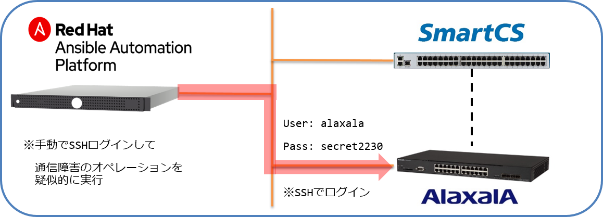

[↑目次に戻る](./README.md)
<br>
# 演習4.2　通信障害からの復旧自動化

演習4.2は演習4.1と同様、通信障害に見立てた、オペレーションミスを人為的に発生させ復旧作業の演習を行います。

## 目次
本演習では以下を行います。  
- STEP1.手動で通信障害を想定したオペレーションミスを起こす 
- STEP2.コンソール（SmartCS）経由で設定情報を取得する
- STEP3.コンソール（SmartCS）経由で設定を復旧させる

<br>
<br>

### STEP1.手動で通信障害を想定したオペレーションミスを起こす

<code>vlan 1</code>のインターフェースである<code>gigabigethernet 0/1</code>がなんらかの原因でDownした事を想定し、人為的にインターフェースをダウンさせます。  

■演習環境



<br>


```
login: alaxala
Password:

Copyright (c) 2012-2019 ALAXALA Networks Corporation. All rights reserved.

AX2230> enable
Password:
AX2230# configure
AX2230(config)# interface gigabitethernet 0/1
!AX2230(config-if)# shutdown
!AX2230(config-if)#
INFO 80/05/02 03:56:37 PORT 0/1 is disabled.
!AX2230(config-if)#
INFO 80/05/02 03:56:39 PORT GigabitEthernet 0/1 Link Down
INFO 80/05/02 03:56:39 VLAN VLAN (1) Status is Down.
!AX2230(config-if)#
```
- コンソール経由、SSH経由のどちらでオペレーションを行っても大丈夫です。  
- コンソール経由で行った場合、<code>exit</code>コマンドを実行して、状態を<code>login: </code>に戻しておいてください。

演習4.1と同様、IPリーチできない状態となりました。

<br>
<br>

### STEP2.コンソール（SmartCS）経由で設定情報を取得する

演習4.1 STEP3 で作成した<code>gathering_config.yml</code>を実行し、コンソール経由で設定情報の取得をおこないます。


<br>


■実行例
```
$ ansible-playbook gathering_config.yml -vvv
```

■実行結果
```
show ip interface 抜粋

"VLAN0001: Down",
~省略~
"  Time-since-last-status-change: 0day 00:09:09",
"  Last down at: 1980/05/02 03:56:39",
"  VLAN: 1 ",
```

VLAN0001がダウン状態である事が分かりました。  

<br>
<br>

### STEP3.コンソール（SmartCS）経由で設定を復旧させる

対象のインターフェースとなる<code>gigabigethernet 0/1</code>をアップさせます。

演習3.1で行った初期構築時の手順をPlaybook化します。

<br>

■演習環境


<br>

■Playbookの編集箇所

|vars |Playbook例の値 |備考 | 
|:---|:---|:---|
|ansible_user |'port01' |SmartCSの**ポートユーザ ID**を指定します |
|ansible_password |'secret01' |SmartCSの**ポートユーザ Password**を指定します |
|ansible_port |9301 |SmartCSの**Ansibleアクセス用 TCPポート**を指定します |
|ipaddr |'192.168.128.2' |**ALAXALA IP**を指定します |

<br>

■Playbook  
(console_init-setting_ansible-reach.yml)
```yaml
---
- name: set initial configuration from console using SmartCS
  hosts: smartcs
  
  vars:
  #ansible_user、ansible_password、ansible_port、ipaddrはユーザごとに異なります。Playbook作成時に変更してください。
  - ansible_connection: network_cli
  - ansible_network_os: ax
  - ansible_become: yes
  - ansible_become_method: enable
  - ansible_become_pass: 'secret2230'
  - ansible_user: "port01"
  - ansible_password: "secret01"
  - ansible_port: 9301
  - ipaddr: '192.168.128.2'  

  tasks:
  - name: set ipaddr to intarface vlan 1
    ax_config:
      lines:
        - 'ip address {{ ipaddr }} 255.255.255.0'
      parents: interface vlan 1
      save_when: changed
  
  - name: intarface up
    ax_config:
      lines:
        - 'no shutdown'
      parents: interface gigabitethernet 0/1
      save_when: changed
  
  - name: enable ssh 
    ax_config:
      lines:
        - 'ip ssh'
        - 'line vty 0 1'
      save_when: changed
```

(init-setting_ansible-reach.yml)  
```yaml
---
- name: login by console
  import_playbook: console_login.yml

- name: init-setting (ansible-reach)
  import_playbook: console_init-setting_ansible-reach.yml

- name: logout by console
  import_playbook: console_logout.yml
```

■実行例
```
$ ansible-playbook init-setting_ansible-reach.yml 
```


■実行結果例
```
PLAY [Login from Console using SmartCS] *******************************************************************

TASK [login ax2230] ***************************************************************************************
ok: [smartcs]

PLAY [set initial configuration from console using SmartCS] ***********************************************

TASK [Gathering Facts] ************************************************************************************
ok: [smartcs]

TASK [set ipaddr to intarface vlan 1] *********************************************************************
ok: [smartcs]

TASK [intarface up] ***************************************************************************************
changed: [smartcs]

TASK [enable ssh] *****************************************************************************************
ok: [smartcs]

PLAY [Login from Console using SmartCS] *******************************************************************

TASK [logout ax2230] **************************************************************************************
ok: [smartcs]

PLAY RECAP ************************************************************************************************
smartcs                     : ok=6    changed=1    unreachable=0    failed=0    skipped=0    rescued=0    ignored=0   
```

IPリーチできる事を確認します。

ALAXALA装置にログインできるかどうかを認してみます。
```
$ ping -c 3 ax
PING ax (192.168.128.2) 56(84) bytes of data.
64 bytes from ax (192.168.128.2): icmp_seq=1 ttl=64 time=1.05 ms
64 bytes from ax (192.168.128.2): icmp_seq=2 ttl=64 time=1.00 ms
64 bytes from ax (192.168.128.2): icmp_seq=3 ttl=64 time=1.05 ms

--- ax ping statistics ---
3 packets transmitted, 3 received, 0% packet loss, time 2002ms
rtt min/avg/max/mdev = 1.008/1.039/1.056/0.043 ms
$ 
$ ssh alaxala@ax
alaxala@ax's password: 

Copyright (c) 2012-2019 ALAXALA Networks Corporation. All rights reserved.

AX2230>
```
無事アクセスできるようになりました。

## 演習4.2のまとめ

- 通信障害が発生した場合、ネットワーク経由で装置にログインする事が難しくなりトラブルシュートに取り掛かるまでの時間が掛かってしまう場合がありますが、SmartCSをAnsibleを組み合わせることで、情報収集や復旧の手順を自動化する事ができます。  
- 通常IP設定やインターフェースのUP/DOWNといったオペレーションはAnsible経由で行う事ができませんが、SmartCSと連携する事でこれらのオペレーションも実行する事ができます。

<br>
<br>

[→演習4.3 ファームウェアアップデートの自動化](./4.3-automation_of_firmware_update.md)  
[←演習4.1 オペミスからの復旧自動化](./4.1-automation_of_operation_error_recovery.md)  
[↑目次に戻る](./README.md)
