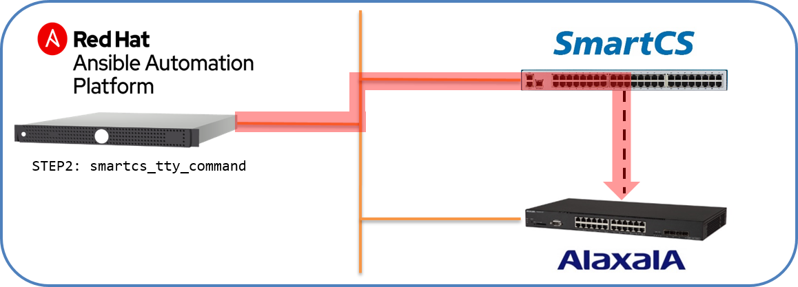

[↑目次に戻る](./README.md)
<br>
# 演習4.3　ファームウェアアップデートの自動化


演習4.3ではSmartCSに接続されている機器のファームウェアアップデートを行う演習を行います。  
バージョンアップ作業はオペレーションにreload/rebootといった再起動処理が含まれる事が多い為SSH経由で作業しにくいオペレーションとなりますが、SmartCS経由でアップデートを行う事で、万が一の場合も安心して作業することができます。  

## 目次
本演習では以下を行います。  
- STEP1.ALAXALA装置のファームウェアアップデート手順を確認する
- STEP2.AnsibleとSmartCSを連携して、ALAXALA装置のファームウェアアップデートを行う

## 演習構成図


<br>
<br>


### STEP1.ALAXALA装置のファームウェアアップデート手順の確認

まず、ALAXALA装置（AX2230）のF/Wバージョンアップ手順について確認します。
あらかじめ、FTPサーバ上にファームウェアのイメージがある事を確認しておきます。  
FTPサーバは現在Ansibleを動作させているRHELのサーバです。  
<br>
```
$ ls -l /home/rhel01/AX2230L20210-01.bin 
-rw-r--r-- 1 rhel01 rhel01 6503284  1月 10 19:15 /home/rhel01/AX2230L20210-01.bin
$ 
```
<br>

(1)現在のシステムバージョン情報を確認する  
<br>
```
AX2230> show version

Date 1980/05/01 08:26:52 UTC
Model: AX2230S-24T
S/W: OS-LT4 Ver. 2.9 (Build:04)
H/W: AX-2230-24T-B [CA022B24T000S0000C7S013:0]

AX2230>
```

(2)バージョンアップイメージをFTPコマンドで取得し、ファームウェアのバージョンアップを行う  
<br>
```
login: alaxala
Password:

Copyright (c) 2012-2019 ALAXALA Networks Corporation. All rights reserved.

AX2230> enable
Password:
#
# ftp 192.168.127.2
Connecting...

220 (vsFTPd 3.0.2)
Name: rhel01
331 Please specify the password.
Password:
230 Login successful.
ftp> binary
Type: binary
ftp> cd /home/rhel01
250 Directory successfully changed.
ftp> get AX2230L20210-01.bin k.img
200 Switching to Binary mode.
200 PORT command successful. Consider using PASV.
150 Opening BINARY mode data connection for AX2230L20210-01.bin (6503284 bytes).
226 Transfer complete.
ftp> quit
#
# ppupdate ramdisk k.img

Software update start
***********************************************
** UPDATE IS STARTED.                        **
***********************************************

old version 2.9 (Build:04)
new version 2.10 (Build:01)

Automatic reboot process will be run after installation process.
Do you wish to continue? (y/n): y

Main      : [************************************************]100%

Update done.
***********************************************
** UPDATE IS FINISHED SUCCESSFULLY.          **
***********************************************

Please wait a few minutes. The reload command is executing.


Boot Initialize.......done.
System Initialize....done.

login:
```
<br>

(3)バージョンアップ後のシステムバージョンを確認する
<br>
```
AX2230> show ramdisk-file

Date 1980/05/01 03:58:19 UTC
Model: AX2230S-24T
S/W: OS-LT4 Ver. 2.10 (Build:01)
H/W: AX-2230-24T-B [CA022B24T000S0000C7S013:0]

AX2230>
```
<br>
<br>

手動でファームウェアのバージョンアップ作業を行う場合、このようなオペレーションとなります。

<br>
<br>

### STEP2.AnsibleとSmartCSを連携して、ALAXALA装置のファームウェアアップデートを行う

STEP1で確認したバージョンアップ作業をPlaybook化します。
モジュールは<code>smartcs_tty_command</code>を利用します。


|手順 |使用するモジュール |
|:---|:---|
|(1)現在のシステムバージョン情報を確認する |smartcs_tty_command | 
|(2)VerupイメージをFTPコマンドで取得し、F/Wのバージョンアップを行う |smartcs_tty_command |
|(3)Verup後のシステムバージョンを確認する |smartcs_tty_command |

ファームウェアのアップデートを行うPlaybookは以下の内容となります。

■Playbook(fw_update.yml)
```yaml
---
- name: ax f/w update from console using SmartCS
  hosts: smartcs
  gather_facts: no
  
  vars:
  - ansible_connection: network_cli
  - ansible_network_os: smartcs
  - ansible_command_timeout: 300
  - username: 'alaxala'
  - password: 'secret2230'
  - ftpserver: '192.168.127.2'
  - ftpuser: 'rhel01'
  - ftppass: 'secret01'
  - imgpath: '/home/rhel01'
  - verupimg: 'AX2230L20210-01.bin'

  tasks:
  - name: ax ppupdate 
    smartcs_tty_command:
      tty: '1'
      cmd_timeout: 180
      custom_response: on
      custom_response_delete_nl: on
      recvchar:
      - 'login:'
      - 'Password:'
      - '> '
      - '# '
      - 'Name:'
      - 'ftp> '
      - 'Do you wish to continue? (y/n)'
      sendchar:
      - '{{ username }}'
      - '{{ password }}'
      - 'show version'
      - 'enable'
      - '{{ password }}'
      - 'ftp {{ ftpserver }}'
      - '{{ ftpuser }}'
      - '{{ ftppass }}'
      - 'binary'
      - 'cd {{ imgpath }}'
      - 'get {{ verupimg }} k.img'
      - 'bye'
      - 'ppupdate ramdisk k.img'
      - 'y'
      - '{{ username }}'
      - '{{ password }}'
      - 'show version'
      - 'exit'
    register: result
  
  - name: before/after version and reboot process
    debug:
      msg: 
        - '{{ result.stdout_lines_custom[2].response }}'
        - '{{ result.stdout_lines_custom[12].response }}'
        - '{{ result.stdout_lines_custom[13].response }}'
        - '{{ result.stdout_lines_custom[16].response }}'
```
■Playbook内容の説明
- result.stdout_lines_custom[2].response  
バージョンアップ実行前の<code>show version</code>コマンドの結果を表示します。
- result.stdout_lines_custom[12].response  
<code>ppupdate ramdisk k.img</code>コマンドの実行時の出力を表示します。 
- result.stdout_lines_custom[13].response  
<code>ppupdate ramdisk k.img</code>コマンドの実行後のreboot処理含めた出力内容を表示します。  
- result.stdout_lines_custom[16].response  
バージョンアップ実行後の<code>show version</code>実行結果を表示します。


■実行例
```
ansible-playbook fw_update.yml
```

■実行結果例
```
TASK [before/after version and reboot process] ************************************************************
ok: [smartcs] => {
    "msg": [
        [
            "Date 1980/05/01 22:51:57 UTC",
            "Model: AX2230S-24T",
            "S/W: OS-LT4 Ver. 2.9 (Build:04)",
            "H/W: AX-2230-24T-B [CA022B24T000S0000C7S013:0]",
            "AX2230>"
        ],
        [
            "Software update start",
            "***********************************************",
            "** UPDATE IS STARTED.                        **",
            "***********************************************",
            "old version 2.9 (Build:04) ",
            "new version 2.10 (Build:01) ",
            "Automatic reboot process will be run after installation process.",
            "Do you wish to continue? (y/n):"
        ],
        [
            "Main      : [*                                               ]  2%"
            ~　抜粋　~
            "Main      : [*********************************************** ] 98%",
            "Main      : [************************************************]100%",
            "Update done.",
            "***********************************************",
            "** UPDATE IS FINISHED SUCCESSFULLY.          **",
            "***********************************************",
            "Please wait a few minutes. The reload command is executing.",
            "Boot Initialize.......done.",
            "System Initialize....done.",
            "\u001b7\u001b[r\u001b[999;999H\u001b[6n\u001b8",
            "login:"
        ],
        [
            "Date 1980/05/01 22:52:58 UTC",
            "Model: AX2230S-24T",
            "S/W: OS-LT4 Ver. 2.10 (Build:01)",
            "H/W: AX-2230-24T-B [CA022B24T000S0000C7S013:0]",
            "AX2230>"
        ]
    ]
}

PLAY RECAP ************************************************************************************************
smartcs                    : ok=2    changed=0    unreachable=0    failed=0    skipped=0    rescued=0    ignored=0   

$ 
```
Playbookが実行され、ファームウェアのバージョンアップをコンソール経由で行う事ができました。  
通常ネットワーク機器のバージョンアップ作業は処理中に再起動処理が入る為、遠隔からのオペレーションを敬遠しがちですが、コンソールサーバ経由で行う事で処理中のログについてもAnsible経由で取得することが可能となります。    
また、万が一バージョンアップ作業がNGとなった場合でも、すぐに遠隔から操作する事が可能となります。


[→演習4.4 初期化の自動化](./4.4-automation_of_initialization.md)  
[←演習4.2 通信障害からの復旧自動化](./4.2-automation_of_recovery_from_network_communication_failures.md)  
[↑目次に戻る](./README.md)
