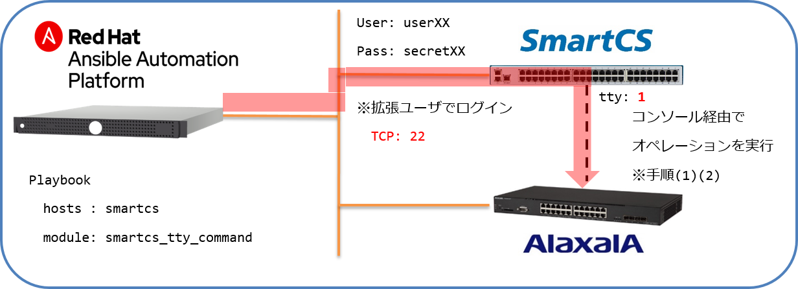

[↑目次に戻る](./README.md)
<br>
# 演習4.4　初期化の自動化

演習4.4ではSmartCSに接続されているALAXALA装置の初期化を行う演習となります。  
初期化作業のオペレーションもバージョンアップ作業と同様にSSH経由では作業しにくい内容となりますが、  
コンソール（SmartCS）経由の場合は、遠隔からも行うことが可能となります。  

なお、本演習は演習5 Ansible Towerの演習の後に実施いたします。  

## 目次
本演習では以下を行います。  
- STEP1.ALAXALA装置の初期化作業手順の確認  
- STEP2.AnsibleとSmartCSを連携して、ALAXALA装置の初期化作業を行う。

<br>
<br>

### STEP1.ALAXALA装置の初期化作業手順の確認

演習で使用しているALAXALA装置（AX2230）を初期化します。  

手順１．  
まずはユーザ情報を初期化します。

```
login: alaxala
Password:

Copyright (c) 2012-2019 ALAXALA Networks Corporation. All rights reserved.

AX2230> enable
Password:
AX2230# clear password
Changing local password for alaxala.
Password cleared.
AX2230# clear password enable-mode
Changing local password for admin.
Password cleared.
AX2230# rename user
Changing username.
Old username:alaxala
New username:operator
AX2230# exit

login:
```

手順２．  
続いて、装置の初期化作業、コンフィグレーションの削除、装置障害ログの削除を行います。

```
login: operator

Copyright (c) 2012-2019 ALAXALA Networks Corporation. All rights reserved.

AX2230> enable
AX2230# line console speed 9600 save
AX2230# trace-monitor enable save
AX2230# set exec-timeout 30 save
AX2230# remove mac-authentication mac-address -all -f
MAC-Authentication is not configured.
AX2230# commit mac-authentication -f
MAC-Authentication is not configured.
AX2230# remove web-authentication user -all -f
Web-Authentication is not configured.
AX2230# clear web-authentication html-files -f
Can't clear because it is default now.
AX2230# clear web-authentication ssl-crt
Would you wish to clear SSL key and certificate? (y/n):y
Can't execute.

AX2230# show license

Date 1980/05/05 00:12:16 UTC
  Available: -----
    ----------------

AX2230# remove wol-device name all -f
License key is not installed.
AX2230# commit wol-device -f

License key is not installed.

AX2230# remove wol-authentication user all -f
License key is not installed.
AX2230# commit wol-authentication -f

License key is not installed.

AX2230# clear ip dhcp snooping binding

DHCP Snooping is not configured.

AX2230# clear ip dhcp server statistics

AX2230# reload
Restart OK? (y/n): y
Please wait a few minutes. The reload command is executing.


Boot Initialize.......done.
System Initialize....done.

login: operator

Copyright (c) 2012-2019 ALAXALA Networks Corporation. All rights reserved.

AX2230> enable
AX2230# format flash
Do you wish to initialize flash memory? (y/n):
INFO 80/05/05 00:13:03 PORT GigabitEthernet 0/1 Link Up/Speed 100M-Full(auto)
AX2230# y
Flash format complete.

AX2230# clear critical-logging
Do you wish to clear critical-logging? (y/n): y

AX2230# reload
Restart OK? (y/n): y
Please wait a few minutes. The reload command is executing.


Boot Initialize.......done.
System Initialize....done.

login:
```

初期化の手順は以上となります。

<br>
<br>

### STEP2.AnsibleとSmartCSを連携して、ALAXALA装置の初期化作業を行う。

STEP1の手順をPlaybook化します。  
手順の途中に再起動処理が含まれている為、<code>smartcs_tty_command</code>を使用します。

|手順 |使用するモジュール |
|:---|:---|
|(1)ユーザ情報を初期化を行う |smartcs_tty_command | 
|(2)装置の初期化作業、コンフィグレーションの削除、装置障害ログの削除を行う |smartcs_tty_command |

■演習環境



<br>

■Playbookの編集箇所

|vars |Playbook例の値 |備考 | 
|:---|:---|:---|
|ttyno |'1' |SmartCSの**TTY**番号を指定します |

<br>

■Playbook  
(initializing_step1_user.yml)
```yaml
---
- name: initializing user settings
  hosts: smartcs
  gather_facts: no
  
  vars:
  #ttynoはユーザごとに異なります。Playbook作成時に変更してください。
  - ansible_connection: network_cli
  - ansible_network_os: smartcs
  - inituser: 'operator'
  - username: 'alaxala'
  - password: 'secret2230'
  - ttyno: '1'
  
  tasks:
  - name: "smartcs_tty_command"
    smartcs_tty_command:
      tty: '{{ ttyno }}'
      custom_response: on
      custom_response_delete_nl: on
      recvchar:
      - 'login:'
      - 'Password:'
      - 'Old username:'
      - 'New username:'
      - '> '
      - '# '
      sendchar:
      - '{{ username }}'
      - '{{ password }}'
      - 'enable'
      - '{{ password }}'
      - 'clear password'
      - 'clear password enable-mode'
      - 'rename user'
      - '{{ username }}'
      - '{{ inituser }}'
      - 'exit'
```

(initializing_step2_all.yml)
```yaml
---
- name: initializing all setting and log
  hosts: smartcs
  gather_facts: no
  
  vars:
  #ttynoはユーザごとに異なります。Playbook作成時に変更してください。
  - ansible_connection: network_cli
  - ansible_network_os: smartcs
  - ansible_command_timeout: 300
  - inituser: 'operator'
  - ttyno: '1'
  
  tasks:
  - name: "smartcs_tty_command"
    smartcs_tty_command:
      tty: '{{ ttyno }}'
      cmd_timeout: 180
      custom_response: on
      custom_response_delete_nl: on
      recvchar:
      - 'login:'
      - '> '
      - '# '
      - 'Would you wish to clear SSL key and certificate? (y/n):'
      - 'Restart OK? (y/n):'
      - 'Do you wish to initialize flash memory? (y/n):'
      - 'Do you wish to clear critical-logging? (y/n):' 
      sendchar:
      - '{{ inituser }}'
      - 'enable'
      - 'line console speed 9600 save'
      - 'trace-monitor enable save'
      - 'set exec-timeout 30 save'
      - 'remove mac-authentication mac-address -all -f'
      - 'commit mac-authentication -f'
      - 'remove web-authentication user -all -f'
      - 'clear web-authentication html-files -f'
      - 'clear web-authentication ssl-crt'
      - 'y'
      - 'show license'
      - 'remove wol-device name all -f'
      - 'commit wol-device -f'
      - 'remove wol-authentication user all -f'
      - 'commit wol-authentication -f'
      - 'clear ip dhcp snooping binding'
      - 'clear ip dhcp server statistics'
      - 'reload'
      - 'y'
      - 'operator'
      - 'enable'
      - 'format flash__NOWAIT__:5'
      - 'y'
      - 'clear critical-logging'
      - 'y'
      - 'reload'
      - 'y'
```


■Playbook内容の説明  
ALAXALA装置の初期化で必要な投入コマンドのうち、今回の演習環境で実行可能なコマンドを記載した手順となります。


■実行例  
```
$ ansible-playbook initializing_step1_user.yml
$ ansible-playbook initializing_step2_all.yml 
```
Playbookは分けていますが、<code>import_playbook</code>を使って１つにまとめてしまっても問題ありません。


■実行結果例  
```
PLAY [initializing all setting and log] ***************************************************************

TASK [smartcs_tty_command] ***************************************************************************
ok: [smartcs]

PLAY RECAP *******************************************************************************************
smartcs                    : ok=1    changed=0    unreachable=0    failed=0    skipped=0    rescued=0    ignored=0 
```
上記実行結果は、(ansible-playbook initializing_step2_all.yml )の実行例となります。


■初期化の確認

初期化用のPlaybookを実行した後、コンフィグが初期化されているかを手動で確認してみます。
```
login: operator

Copyright (c) 2012-2019 ALAXALA Networks Corporation. All rights reserved.

> enable
# show running-config
#configuration list for AX2230S-24T
!
vlan 1
  name "VLAN0001"
!
spanning-tree mode pvst
!
interface gigabitethernet 0/1
  switchport mode access
!
interface gigabitethernet 0/2
  switchport mode access
!
～抜粋～
!
interface gigabitethernet 0/28
  switchport mode access
!
interface vlan 1
!
#
```

設定が初期化されている事を確認できました。


[←演習4.3 ファームウェアアップデートの自動化](./4.3-automation_of_firmware_update.md)  
[↑目次に戻る](./README.md)
