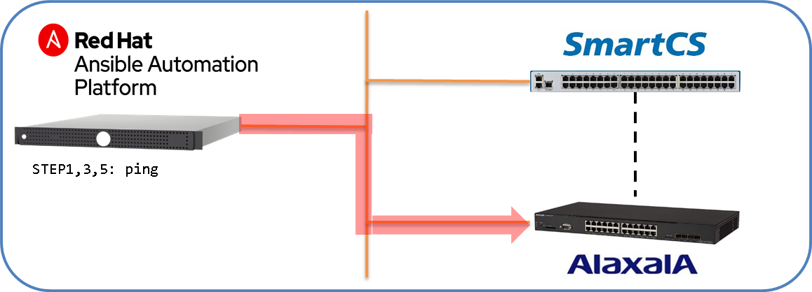
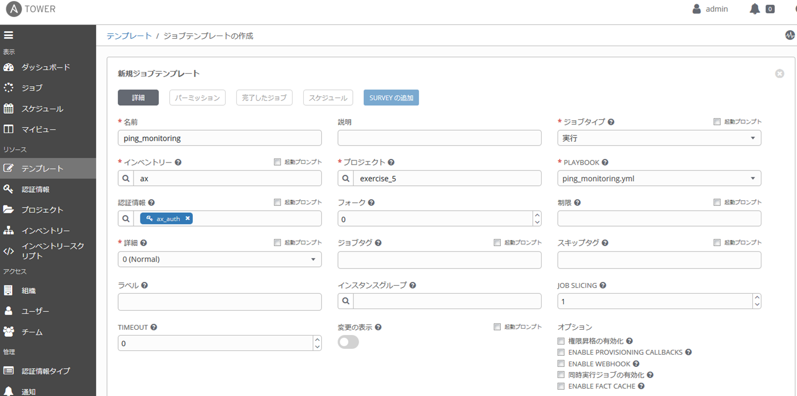
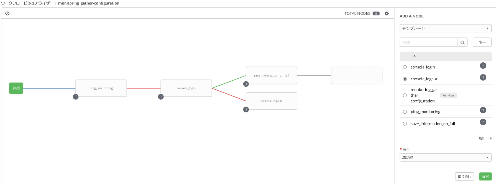
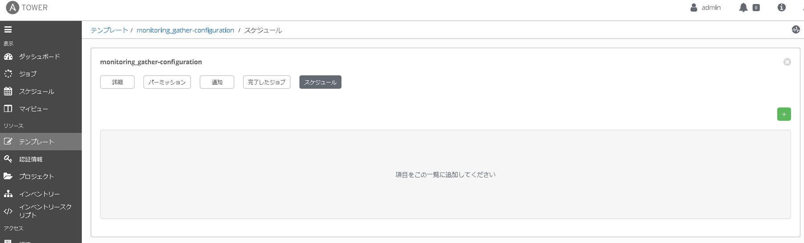
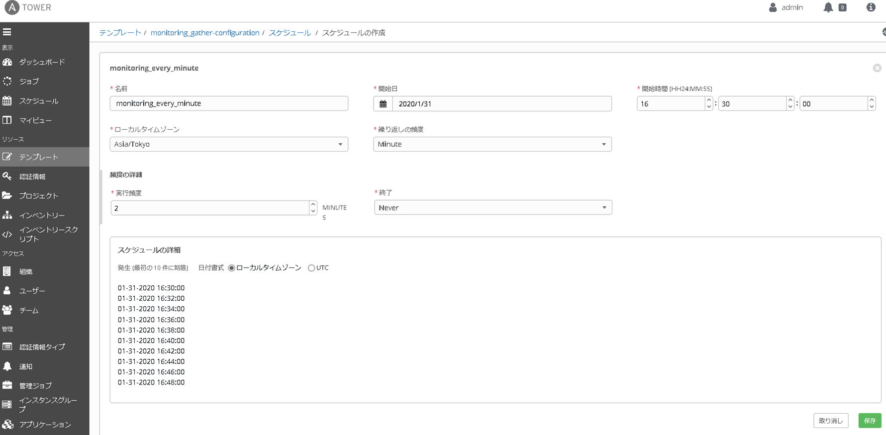
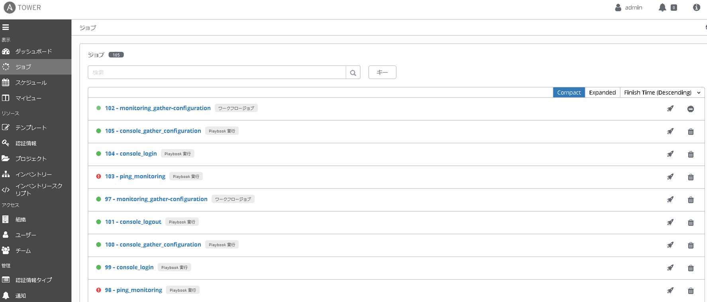
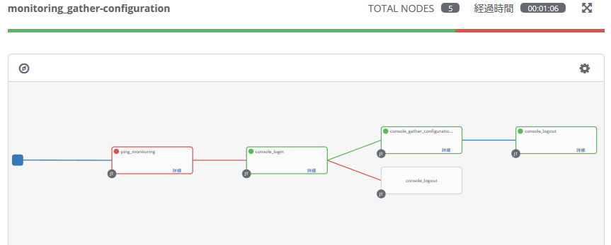

[↑目次に戻る](../README.md)
<br>


# 演習5.2　定期的な死活監視と障害発生時の情報取得を自動化

演習5.2はALAXALA装置に対して定期的な死活監視と、NW障害やオペレーションミスで死活監視が失敗した場合の情報取得をワークフロー実行する演習を行います。

## 目次
本演習では以下を行います。  
- STEP1.<code>ping</code>モジュールを利用したALAXALA装置への死活監視用のPlaybookを作成する
- STEP2.Ansible Towerに死活監視と情報取得のジョブテンプレートを作成する
- STEP3.Ansible Towerに死活監視から障害時の情報取得までのワークフローテンプレートを作成し、スケジューリング実行を設定する
- STEP4.手動でオペレーションミスを起こす
- STEP5.ワークフローテンプレートの実行結果と、コンソール（SmartCS）経由での情報取得ログを確認する

## 演習構成図




<br>
<br>

### STEP1.<code>ping</code>モジュールを利用したALAXALA装置への死活監視用のPlaybookを作成する

まずは、演習5.2で使用するPlaybookを作成し、Ansible Towerから実行するための<code>/var/lib/awx/projects/exercise_5</code>ディレクトリを作成します。  
以降のPlaybook作成は、下記コマンドにて作成したディレクトリに作成してください。
```
$ sudo mkdir /var/lib/awx/projects/exercise_5
```

STEP1では、ALAXALA装置に対して<code>ping</code>モジュールを利用して死活監視を行うPlaybookを作成します。  
死活監視を行うPlaybook例を以下に記載します。

■Playbook(ping_monitoring.yml)  
```yaml
---
- name: monitoring ax connectivity
  hosts: ax
  gather_facts: no

  vars:
  - ansible_connection: network_cli
  - ansible_network_os: ax

  tasks:
  - name: ping monitoring
    ping:
```

■Playbook内容の説明  
<code>ping</code>モジュールを利用して、ALAXALA装置への死活監視を行います。  
コネクションプラグインとして<code>network_cli</code>を利用して、SSHでALAXALA装置に接続できるかどうかを確認します。  
- ping:  
<code>hosts</code>で指定した対象装置に対して疎通確認を行います。  
確認方法は、<code>ansible_connection</code>にて指定するコネクションプラグインに依存します。  

  | コネクションプラグイン | 確認方法 |
  | --- | --- |
  | network_cli | SSHで対象装置に接続できるかどうか |
  | ssh / paramiko | SSHでPythonスクリプトを送信し実行できるかどうか |
  | netconf | NETCONFで対象機器に接続できるかどうか |

■実行例  
```
$ sudo ansible-playbook /var/lib/awx/projects/exercise_5/ping_monitoring.yml 
```


■実行結果例
```
PLAY [monitoring ax connectivity] ********************************************************************************

TASK [ping monitoring] *******************************************************************************************
ok: [ax]

PLAY RECAP *******************************************************************************************************
ax                         : ok=1    changed=0    unreachable=0    failed=0    skipped=0    rescued=0    ignored=0
```
ALAXALA装置への疎通性を確認することができました。

<br>
<br>

### STEP2.Ansible Towerに死活監視と情報取得のジョブテンプレートを作成する

まずは、演習4.1のSTEP3で使用したログイン用、ログアウト用のPlaybookを作業用ディレクトリにコピーします。

```
$ sudo cp /home/rhel01/exercise_4/console_login.yml /var/lib/awx/projects/exercise_5
$ sudo cp /home/rhel01/exercise_4/console_logout.yml /var/lib/awx/projects/exercise_5
```

次に、演習3.3に記載の「参考」と同様に、SmartCS経由で取得した情報をホスト名と時刻情報を含めたファイル名で保存するための<code>save_information_on_fail.yml</code>を作成します。  
なお、以下のtasks以外の部分は演習4.1 STEP3の演習で作成した<code>console_gathering_config.yml</code>から変更ありません。  

■Playbook(save_information_on_fail.yml)  
```yaml
tasks:
  - name: show commands
    ax_command:
      commands:
        - show ip interface
        - show vlan
        - show access-filter
        - show running-config
    register: result

  - name: gather ax facts all
    ax_facts:
      gather_subset: all

  - name: save to localfile
    copy:
      content: "{{ result.stdout_lines | join('\n') }}"
      dest: "/var/lib/awx/projects/exercise_5/log_monitoring-fail_{{ ansible_net_hostname }}_{{ now(False, '%Y%m%d_%H%M%S') }}.txt"
```

■ジョブテンプレートの作成  
Ansible Towerへログインし、STEP1で作成した死活監視用のPlaybook、STEP2で作成した情報取得用のPlaybook、STEP2でコピーしたログイン/ログアウト用のPlaybookを実行するためのジョブテンプレートを作成します。  
ジョブテンプレートの作成時に指定する値のうち、下記に掲載の作成画面例から変更すべき項目を下記の表に記載しています。  

  | インベントリー | Playbook | 認証情報 |
  | --- | --- | --- |
  | ax | ping_monitoring.yml | ax_auth |
  | smartcs | console_login.yml | smartcs_auth_cs-module |
  | smartcs | save_information_on_fail.yml | smartcs_auth_ax-module |
  | smartcs | console_logout.yml | smartcs_auth_cs-module |



上記の作成画面例は、<code>ping_monitoring.yml</code>を実行するジョブテンプレートの作成例となります。

<br>
<br>

### STEP3.Ansible Towerに死活監視から障害時の情報取得までのワークフローテンプレートを作成し、スケジューリング実行を設定する

■ワークフローテンプレートの作成  
STEP2で作成したジョブテンプレートを組み合わせて、死活確認(<code>ping_monitoring.yml</code>)が失敗した時に、コンソール（SmartCS）経由で情報取得(<code>save_information_on_fail.yml</code>)を行うワークフローテンプレートを作成します。



上記作成画面は、<code>save_information_on_fail.yml</code>を実行した後に、成功/失敗に関係なく(常時)<code>console_logout.yml</code>を実行するように設定する際の選択例です。  
画面右下の「実行」項目で、1つ前のジョブテンプレートの実行結果に応じて、選択中のジョブテンプレートを実行させることができます。(常時、成功時、障害発生時の3つより選択します。)

■スケジューリング実行の設定  
ワークフローテンプレートを定期的に実行させるように、スケジューリングの設定を行います。  
作成済みのワークフローテンプレート<code>monitoring_gather-configuration</code>の編集画面から、スケジュールを選択して新規のスケジュールを登録します。  



死活監視を2分に1回実行する場合、下記画面のように入力します。



スケジューリング実行を設定後は、実行されたワークフローテンプレートが「ジョブ」のページに表示されます。  
現時点ではALAXALA装置への疎通が取れている状態なので、死活監視のジョブテンプレートのみが実行されているはずです。

<br>
<br>

### STEP4.手動でオペレーションミスを起こす
> この後はSmartCS経由でAX-2230を初期化する演習だけなので、ACLの復旧は不要かもしれない。  

手動でオペレーションミスを起こします。  
演習4.1のSTEP2と同様に、SSHでALAXALA装置にアクセスして、設定済みのACLを手動で変更します。  
```
$ ssh alaxala@ax
alaxala@ax's password: 

Copyright (c) 2012-2019 ALAXALA Networks Corporation. All rights reserved.

AX2230> enable
Password:
AX2230# configure 
AX2230# (config)# ip access-list standard "access ansible host only"
!AX2230(config-std-nacl)# show
ip access-list standard "access ansible host only"  
  10 permit host 192.168.127.2 
  20 deny any 
!
!AX2230(config-std-nacl)# 10 permit host 192.168.0.1
!AX2230(config-std-nacl)# packet_write_wait: Connection to 192.168.128.2 port 22: Broken pipe
```

誤って設定済みのACLに対して、許可するホストを変更してしまいました。  
その為、<code>10 permit host 192.168.0.1</code>を投入後、SSHアクセスした端末から操作ができなくなります。  
上記の操作により、AnsibleからALAXLA装置に対してIPリーチできない状態となりました。  

<br>
<br>

### STEP5.ワークフローテンプレートの実行結果と、コンソール（SmartCS）経由での情報取得ログを確認する

まずは、スケジューリング実行されているワークフローテンプレートの実行結果を確認します。
STEP4でACLの設定変更を実施したため、死活監視が失敗しコンソール（SmartCS）経由で情報取得が実行されているはずです。





IPリーチでALAXALA装置にアクセスできない状態となっていますが、コンソール経由であればアクセスが可能です。  
ワークフローテンプレートにより、ALAXALA装置へのIPリーチ不可の障害を検出した際に自動で情報を取得しています。  
<code>log_monitoring-fail_ホスト名_時刻情報.txt</code>という名前のログファイルがワーキングディレクトリに保存されていますので、catコマンドなどで内容を確認してください。  

```
$ sudo ls -l /var/lib/awx/projects/exercise_5
～抜粋～
-rw-r--r-- 1 root root 7188  1月 23 18:20 log_monitoring-fail_AX2230_20200123_182000.txt
$
$ sudo cat /var/lib/awx/projects/exercise_5/log_monitoring-fail_AX2230_20200123_182000.txt
```


<br>
<br>

## 演習5.2のまとめ

- Ansible Towerのワークフロー機能を利用することで、死活監視が失敗した場合に情報取得を実行するという様な条件分岐するオペレーションをPlaybookを組み合わせて実行することが可能となります。
- さらに、スケジューリング機能を利用することで、監視や定時バックアップなどのPlaybookを簡単に定期実行させることが可能となります。

<br>
<br>

[←演習5.1　Ansible Towerのセットアップ](/5.1-setup_Ansible_Tower.md)   
[↑目次に戻る](../README.md)
