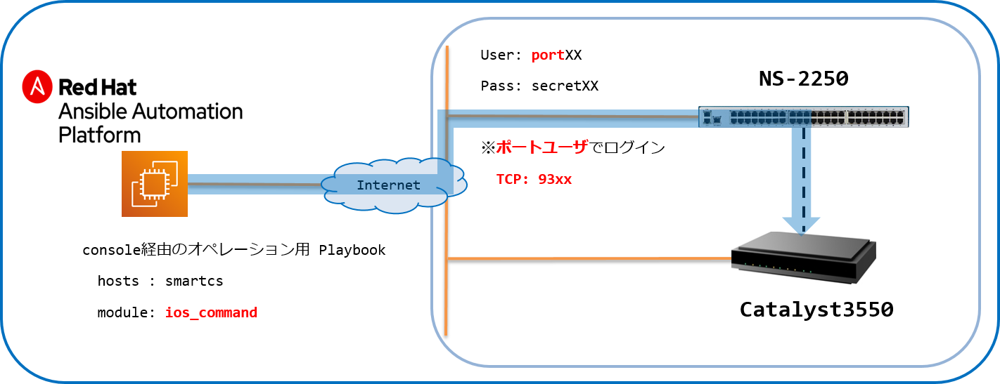

[↑目次に戻る](./README.md)
<br>
# 演習3.4　IOS装置の設定情報をSmartCS経由で取得する

演習3.3でios_commandを使ってIOS装置から設定情報を取得するPlaybookを作成しました。    
演習3.4では、作成したPlaybookの内容を一部変更して、SmartCS経由（コンソール経由）で同様の情報取得を行います。<br>
これらの操作を通して、ベンダーモジュールをSmartCS経由で実行するベンダーモジュール連携機能の理解を深めましょう。

## 目次
本演習では以下を行います。  
- [Step 1. ログイン用、ログアウト用のPlaybookを作成する](./3.4-setting_of_ios_device_via_smartcs.md#step-1-ログイン用ログアウト用のPlaybookを作成する)
- [Step 2. <code>ios_command</code>をSmartCS経由で動作させるように変更する](./3.4-setting_of_ios_device_via_smartcs.md#step-2-ios_commandをSmartCS経由で動作させるように変更する)
- [Step 3. 作成した3つのPlaybookを1回のコマンドで実行する](./3.4-setting_of_ios_device_via_smartcs.md#step-3-作成した3つのPlaybookを1回のコマンドで実行する) 

<br>
<br>

## 演習構成図


<br>
<br>

### Step 1. ログイン用、ログアウト用のPlaybookを作成する。

通常のモジュール(ios_command等)は、SSH経由で装置にログインして情報を取得しますが、コンソール経由で接続をする場合  
- コンソールからのログイン  
- コンソールからのログアウト  
の処理を行う必要があります。

演習3.1で使った<code>smartcs_tty_command</code>を利用してPlaybookを作成します。

<br>

■演習環境


<br>


>> 参考として、Ansibleを使わない場合の(一般的な手作業による)操作と出力は、以下のようなオペレーションとなります。<br>
**[次の操作は不要です]**  

ログイン時
```
User Access Verification

Usename: cisco
Password:
Cat3550>
```

>> 参考として、Ansibleを使わない場合の(一般的な手作業による)操作と出力は、以下のようなオペレーションとなります。<br>
**[次の操作は不要です]**  

ログアウト時
```
Cat3550> exit

Cat3550 con0 is now available

Press RETURN to get started.

```


Playbookは以下のような内容となります。 
次のコマンドを実施し、ファイルを作成しましょう。<br>

```bash
vi console_login.yml
```
実行すると、console_login.ymlというファイルが作成され、エディタ画面が表示されます。<br>
次に、**iキー**を押して **Insertモード** (挿入モード)に変更してください。<br>
モードが変更されたこと確認し(左下にモード名が表示されます)、下記の内容をエディタで記載してください。<br>
> 今回は、コピー＆ペーストでの実施をお勧めします。<br>

■Playbook  
(console_login.yml)
```yaml
---
- name: Login from Console using SmartCS
  hosts: smartcs
  gather_facts: no

  vars:
  - tty_no: "{{ hostvars['ios']['smartcs_tty'] }}"
  - ios_password: "{{ hostvars['ios']['ansible_password'] }}"

  - ansible_command_timeout: 60

  tasks:
  - name: login cat3550
    seiko.smartcs.smartcs_tty_command:
      tty: '{{ tty_no }}'
      error_detect_on_module: failed
      recvchar:
      - 'Username: '
      - 'Password: '
      - 'Cat3550>'
      sendchar:
      - '__NL__'
      - 'cisco'
      - '{{ ios_password }}'
```
入力が終わったら、[esc]キーを押して、Insertモードから抜けてください。<br>
モードが変更されたことを確認し、:wq と入力して（左下に:wqと表示されます。）、[Enter]キーを押してください。<br>
以上で、ファイルを保存し、エディターを終了します。<br>

続いてログアウト用のPlaybookを作成します。<br>
次のコマンドを実施し、ファイルを作成しましょう。<br>

```bash
vi console_logout.yml
```
実行すると、console_logout.ymlというファイルが作成され、エディタ画面が表示されます。<br>
次に、**iキー**を押して **Insertモード** (挿入モード)に変更してください。<br>
モードが変更されたこと確認し(左下にモード名が表示されます)、下記の内容をエディタで記載してください。<br>
> 今回は、コピー＆ペーストでの実施をお勧めします。<br>

(console_logout.yml)
```yaml
---
- name: Logout from Console using SmartCS
  hosts: smartcs
  gather_facts: no

  vars:
  - tty_no: "{{ hostvars['ios']['smartcs_tty'] }}"

  - ansible_command_timeout: 60

  tasks:
  - name: logout cat3550
    seiko.smartcs.smartcs_tty_command:
      tty: '{{ tty_no }}'
      error_detect_on_module: failed
      recvchar:
      - 'Cat3550#'
      - 'Press RETURN to get started.'
      sendchar:
      - 'exit'
```
入力が終わったら、[esc]キーを押して、Insertモードから抜けてください。<br>
モードが変更されたことを確認し、:wq と入力して（左下に:wqと表示されます。）、[Enter]キーを押してください。<br>
以上で、ファイルを保存し、エディターを終了します。<br>

<br>
<br>

### Step 2. ios_commandをSmartCS経由で動作させるように変更する

実際の処理部分のPlaybookを作成します。  
演習3.3の<code>ios_command</code>とtask部分は同じですが、<code>hosts</code>に指定する値が変わります。

<br>

■演習環境



<br>

次のコマンドを実施し、ファイルを作成しましょう。<br>

```bash
vi console_gathering_ios_information.yml
```
実行すると、console_gathering_ios_information.ymlというファイルが作成され、エディタ画面が表示されます。<br>
次に、**iキー**を押して **Insertモード** (挿入モード)に変更してください。<br>
モードが変更されたこと確認し(左下にモード名が表示されます)、下記の内容をエディタで記載してください。<br>
> 今回は、コピー＆ペーストでの実施をお勧めします。<br>

■Playbook(console_gathering_ios_information.yml)  
```yaml
---
- name: gathering ios informataion from console using SmartCS
  hosts: ios_sshxpt
  gather_facts: no

  tasks:
  - name: show commands
    cisco.ios.ios_command:
      commands:
        - show version
        - show interfaces gigabitethernet 0/1
        - show ip interface
        - show vlan
        - show running-config
    register: result

  - name: show command output
    debug:
      msg:
        - '{{ result.stdout_lines[0] }}'
```

入力が終わったら、[esc]キーを押して、Insertモードから抜けてください。<br>
モードが変更されたことを確認し、:wq と入力して（左下に:wqと表示されます。）、[Enter]キーを押してください。<br>
以上で、ファイルを保存し、エディターを終了します。<br>

■Playbook内容の説明  
- <code>hosts: ios_sshxpt</code>  
SmartCS経由で接続を行うため、接続先をios_sshxptと設定します。   

<br>
<br>


### Step 3. 作成した3つのPlaybookを1回のコマンドで実行する 

STEP1、STEP2 で作成した3つのPlaybookを1回のコマンドで実行できるようなPlaybookを作成します。  
複数のPlaybookを集約して実行する際は、<code>import_playbook</code>を利用します。  
https://docs.ansible.com/ansible/latest/modules/import_playbook_module.html

次のコマンドを実施し、ファイルを作成しましょう。<br>

```bash
vi gathering_ios_information_via-console.yml
```
実行すると、gathering_ios_information_via-console.ymlというファイルが作成され、エディタ画面が表示されます。<br>
次に、**iキー**を押して **Insertモード** (挿入モード)に変更してください。<br>
モードが変更されたこと確認し(左下にモード名が表示されます)、下記の内容をエディタで記載してください。<br>
> 今回は、コピー＆ペーストでの実施をお勧めします。<br>

■Playbook(gathering_ios_information_via-console.yml)
```yaml
---
- name: login by console
  import_playbook: console_login.yml

- name: gathering ios information
  import_playbook: console_gathering_ios_information.yml

- name: logout by console
  import_playbook: console_logout.yml
```
入力が終わったら、[esc]キーを押して、Insertモードから抜けてください。<br>
モードが変更されたことを確認し、:wq と入力して（左下に:wqと表示されます。）、[Enter]キーを押してください。<br>
以上で、ファイルを保存し、エディターを終了します。<br>

■実行例
```
ansible-playbook -vvv gathering_ios_information_via-console.yml 
```

■実行結果例
```
PLAY [Login from Console using SmartCS] ************************************************************************

TASK [login cat3550] *******************************************************************************************
ok: [smartcs]

PLAY [gathering ios informataion from console using SmartCS] ***************************************************

TASK [show commands] *******************************************************************************************
ok: [ios_sshxpt]

TASK [show command output] *************************************************************************************
ok: [ios_sshxpt] => {
    "msg": [
        [
            "Cisco IOS Software, C3550 Software (C3550-IPSERVICESK9-M), Version 12.2(44)SE6, RELEASE SOFTWARE (fc1)",
            "Copyright (c) 1986-2009 by Cisco Systems, Inc.",
            "Compiled Mon 09-Mar-09 20:28 by gereddy",
            "Image text-base: 0x00003000, data-base: 0x012A99FC",
            "",
～抜粋～
            "",
            "The password-recovery mechanism is enabled.",
            "384K bytes of flash-simulated NVRAM.",
            "Base ethernet MAC Address: 00:0B:BE:D3:0D:00",
            "Motherboard assembly number: 73-5700-09",
            "Power supply part number: 34-0966-02",
            "Motherboard serial number: CAT06510DYB",
            "Power supply serial number: DCA06471PNQ",
            "Model revision number: G0",
            "Motherboard revision number: A0",
            "Model number: WS-C3550-24-EMI",
            "System serial number: CAT0652X0GY",
            "Configuration register is 0x10F"
        ]
    ]
}

PLAY [Logout from Console using SmartCS] ***********************************************************************

TASK [logout cat3550] ******************************************************************************************
ok: [smartcs]

PLAY RECAP *****************************************************************************************************
ios_sshxpt                 : ok=2    changed=0    unreachable=0    failed=0    skipped=0    rescued=0    ignored=0
smartcs                    : ok=2    changed=0    unreachable=0    failed=0    skipped=0    rescued=0    ignored=0   
```

SmartCS経由で`ios_command`を実行し、IOS装置のコマンド実行結果を取得することができました。  
ベンダーモジュールをSmartCS経由で動作させる場合、以下の変更をするだけでPlaybookを再利用する事が可能です。  
※下記変更により、インベントリ内に記載されたベンダーモジュール連携用の`ansible_user`、`ansible_password`、`ansible_port`が適用されます。  
- `hosts`を`ios`から`ios_sshxpt`に変更

<br>
<br>


## 演習3のまとめ

- <code>smartcs_tty_command</code>を使い、送受信する文字列を指定してコンソールアクセスをする方法  
- <code>ios_command</code>など、他ベンダーのモジュールを利用してSmartCS経由でPlaybookを実行する方法  
についての演習を行いました。  

AnsibleとSmartCSを連携してコンソールアクセスを行う方法としては上記の通り２パターンありますが、  
それぞれ一長一短があります。  

|| <code>smartcs_tty_command</code>を使う場合 | 他ベンダーモジュールとSmartCSを連携する場合 |
|:---|:---|:---|
|〇 |ベンダー製のモジュールの無いネットワーク機器にコンソール経由でアクセスすることが可能 |ベンダー製モジュールを使ったPlaybookの一部パラメータを変更する事でタスク部分は再利用が可能。|
|△ |コンソールの入出力情報がないと、Playbook作成ができない。冪等性の担保がない。 |<code>network_cli</code>コネクションプラグインをサポートしていないと使えない。処理時間がSSH経由と比較して長い |

ターゲットとなるネットワーク機器のベンダーモジュールがあり、コネクションプラグインとして<code>network_cli</code>をサポートしてる場合は、Playbookの再利用性などを考え、他ベンダーモジュールとSmartCSを連携して使う方法が望ましいです。

<code>smartcs_tty_command</code>を使うシチュエーションとして適切なのは以下のような場合となります。  
- ベンダー製モジュールが無いネットワーク機器にアクセスしたい場合  
- ベンダー製モジュールがあるが、<code>network_cli</code>プラグインのサポートないネットワーク機器にアクセスしたい場合
- 既存のモジュールを使ったオペレーションが難しい場合（再起動処理が含まれる手順など）

<br>
<br>

[←演習3.3 IOS装置の設定情報を取得する](./3.3-get_ios_device_information.md)   
[↑目次に戻る](./README.md)
