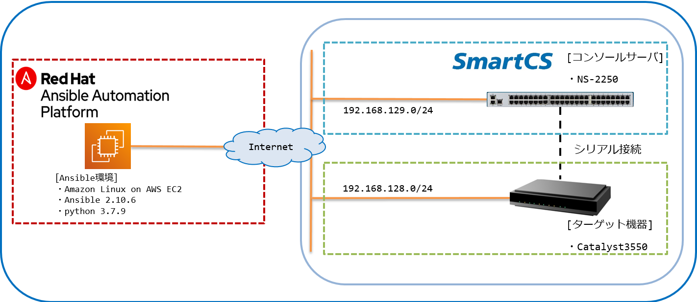

[↑目次に戻る](./README.md)
<br>
# 演習1.1　演習環境の確認
演習1.1では、本日のハンズオンの演習環境の確認を行います。
<br>

## 目次
本演習では以下を行います。

- [Step 1. 本ハンズオンの環境と情報を理解する](./1.1-preparing_for_the_exercise.md#step-1-本ハンズオンの環境と情報を理解する)
- [Step 2. RHELサーバーに接続する](./1.1-preparing_for_the_exercise.md#step-2-RHELサーバーに接続する)
- [Step 3. python仮想環境を有効化する](./1.1-preparing_for_the_exercise.md#step-3-python仮想環境を有効化する)
- [Step 4. Ansibleのバージョンを確認する](./1.1-preparing_for_the_exercise.md#step-4-Ansibleのバージョンを確認する)
- [Step 5. Ansibleの設定情報を確認する](./1.1-preparing_for_the_exercise.md#step-5-Ansibleの設定情報を確認する)
- [Step 6. AnsibleのInventory情報を確認する](./1.1-preparing_for_the_exercise.md#step-6-AnsibleのInventory情報を確認する)
- [Step 7. SmartCSのバージョン情報を確認する](./1.1-preparing_for_the_exercise.md#step-7-SmartCSのバージョン情報を確認する)
- [Step 8. トラブルシュートの手順を確認する](./1.1-preparing_for_the_exercise.md#step-8-トラブルシュートの手順を確認する)

<br>
<br>

### Step 1. 本ハンズオンの環境と情報を理解する

#### 演習構成図


#### ユーザ毎の環境
本ワークショップでは、参加者一人につき1環境を提供しています。<br>
各要素ごとの環境情報表は下記となります。
<br>
<br>

#### Amazon Linux EC2 ( Ansible Controller ) 
Ansible Engineがインストールされているサーバーです。<br>
本ワークショップでは、このEC2から、各種操作やAnsible Playbookの実行を行ないます。

| 環境ID | EC2 Global IP | EC2 ユーザ ID | Password |  
|:---|:---|:---|:---|
| 1  | (別途お知らせ) | (別途お知らせ) | (別途お知らせ) |
| 2  | (別途お知らせ) | (別途お知らせ) | (別途お知らせ) |
| 3  | (別途お知らせ) | (別途お知らせ) | (別途お知らせ) |
| 4  | (別途お知らせ) | (別途お知らせ) | (別途お知らせ) |
| 5  | (別途お知らせ) | (別途お知らせ) | (別途お知らせ) |
| 6  | (別途お知らせ) | (別途お知らせ) | (別途お知らせ) |
| 7  | (別途お知らせ) | (別途お知らせ) | (別途お知らせ) |
| 8  | (別途お知らせ) | (別途お知らせ) | (別途お知らせ) |
| 9  | (別途お知らせ) | (別途お知らせ) | (別途お知らせ) |
| 10 | (別途お知らせ) | (別途お知らせ) | (別途お知らせ) |

<br>
<br>

#### 操作対象のNW機器 ( IOS )
本セッションにおいて、SmartCS経由で設定変更を行う対象となるIOS NW機器です。<br>

| 環境ID | IOS IP | default ユーザ ID | ユーザ ID<br> (初期設定後) | Password<br> (初期設定後) | Enable Password<br> (初期設定後) |
|:---|:---|:---|:---|:---|:---|
| 1  | 192.168.128.1/24 | なし | cisco | secret3550 | secret3550 |
| 2  | 192.168.128.2/24 | なし | cisco | secret3550 | secret3550 | 
| 3  | 192.168.128.3/24 | なし | cisco | secret3550 | secret3550 |
| 4  | 192.168.128.4/24 | なし | cisco | secret3550 | secret3550 |
| 5  | 192.168.128.5/24 | なし | cisco | secret3550 | secret3550 |
| 6  | 192.168.128.6/24 | なし | cisco | secret3550 | secret3550 |
| 7  | 192.168.128.7/24 | なし | cisco | secret3550 | secret3550 |
| 8  | 192.168.128.8/24 | なし | cisco | secret3550 | secret3550 |
| 9  | 192.168.128.9/24 | なし | cisco | secret3550 | secret3550 |
| 10 | 192.168.128.10/24 | なし | cisco | secret3550 | secret3550 |

※IOS装置のIPアドレスは演習3.1にて設定します。ハンズオン開始時点では初期状態（未設定）となります。  

<br>
<br>

#### コンソールサーバ ( SmartCS )
コンソール接続を利用して複数のネットワーク機器などを遠隔から操作するためのコンソールサーバーです。<br>
後ほど各演習内で説明がありますが、SmartCSは用途/操作に合わせて<br>
- **ログインするユーザID** <br>
- **TCPポート番号** <br>
が異なります。
以下では、それぞれのケースにおけるパラメータを環境ごとに記載しています。

<br>
<br>

##### ① 手動での本体アクセス / Ansible経由でSmartCS用モジュールを利用したコンソールアクセス
SmartCSはSmartCS自体の設定変更や情報取得を行う事が可能なユーザ**＜一般ユーザ＞** と、<br>
SmartCSに接続されているNW機器のコンソールにアクセスできるユーザ**＜ポートユーザ＞** を通常分けて管理しています。<br>
**userXX**というユーザは一般ユーザでもポートユーザでもない、**拡張ユーザ** というユーザグループに所属しており、<br>
SmartCSの設定変更・情報取得と、Ansible経由でコンソールアクセス用のコマンドを実行する事の両方が可能です。<br>
下記のパラメータは、<br>
- 手動でSmartCSにログインして装置設定を行う、情報取得を行う場合<br>
- Ansible経由で**smartcs_tty_command**モジュールを利用して、<br>
SmartCSに接続されている機器とコンソール経由のオペレーションをする場合<br>

に指定するパラメータとなります。

| 環境ID | SmartCS IP | TCPポート | tty番号 | 拡張ユーザ ID | Password | 
|:---|:---|:---|:---|:---|:---|
| 1  | 192.168.129.**1**/24 | 22 | 1  | user01 | secret01 | 
| 2  | 192.168.129.**1**/24 | 22 | 2  | user02 | secret02 | 
| 3  | 192.168.129.**1**/24 | 22 | 3  | user03 | secret03 | 
| 4  | 192.168.129.**1**/24 | 22 | 4  | user04 | secret04 | 
| 5  | 192.168.129.**1**/24 | 22 | 5  | user05 | secret05 | 
| 6  | 192.168.129.**2**/24 | 22 | 6  | user06 | secret06 | 
| 7  | 192.168.129.**2**/24 | 22 | 7  | user07 | secret07 | 
| 8  | 192.168.129.**2**/24 | 22 | 8  | user08 | secret08 | 
| 9  | 192.168.129.**2**/24 | 22 | 9  | user09 | secret09 | 
| 10 | 192.168.129.**2**/24 | 22 | 10 | user10 | secret10 | 

<br>
<br>

##### ② ダイレクトモード・ポートアクセス（手動）
SmartCSではあらかじめ設定された特定のポート番号を指定することで、直接目的の機器のコンソールに接続ができます。<br>
**portXX**というユーザIDは**ポートユーザ**というユーザグループに所属しており、<br>
SmartCSにシリアル経由で接続されているNW機器にログインする事ができるユーザとなります。<br>
下記のパラメータは、
- **手動でSmartCSのポート番号を指定して、前述のAlaxalaのコンソール接続を行う場合**<br>

に指定するパラメータとなります。

| 環境ID | SmartCS IP | TCPポート (RW) | TCPポート (RO) | ポートユーザ ID | Password | 
|:---|:---|:---|:---|:---|:---|
| 1  | 192.168.129.**1**/24 | 8301 | 8401 | port01 | secret01 | 
| 2  | 192.168.129.**1**/24 | 8302 | 8402 | port02 | secret02 | 
| 3  | 192.168.129.**1**/24 | 8303 | 8403 | port03 | secret03 | 
| 4  | 192.168.129.**1**/24 | 8304 | 8404 | port04 | secret04 | 
| 5  | 192.168.129.**1**/24 | 8305 | 8405 | port05 | secret05 | 
| 6  | 192.168.129.**2**/24 | 8306 | 8406 | port06 | secret06 | 
| 7  | 192.168.129.**2**/24 | 8307 | 8407 | port07 | secret07 | 
| 8  | 192.168.129.**2**/24 | 8308 | 8408 | port08 | secret08 | 
| 9  | 192.168.129.**2**/24 | 8309 | 8409 | port09 | secret09 | 
| 10 | 192.168.129.**2**/24 | 8310 | 8410 | port10 | secret10 | 

<br>
<br>

##### ③ Ansible経由で他ベンダーモジュール(IOSモジュール)を利用したコンソールアクセス
SmartCSではあらかじめ設定された特定のポート番号を指定することで、直接目的の機器のコンソールに接続ができます。<br>
**portXX**というユーザIDは**ポートユーザ**というユーザグループに所属しており、<br>
SmartCSにシリアル経由で接続されているNW機器にログインする事ができるユーザとなります。<br>
SmartCSを介して他ベンダーモジュール（ios_command など）を実行する場合には、手動でポートアクセスをする場合と<br>
異なるTCPポート番号を指定する必要があります。<br>
下記のパラメータは、
- **AnsibleからSmartCS経由で他ベンダーモジュールを実行する場合**<br>

に指定するパラメータとなります。

| 環境ID | SmartCS IP | TCPポート | ポートユーザ ID | Password | 
|:---|:---|:---|:---|:---|
| 1  | 192.168.129.**1**/24 | 9301 | port01 | secret01 | 
| 2  | 192.168.129.**1**/24 | 9302 | port02 | secret02 | 
| 3  | 192.168.129.**1**/24 | 9303 | port03 | secret03 | 
| 4  | 192.168.129.**1**/24 | 9304 | port04 | secret04 | 
| 5  | 192.168.129.**1**/24 | 9305 | port05 | secret05 | 
| 6  | 192.168.129.**2**/24 | 9306 | port06 | secret06 | 
| 7  | 192.168.129.**2**/24 | 9307 | port07 | secret07 | 
| 8  | 192.168.129.**2**/24 | 9308 | port08 | secret08 | 
| 9  | 192.168.129.**2**/24 | 9309 | port09 | secret09 | 
| 10 | 192.168.129.**2**/24 | 9310 | port10 | secret10 | 

<br>

#### 配布資料のDL

- [環境構成図](./contents/pdf/document_Environment%20diagram.pdf)

- [ユーザ毎環境](.//contents/pdf/document_Environment_for_each_user.pdf)

<br>
<br>

### Step 2. EC2サーバーに接続する
次に、各自のEC2サーバーに接続してください。<br>

Windowsの場合は、TeraTerm や PuTTYなどのSSHクライアントを利用してください。<br>

MacOS / Linuxの場合は、Terminalからそれぞれの環境に合わせて次のようなコマンドを実施してください。<br>
環境ID：1の場合のコマンド例<br>
```
$ ssh ec2-user@XXX.XXX.XXX.XXX
```

<br>
<br>

### Step 3. python仮想環境を有効化する

次のコマンドを実行して、python仮想環境を有効化してください。
```
[ec2-user@ip-172-26-10-114 ~]$ cd ansible-handson
[ec2-user@ip-172-26-10-114 ansible-handson]$ source bin/activate
(ansible-handson)[ec2-user@ip-172-26-10-114 ansible-handson]$
```
プロンプトの先頭が<code>(ansible-handson)</code>となっていることを確認してください。

<br>
<br>

### Step 4. Ansibleのバージョンを確認する

次のコマンドを実行して、Ansibleの状態を確認しましょう。
```
(ansible-handson)[ec2-user@ip-172-26-10-114 ansible-handson]$ ansible --version
```
以下のような出力となるはずです。
```
(ansible-handson)[ec2-user@ip-172-26-10-114 ansible-handson]$ ansible --version
ansible 2.10.6
  config file = /home/ec2-user/ansible-handson/ansible.cfg
  configured module search path = ['/home/ec2-user/.ansible/plugins/modules', '/usr/share/ansible/plugins/modules']
  ansible python module location = /home/ec2-user/ansible-handson/lib64/python3.7/site-packages/ansible
  executable location = /home/ec2-user/ansible-handson/bin/ansible
  python version = 3.7.9 (default, Feb 18 2021, 03:10:35) [GCC 7.3.1 20180712 (Red Hat 7.3.1-12)]
(ansible-handson)[ec2-user@ip-172-26-10-114 ansible-handson]$ 
```
Ansibleを使った演習（演習3、演習4）については以下のAnsibleバージョンで行います。<br>
※Ansibleのバージョンが`2.10.6`である事を確認して下さい。

また、SmartCS及びIOS用のAnsibleモジュールのバージョンについて、本演習では以下を使用します。

| S/W | バージョン |
|:---|:---|
|Ansible | 2.10.6 |
|SmartCS module for Ansible | 1.3.0 |
|IOS modules for Ansible | 1.2.1 |

<br>

*config fileでは、このディレクトリでAnsibleコマンドを実行した場合に使用される、コンフィグファイルの場所を示しています。


<br>
<br>

### Step 5. Ansibleの設定情報を確認する

次のコマンドを実施して、Ansibleの設定ファイルを確認しましょう。

```
(ansible-handson)[ec2-user@ip-172-26-10-114 ansible-handson]$ cat /home/ec2-user/.ansible.cfg
```

結果は、以下のような出力となるはずです。

<code>.ansible.cfg</code>
```
$ cat /home/ec2-user/.ansible.cfg
[defaults]
stdout_callback = yaml
connection = smart
timeout = 60
deprecation_warnings = False
host_key_checking = False
retry_files_enabled = False
inventory = /home/ec2-user/hosts
```

*inventoryでは、Ansibleコマンド実行時に特に指定しなかった場合にデフォルトで利用されるインベントリのパスを示しています。

<br>
<br>

### Step 6. AnsibleのInventory情報を確認する
Ansibleにおける管理対象を登録するInventoryファイルを確認してみましょう。<br>

```
(ansible-handson)[ec2-user@ip-172-26-10-114 ansible-handson]$ cat /home/ec2-user/hosts
```

<code>/etc/ec2-user/hosts</code>（#1ユーザの場合）  
  
```
$ cat /home/ec2-user/hosts
[seiko]
smartcs ansible_host=192.168.129.1 ansible_user=user01 ansible_password=secret01

[cisco]
ios ansible_host=192.168.128.1 ansible_user=cisco ansible_password=secret3550 smartcs_tty=1
ios_sshxpt ansible_host=192.168.129.1 ansible_user=port01 ansible_password=secret01 ansible_port=9301

[controll]
ansible ansible_host=172.26.10.114 ansible_user=ec2-user ansible_password=XXXXX

[seiko:vars]
ansible_connection=ansible.netcommon.network_cli
ansible_network_os=seiko.smartcs.smartcs

[cisco:vars]
ansible_become=yes
ansible_become_method=enable
ansible_become_password=secret3550
ansible_connection=ansible.netcommon.network_cli
ansible_network_os=cisco.ios.ios
```

このInventoryには、smartcs , ios , ios_sshxpt , ansibleの4つのノードが登録されています。<br>
smartcsはseikoグループに所属し、 ipアドレス: 192.168.129.1 , ユーザID: user01 , パスワード: secret01として設定されています。<br>
また、[seiko:vars]の次に書かれている2つもsmartcsに設定されている変数（グループ変数）となります。
<br>
<br>

本ハンズオンでは、指示がない限りこのInventoryファイルを使用します。<br>
※本Inventoryは、このInventoryファイルがデフォルトInventoryとして登録されています。<br>
　デフォルトInventoryは、明示的に他のInventoryを指定しない限り、使用されます。<br>
　Playbookを実行する際に<code>ansible-playbook -i <inventory> playbook.yml</code>とすると、特定のInventoryを指定できます。<br>
 
<br>
<br>

### Step 7. 使用するネットワーク機器のバージョン情報を確認する
EC2サーバーから次のコマンドを実行し、SmartCSの情報を確認しましょう。
<br>

■SmartCS（NS-2250-48）
```
(ansible-handson)[ec2-user@ip-172-26-10-114 ansible-handson]$ ssh user01@smartcs
user01@smartcs's password: 
(1)NS-2250_Ansible_1> show version
System                : System Software Ver 2.2 (Build 2020-09-29)
Boot Status           : Power on (00:01:00)
System Up Time        : 2021/05/18 16:21:30
Local MAC Address     : 00:80:15:42:1d:48
Number of MAC Address : 2
Model                 : NS-2250-48 (48 port)
Serial No.            : 87206770
BootROM               : Ver 1.1
Main Board CPU        : e500v2 (533.333328MHz)
Main Memory           : 1025264 KBytes
Boot System           : main (Ver 2.2)
Boot Config           : internal startup1
Main System           : Ver 2.2
Backup System         : Ver 2.1
```
※`System`が`System Software Ver 2.2`である事を確認して下さい。<br>
※ smartcsやiosのIPアドレスは、各環境の/etc/hostsにも定義されています。<br>

<br>
<br>

### Step 8. トラブルシュートの手順を確認する
演習中にトラブルが発生した際の対応方法を確認します。

■playbook実行時にエラーが発生した場合
SmartCSを経由してAnsible playbookを実行しエラーが発生した際は、下記のトラブルシューティングを参考に対応してください。
問題が解決しない場合は、下記の「エラーが解決しない場合」を参照してください。
- [トラブルシュート](https://github.com/ssol-smartcs/ansible-tech-info/blob/main/troubleshooting.md)

■エラーが解決しない場合
トラブルシューティングの内容で解決しない場合は、zoomのチャットでxxx宛てにチャットを送信してください。
ブレイクアウトセッションに移動し、解決に向けてトラブルシュートを行います。

<br>
<br>
以上で、演習 1.は終了です。
<br>
<br>

[ →演習2.1 SmartCSを介してIOS装置へコンソールアクセスする](./2.1-serial_connection_to_ios_via_smartcs.md)  
[↑目次に戻る](./README.md)
