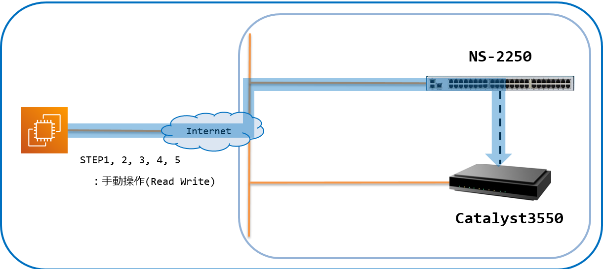
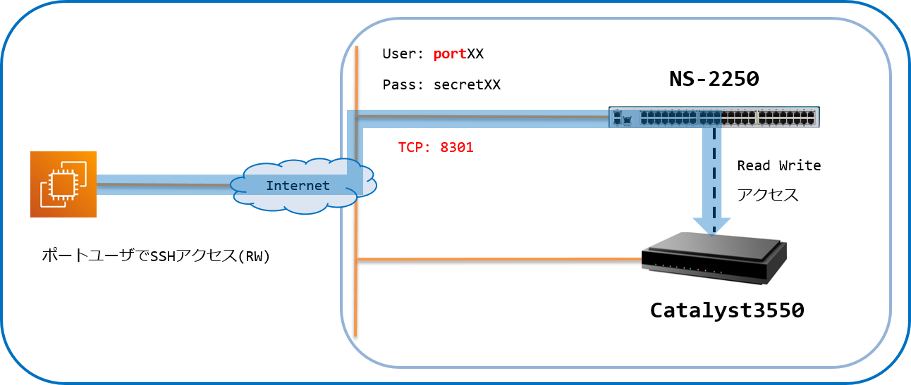

[↑目次に戻る](./README.md)
<br>
# 演習2.1　SmartCSを介してIOS装置へコンソールアクセスする
演習2.1では、SmartCSを介してIOS装置へのコンソールアクセスを行います。
<br>
TeratermなどのターミナルソフトからSmartCSへの接続時に、SmartCSの各シリアルポートに割り当てられたTCPポートを指定して
アクセスするダイレクトモードを使用します
<br>
<br>

## 目次
本演習では以下を行います。
- STEP1. SmartCSのポートサーバーへノーマルモード(RW)でログインする
- STEP2. SmartCSを介してIOS装置へログインする
- STEP3. IOS装置に対してコマンドを実行する
- STEP4. IOS装置からログアウトする
- STEP5. SmartCSのシリアルセッションを終了する

## 演習構成図



<br>
<br>

## 用語解説
演習2.1で使用する、SmartCS特有の用語についての解説です。  

|用語 |解説 |
|:---|:---|
|シリアルポート(tty) |ネットワーク機器のコンソールを接続するためのSmartCS側のポートです。本日のハンズオンではIOS装置のコンソールがSmartCSのシリアルポート2~11に接続されています。 |
|ダイレクトモード |SmartCSを介してネットワーク機器のコンソールへアクセスするための方式の1つです。Telnet/SSHでSmartCSへアクセスする際に、SmartCSのシリアルポートに割り当てられたTCPポート番号を指定することで、ネットワーク機器のコンソールへアクセスすることができます。 |
|ノーマルモード(RW) |SmartCSを介してネットワーク機器のコンソールへアクセスする際の権限の1つです。ノーマルモードでアクセスすると、データの送信/受信をどちらも実施することが可能です。 |
|ポートサーバー |SmartCSを介して指定されたシリアルポートへアクセスするための、SmartCS内部にあるサーバーです。 |
|ポートサーバーメニュー|SmartCSを介して指定されたシリアルポートへアクセスする際に表示されるメニューです。ポートサーバーメニューから「接続開始」等の操作を選択します。 |
|ポートユーザ |SmartCSを介して指定されたシリアルポートへアクセスする際に使用されるユーザのグループです。本日のハンズオンではポートユーザグループに所属しているportXXを使用します。 |

### STEP1. SmartCSのポートサーバーへノーマルモード(RW)でログインする

ダイレクトモード、かつノーマルモード(RW)でSmartCSのポートサーバーへ接続し、ポートユーザでログインします。  
まず、Teratermなどのターミナルソフトを使用して、SSHでSmartCSへ接続します。  
このとき、SSH、ダイレクトモード、かつノーマルモード(RW)でのアクセスなので、使用するシリアルポート(tty)に割り当てられているTCPポート(SSH RW)を指定します。  
※ユーザ#2の場合は8302となります。    
※演習1.1に記載の[環境情報](./1.1-preparing_for_the_exercise.md#コンソールサーバ--smartcs-)を参考にしてTCPポート(SSH RW) 83xxというポート番号を指定してください。  

#### 演習環境


|接続先 |IP |TCPPort |Login |備考 | 
|:---|:---|:---|:---|:---|
|SmartCS |192.168.129.X |83XX |portXX/secretXX|ポートユーザでログイン|


認証には、ポートユーザのユーザ、パスワードを入力してログインします。  
※ユーザ#2の場合はport02/secret02となります。  
※演習1.1に記載の[環境情報](./1.1-preparing_for_the_exercise.md#コンソールサーバ--smartcs-)を参考にしてポートユーザのID/パスワードを入力してください。  
ログインに成功すると、以下のようなポートサーバーメニューが表示されます。  

```
-- RW1 ------------------------
Host  : "NS-2250_Ansible_1"
Label : "cat3550_1"
-------------------------------
1  : display Port Log
2  : display Port Log (LAST)
3  : start tty connection
4  : close telnet/ssh session
5  : show all commands
tty-1:rw>
```

<br>
<br>


### STEP2. SmartCSを介してIOS装置へログインする
ポートサーバーメニューからシリアルセッションを開始し、IOS装置へログインを行います。
<br>
まず、<code>3  : start tty connection</code>を選択し、シリアルセッションを開始します。
<br>
続けてEnter押下でIOS装置にログインすることができます。
<br>

```
-- RW1 ------------------------
Host  : "NS-2250_Ansible_1"
Label : "cat3550_1"
-------------------------------
1  : display Port Log
2  : display Port Log (LAST)
3  : start tty connection
4  : close telnet/ssh session
5  : show all commands
tty-1:rw> 3
Press "CTRL-A" to return this MENU.
Start tty connection

Switch1>
```

<br>
<br>


### STEP3. IOS装置に対してコマンドを実行する
IOS装置にログイン後、コマンドを実行します。
<br>
<code>Switch1></code>というプロンプトが表示されたら、<code>show version</code>コマンドを実行します。
<br>
※演習4.3でF/Wバージョンアップを行うので、<code> Version 12.2(44)SE6 </code>となっている事を確認してください。
<br>

```
Switch1>show version
Cisco IOS Software, C3550 Software (C3550-IPSERVICESK9-M), Version 12.2(44)SE6, RELEASE SOFTWARE (fc1)
Copyright (c) 1986-2009 by Cisco Systems, Inc.
Compiled Mon 09-Mar-09 20:28 by gereddy
Image text-base: 0x00003000, data-base: 0x012A99FC

　　　　　・
　　　　　・
　　　　　・
```

ソフトウェアバージョンを確認したら、<code>enable</code>コマンドで管理者権限へ移行し<code>show running-config</code>を実行します。
<br>
IPアドレスやユーザなどの設定がされておらず、工場出荷状態であることを確認します。
<br>

```
Switch1>enable
Password:
Switch1#
Switch1#show running-config
Building configuration...

Current configuration : 4173 bytes
!
version 12.2
no service pad
service timestamps debug datetime msec
service timestamps log datetime msec
service password-encryption
!
～(省略)～
!
line con 0
line vty 0 4
 password 7 13061E010803
 login local
 transport input ssh
line vty 5 15
 password 7 13061E010803
 login local
 transport input ssh
!
end

Switch1#
```

<br>
<br>


### STEP4. IOS装置からログアウトする
オペレーションが完了したら、コンソールを初期状態に戻すためにログアウトを行います。
<br>
<code>exit</code>コマンドを実行してIOS装置からログアウトします。
<br>

```
Switch1>exit

Switch1 con0 is now available


Press RETURN to get started.
```


### STEP5. SmartCSのシリアルセッションを終了する
ログアウト後はSmartCSを介したシリアルセッションを終了させます。
<br>
IOS装置からのログアウトが完了したら、Ctrl+Aを入力してポートサーバーメニューに戻ります。
<br>
その後、<code>4  : close telnet/ssh session</code>を選択して終了します。
<br>

```
Switch1>
-- RW1 ------------------------
Host  : "NS-2250_Ansible_1"
Label : "cat3550_1"
-------------------------------
1  : display Port Log
2  : display Port Log (LAST)
3  : start tty connection
4  : close telnet/ssh session
5  : show all commands
tty-1:rw> 4
```

<br>
<br>


### 参考情報1. シリアルポートアクセス用のTCPポート番号
SmartCSのシリアルポートへの各アクセス方法において、シリアルポートに割り当てられているTCPポート番号は下記の通りです。

| 接続モード | プロトコル | セッション種別 | TCPポート |
| --- | --- | --- | --- |
| ダイレクトモード | Telnet | ノーマルモード(RW) | 8101～8148 |
| ダイレクトモード | Telnet | モニターモード(RO) | 8201～8248 |
| ダイレクトモード | SSH | ノーマルモード(RW) | 8301～8348 |
| ダイレクトモード | SSH | モニターモード(RO) | 8401～8448 |
| セレクトモード | Telnet | ノーマルモード(RW) | 23 |
| セレクトモード | Telnet | モニターモード(RO) | 23 |
| セレクトモード | SSH | ノーマルモード(RW) | 22 |
| セレクトモード | SSH | モニターモード(RO) | 22 |

<br>
<br>


### 参考情報2. セレクトモード
本ハンズオンではダイレクトモードでIOS装置にアクセスを行いますが、SmartCSを介したもう1つのアクセス方法としてセレクトモードがあります。
<br>
セレクトモードではSmartCSの代表ポート(SSHの場合は22)を指定してアクセスし、ポートユーザ認証を行います。


ポートユーザでログインすると、アクセス可能なシリアルポートの一覧(ポートセレクトメニュー)が表示され、ポート番号(tty)を選択してアクセスを行います。
<br>

```
Host : "NS-2250_Ansible_1"
login from 172.26.10.114
user (port01) Access TTY List
===========================================================================
 tty : Label                                RW     RO
---------------------------------------------------------------------------
   1 : cat3550_1                             0      0
---------------------------------------------------------------------------
Enter tty number to access serial port
 <ttyno>          : connect to serial port RW session ( 1  - 48  )
 <ttyno>r         : connect to serial port RO session ( 1r - 48r )
 l                : show tty list
 l<ttyno>-<ttyno> : show a part of tty list
 d                : show detail tty list
 d<ttyno>-<ttyno> : show a part of detail tty list
 h                : help message
 e                : exit
===========================================================================
tty>
```

1つのシリアルポートへのオペレーションが終了したら、切替文字コード(本ハンズオンでは<code>Ctrl+A</code>ですが、設定により変更可能)を入力することでポートサーバーメニューへ戻り、<code>0  : return Port Select Menu</code>を選択することでポートセレクトメニューへ戻ることができます。
<br>
新たにターミナルを立ち上げ直すことなく、別のシリアルポートへアクセスを切り替えることが可能となります。
<br>

```
Switch1>
-- RW1 ------------------------
Host  : "NS-2250_Ansible_1"
Label : "cat3550_1"
-------------------------------
0  : return Port Select Menu
1  : display Port Log
2  : display Port Log (LAST)
3  : start tty connection
4  : close telnet/ssh session
5  : show all commands
tty-1:rw> 0
return Port Select Menu

Host : "NS-2250_Ansible_1"
login from 172.26.10.114
user (port01) Access TTY List
===========================================================================
 tty : Label                                RW     RO
---------------------------------------------------------------------------
   1 : cat3550_1                             0      0
   2 :                                       0      0
---------------------------------------------------------------------------
Enter tty number to access serial port
 <ttyno>          : connect to serial port RW session ( 1  - 48  )
 <ttyno>r         : connect to serial port RO session ( 1r - 48r )
 l                : show tty list 
 l<ttyno>-<ttyno> : show a part of tty list
 d                : show detail tty list 
 d<ttyno>-<ttyno> : show a part of detail tty list
 h                : help message 
 e                : exit 
===========================================================================
tty> 2
```

<br>
<br>


### 参考情報3. ポートログの確認
SmartCSを介した操作による入出力情報、およびシリアル接続機器から自発的に出力される情報(再起動ログなど)を保存する機能(ポートログ保存機能)があります。
<br>
保存されているポートログは、ポートサーバーメニューで<code>1  : display Port Log</code>を選択して表示することができます。
<br>
また、<code>2  : display Port Log (LAST)</code>を選択すると最新の約5000文字を表示することができます。
<br>

```
-- RW1 ------------------------
Host  : "NS-2250_Ansible_1"
Label : "cat3550_1"
-------------------------------
1  : display Port Log
2  : display Port Log (LAST)
3  : start tty connection
4  : close telnet/ssh session
5  : show all commands
tty-1:rw> 2

Switch1>
Switch1>enable
Password:
Switch1#
Switch1#
```


[→演習2.2 SmartCSを介したIOS装置へのコンソールアクセスを、別セッションでミラーリングする](./2.2-mirroring_operation_of_smartcs.md)  
[↑目次に戻る](./README.md)
