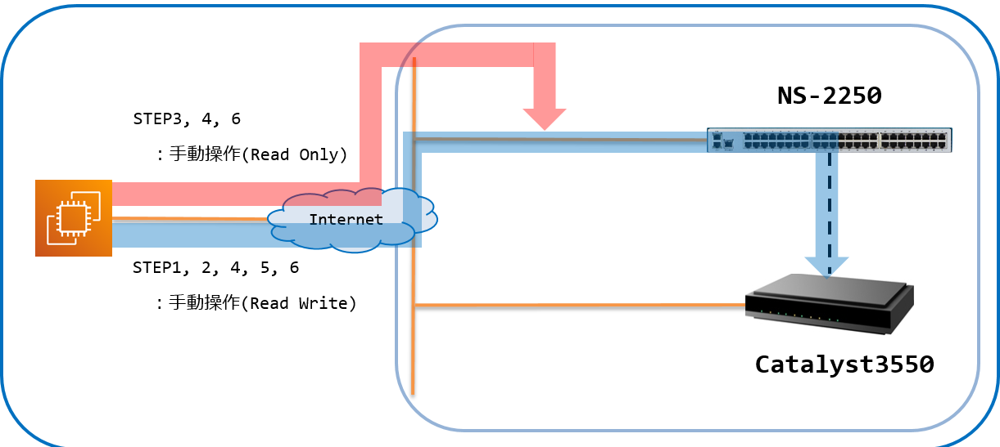
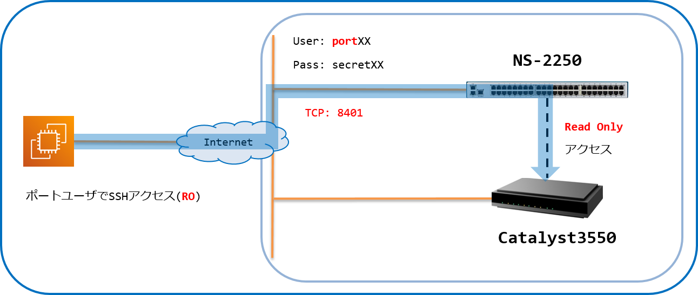

[↑目次に戻る](./README.md)
<br>
# 演習2.2　SmartCSを介したIOS装置へのコンソールアクセスを、別セッションでミラーリングする
演習2.2では、SmartCSを介したIOS装置へのコンソールアクセスに対し、別セッションでミラーリングを行います。
<br>
TeratermなどのターミナルソフトからSmartCSへの接続時に、SmartCSの各シリアルポートに割り当てられたTCPポートを指定して
アクセスするダイレクトモードを使用します。

<br>
<br>

## 目次
本演習では以下を行います。
- STEP1. SmartCSのポートサーバーへノーマルモード(RW)でログインする
- STEP2. SmartCSを介してIOS装置へログインする
- STEP3. SmartCSのポートサーバーへモニターモード(RO)でログインする
- STEP4. IOS装置に対してコマンドを実行し、ミラーリングを行う
- STEP5. IOS装置からログアウトする
- STEP6. SmartCSのシリアルセッションを終了する

<br>
<br>

## 演習構成図



<br>
<br>

## 用語解説
演習2.2で使用する、SmartCS特有の用語についての解説です。  

|用語 |解説 |
|:---|:---|
|シリアルポート |ネットワーク機器のコンソールを接続するためのSmartCS側のポートです。本日のハンズオンではIOS装置のコンソールがSmartCSのシリアルポート1,9,17,25,33に接続されています。 |
|ダイレクトモード |SmartCSを介してネットワーク機器のコンソールへアクセスするための方式の1つです。Telnet/SSHでSmartCSへアクセスする際に、SmartCSのシリアルポートに割り当てられたTCPポート番号を指定することで、ネットワーク機器のコンソールへアクセスすることができます。 |
|ノーマルモード(RW) |SmartCSを介してネットワーク機器のコンソールへアクセスする際の権限の1つです。ノーマルモードでアクセスすると、データの送信/受信をどちらも実施することが可能です。 |
|モニターモード(RO) |SmartCSを介してネットワーク機器のコンソールへアクセスする際の権限の1つです。モニターモードでアクセスすると、データの受信のみを実施することが可能です。 |
|ポートサーバー |SmartCSを介して指定されたシリアルポートへアクセスするための、SmartCS内部にあるサーバーです。 |
|ポートサーバーメニュー|SmartCSを介して指定されたシリアルポートへアクセスする際に表示されるメニューです。ポートサーバーメニューから「接続開始」等の操作を選択します。 |
|ポートユーザ |SmartCSを介して指定されたシリアルポートへアクセスする際に使用されるユーザのグループです。本日のハンズオンではポートユーザグループに所属しているportXXを使用します。 |

### STEP1. SmartCSのポートサーバーへノーマルモード(RW)でログインする
ダイレクトモード、かつノーマルモード(RW)でSmartCSのポートサーバーへ接続し、ポートユーザでログインします。  
まず、Teratermなどのターミナルソフトを使用して、SSHでSmartCSへ接続します。  
このとき、SSH、ダイレクトモード、かつノーマルモード(RW)でのアクセスなので、使用するシリアルポート(tty)に割り当てられているTCPポート(SSH RW)を指定します。  
※ユーザ#1とユーザ#6の場合は8301となります。    
※演習1.1に記載の[環境情報](./1.1-preparing_for_the_exercise.md#コンソールサーバ--smartcs-)を参考にしてTCPポート(SSH RW) 83xxというポート番号を指定してください。  

#### 演習環境


|接続先 |IP |TCPPort |Login |備考 | 
|:---|:---|:---|:---|:---|
|SmartCS |192.168.129.X |**83XX** |portXX/secretXX|ポートユーザでログイン(RW)|


認証には、ポートユーザのユーザ、パスワードを入力してログインします。  
※ユーザ#1の場合はport01/secret01となります。  
※演習1.1に記載の[環境情報](./1.1-preparing_for_the_exercise.md#コンソールサーバ--smartcs-)を参考にしてポートユーザのID/パスワードを入力してください。  
ログインに成功すると、以下のようなポートサーバーメニューが表示されます。  

```
-- RW1 ------------------------
Host  : "NS-2250_Ansible_1"
Label : "AX-2230_1"
-------------------------------
1  : display Port Log
2  : display Port Log (LAST)
3  : start tty connection
4  : close telnet/ssh session
5  : show all commands
tty-1:rw>
```

<br>
<br>

### STEP2. SmartCSを介してIOS装置へログインする
ポートサーバーメニューからシリアルセッションを開始し、IOS装置へログインを行います。
<br>
まず、<code>3  : start tty connection</code>を選択し、シリアルセッションを開始します。
<br>
続けてログインID（operator）を入力するとIOS装置にログインすることができます。
<br>

```
-- RW1 ------------------------
Host  : "NS-2250_Ansible_1"
Label : "AX-2230_1"
-------------------------------
1  : display Port Log
2  : display Port Log (LAST)
3  : start tty connection
4  : close telnet/ssh session
5  : show all commands
tty-1:rw> 3
Press "CTRL-A" to return this MENU.
Start tty connection
operator

Copyright (c) 2012-2019 ALAXALA Networks Corporation. All rights reserved.

> 
```

<br>
<br>

### STEP3. SmartCSのポートサーバーへモニターモード(RO)でログインする
STEP1のセッションを残したまま新しくターミナルを開き、ダイレクトモード、かつモニターモード(RO)でSmartCSのポートサーバーへ接続接続し、ポートユーザでログインします。  
まず、Teratermなどのターミナルソフトを使用して、SSHでSmartCSへ接続します。  
このとき、SSH、ダイレクトモード、かつモニターモード(RO)でのアクセスなので、使用するシリアルポート(tty)に割り当てられているTCPポート(SSH RO)を指定します。  
※ユーザ#1とユーザ#6の場合は8401となります。  
※演習1.1に記載の[環境情報](./1.1-preparing_for_the_exercise.md#コンソールサーバ--smartcs-)を参考にしてTCPポート(SSH RO) 84xxというポート番号を指定してください。  

#### 演習環境


|接続先 |IP |TCPPort |Login |備考 | 
|:---|:---|:---|:---|:---|
|SmartCS |192.168.129.X |**84XX** |portXX/secretXX|ポートユーザでログイン(RO)|


認証には、ポートユーザのユーザ、パスワードを入力してログインします。  
※ユーザ#1の場合はport01/secret01となります。  
※演習1.1に記載の[環境情報](./1.1-preparing_for_the_exercise.md#コンソールサーバ--smartcs-)を参考にしてポートユーザのID/パスワードを入力してください。  

ログインに成功するとシリアルセッションが開始し、以下のような内容が表示されます。  
モニターモード(RO)でアクセスしているので、Enterや文字列などの入力ができないことをご確認ください。  

```
Press "CTRL-A" to disconnect this session.
Start tty connection

```

<br>
<br>

### STEP4. IOS装置に対してコマンドを実行し、ミラーリングを行う
IOS装置にログイン後、コマンドを実行します。
<br>
ノーマルモード(RW)のセッションで<code>></code>というプロンプトが表示されたら、<code>show version</code>コマンドを実行します。
<br>
以下のような実行結果が、モニターモード(RO)のセッションでも表示されることをご確認ください。
<br>

```
> show version

Date 1980/04/10 03:41:23 UTC
Model: AX2230S-24T
S/W: OS-LT4 Ver. 2.10 (Build:01)
H/W: AX-2230-24T-B [CA022B24T000S0000C7S013:0]

> 
```

<br>
<br>

### STEP5. IOS装置からログアウトする
オペレーションが完了したら、コンソールを初期状態に戻すためにログアウトを行います。
<br>
ノーマルモード(RW)のセッションで<code>exit</code>コマンドを実行して、IOS装置からログアウトします。
<br>

```
> exit

login: 
```

<br>
<br>

### STEP6. SmartCSのシリアルセッションを終了する
ログアウト後はSmartCSを介したシリアルセッションを終了させます。
<br>
ノーマルモード(RW)のセッションでIOS装置からのログアウトが完了したら、Ctrl+Aを入力してポートサーバーメニューに戻ります。
<br>
その後、<code>4  : close telnet/ssh session</code>を選択して終了します。
<br>

```
login: 
-- RW1 ------------------------
Host  : "NS-2250_Ansible_1"
Label : "AX-2230_1"
-------------------------------
1  : display Port Log
2  : display Port Log (LAST)
3  : start tty connection
4  : close telnet/ssh session
5  : show all commands
tty-1:rw> 4
```

その後、モニターモード(RO)のセッションではCtrl+Aを入力するとターミナルが閉じ、セッションが終了します。

<br>
<br>

### 参考情報. playbook作成時にミラーリングを活用
- SmartCSを経由して動作させるplaybookを作成する際には、オペレーションが確実に実行されているかどうかをミラーリングの機能で確認することができます。
- SmartCS用のAnsibleモジュールを使用したplaybookを動作させる際には、シリアルポートに接続されている機器の出力内容を把握し、待ち文字としてplaybook内で定義する必要があります。(演習3.1 STEP1にて使用する、<code>smartcs_tty_command</code>モジュールの<code>recvchar</code>オプション)  
playbook作成の段階では、オペレーションが途中で停止してしまい対象機器から手動でログアウトさせたい場合がありますので、Ansibleによるオペレーションを実行しながらノーマルモード(RW)のセッションを別に開いておくと便利です。
- 誤操作防止のために上述の①Ansibleと②ノーマルモード(RW)のセッションは、デフォルトでは排他がかかるよう制限されています。本ハンズオンではplaybook作成時の利便性を考慮し、SmartCSの設定により排他を解除しております。


[→演習2.3 SmartCSを介したシリアルセッション情報を確認する](./2.3-checking_serial_session_information_of_smartcs.md)  
[←演習2.1 SmartCSを介してIOS装置へコンソールアクセスする](./2.1-serial_connection_to_alaxala_via_smartcs.md)  
[↑目次に戻る](./README.md)
