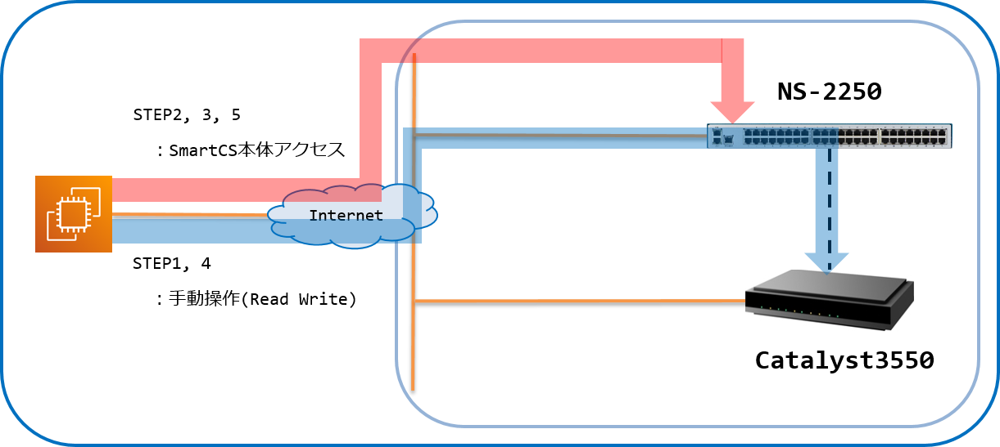
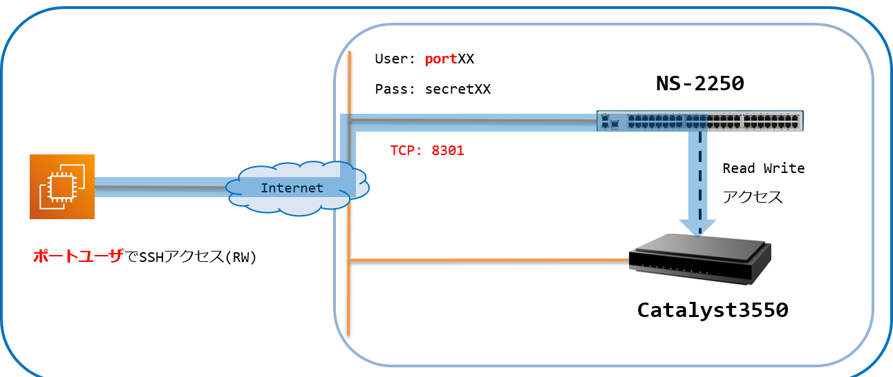
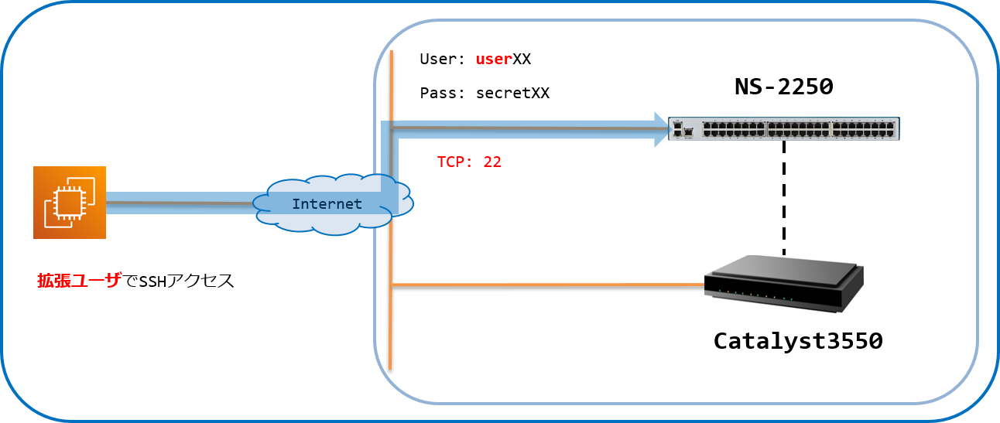

[↑目次に戻る](./README.md)
<br>
# 演習2.3　SmartCSを介したシリアルセッション情報を確認する
演習2.3では、SmartCSを介したIOS装置へのコンソールアクセスのセッション情報を確認します。
<br>
TeratermなどのターミナルソフトからSmartCSへの接続時に、SmartCSの各シリアルポートに割り当てられたTCPポートを指定して
アクセスするダイレクトモードを使用します。
<br>
<br>

## 目次
本演習では以下を行います。
- [Step 1. SmartCSのポートサーバーへノーマルモード(RW)でログインする](./2.3-checking_serial_session_information_of_smartcs.md#step-1-SmartCSのポートサーバーへノーマルモードRWでログインする)
- [Step 2. SmartCSへ本体ログインする](./2.3-checking_serial_session_information_of_smartcs.md#step-2-SmartCSへ本体ログインする)
- [Step 3. SmartCSでシリアルセッション情報を確認する](./2.3-checking_serial_session_information_of_smartcs.md#step-3-SmartCSでシリアルセッション情報を確認する)
- [Step 4. SmartCSのシリアルセッションを終了する](./2.3-checking_serial_session_information_of_smartcs.md#step-4-SmartCSのシリアルセッションを終了する)
- [Step 5. SmartCS本体からログアウトする](./2.3-checking_serial_session_information_of_smartcs.md#step-5-SmartCS本体からログアウトする)

<br>
<br>


## 演習構成図



<br>
<br>

## 用語解説
演習2.3で使用する、SmartCS特有の用語についての解説です。  

|用語 |解説 |
|:---|:---|
|シリアルポート |ネットワーク機器のコンソールを接続するためのSmartCS側のポートです。本日のハンズオンではIOS装置のコンソールがSmartCSのシリアルポート1~10に接続されています。 |
|ダイレクトモード |SmartCSを介してネットワーク機器のコンソールへアクセスするための方式の1つです。Telnet/SSHでSmartCSへアクセスする際に、SmartCSのシリアルポートに割り当てられたTCPポート番号を指定することで、ネットワーク機器のコンソールへアクセスすることができます。 |
|ノーマルモード(RW) |SmartCSを介してネットワーク機器のコンソールへアクセスする際の権限の1つです。ノーマルモードでアクセスすると、データの送信/受信をどちらも実施することが可能です。 |
|ポートサーバー |SmartCSを介して指定されたシリアルポートへアクセスするための、SmartCS内部にあるサーバーです。 |
|ポートサーバーメニュー|SmartCSを介して指定されたシリアルポートへアクセスする際に表示されるメニューです。ポートサーバーメニューから「接続開始」等の操作を選択します。 |
|ポートユーザ |SmartCSを介して指定されたシリアルポートへアクセスする際に使用されるユーザのグループです。本日のハンズオンではポートユーザグループに所属しているportXXを使用します。 |
|拡張ユーザ |SmartCS本体へアクセスし情報取得などを実行可能で、かつAnsibleと連携して指定されたシリアルポートへアクセスする際に使用されるユーザのグループです。本日のハンズオンでは拡張ユーザグループに所属しているuserXXを使用します。 |

### Step 1. SmartCSのポートサーバーへノーマルモード(RW)でログインする
ダイレクトモード、かつノーマルモード(RW)でSmartCSのポートサーバーへ接続し、ポートユーザでログインします。  
まず、Teratermなどのターミナルソフトを使用して、SSHでAnsibleホストへ接続します。  
その後、AnsibleホストのSSHクライアントでSmartCSへ接続します。  
このとき、SSH、ダイレクトモード、かつノーマルモード(RW)でのアクセスなので、使用するシリアルポート(tty)に割り当てられているTCPポート(SSH RW)を指定します。  
※ユーザ#1の場合は8301となります。    
※演習1.1に記載の[環境情報](./1.1-preparing_for_the_exercise.md#コンソールサーバ--smartcs-)を参考にしてTCPポート(SSH RW) 83xxというポート番号を指定してください。  

#### 演習環境


|接続先 |IP |TCPPort |Login |備考 | 
|:---|:---|:---|:---|:---|
|SmartCS |192.168.129.X (ホスト名"smartcs"で指定可) |**83XX** |portXX/secretXX|ポートユーザでログイン|

AnsibleホストのSSHコマンドで、TCP Port: 83XXを指定してSmartCSへSSH接続します。  
※ユーザ#1の場合はTCP Port: 8301となります。  

認証には、ポートユーザのユーザ、パスワードを入力してログインします。  
※ユーザ#1の場合はport01/secret01となります。  
※演習1.1に記載の[環境情報](./1.1-preparing_for_the_exercise.md#コンソールサーバ--smartcs-)を参考にしてポートユーザのID/パスワードを入力してください。  

```
[ec2-user@ip-172-26-10-114 ~]$ ssh portXX@smartcs -p 83XX
Console Server Authentication.
portXX@smartcs's password:
```

ログインに成功すると、以下のようなポートサーバーメニューが表示されます。  

```
-- RW1 ------------------------
Host  : "NS-2250_Ansible_X"
Label : "cat3550_X"
-------------------------------
1  : display Port Log
2  : display Port Log (LAST)
3  : start tty connection
4  : close telnet/ssh session
5  : show all commands
tty-X:rw>
```

<br>
<br>

### Step 2. SmartCSへ本体ログインする
STEP1のセッションを残したまま新しくターミナルを開き、SmartCSへ本体アクセスして拡張ユーザでログインを行います。  
まず、Teratermなどのターミナルソフトを使用して、SSHでAnsibleホストへ接続します。  
その後、AnsibleホストのSSHクライアントでSmartCSへ接続します。  
今回接続時に指定するTCPポート番号は22です。  

#### 演習環境


|接続先 |IP |TCPPort |Login |備考 | 
|:---|:---|:---|:---|:---|
|SmartCS |192.168.129.X (ホスト名"smartcs"で指定可) |**22** |userXX/secretXX|拡張ユーザでログイン|

AnsibleホストのSSHコマンドでSmartCSへSSH接続します。  
※全ユーザ共通でTCP Port: 22となりますので、<code>-p</code>オプションの指定は不要です。  

認証には、拡張ユーザのID/パスワードを入力してログインします。  
※ユーザ#1の場合はuser01/secret01となります。  
※演習1.1に記載の[環境情報](./1.1-preparing_for_the_exercise.md#コンソールサーバ--smartcs-)を参考にして拡張ユーザのID/パスワードを入力してください。  

```
[ec2-user@ip-172-26-10-114 ~]$ ssh userXX@smartcs
Console Server Authentication.
userXX@smartcs's password:
```

ログインに成功すると、<code>(X)NS-2250_Ansible_X> </code>というプロンプトが表示されます。  
※SmartCSのプロンプト先頭の括弧内の数字は固定ではなく、変動する可能性があります。（接続のたびに空いている番号から割り振られます。）

<br>
<br>

### Step 3. SmartCSでシリアルセッション情報を確認する
SmartCSへ本体ログイン後、シリアルセッション情報の確認を行います。  
<code>(X)NS-2250_Ansible_X> </code>というプロンプトが表示されたら、<code>show portd session</code>コマンドを実行します。  
※SmartCSのプロンプト先頭の括弧内の数字は固定ではなく、変動する可能性があります。（接続のたびに空いている番号から割り振られます。）

```
(X)NS-2250_Ansible_X# show portd session
telnet rw :   0   ro :   0
ssh    rw :   X   ro :   0
available session ( telnet only : 95 / ssh only : 95 )
---------------------------------------------------------------------------
tty    : Label                                      Session-Limit
   Type Login-User       Local     Remote
---------------------------------------------------------------------------
tty  X : cat3550_X                                  RW: 2 / RO: 3
   rw 1 portXX           ssh:83XX  XXX.XXX.XXX.XXX:XXXXX

(X)NS-2250_Ansible_X#
```

<br>
<br>

### Step 4. SmartCSのシリアルセッションを終了する
SmartCSを介したシリアルセッションを終了させます。  
STEP1で表示させたポートサーバーメニューで、<code>4  : close telnet/ssh session</code>を選択して終了します。  

```
Switch>
-- RW1 ------------------------
Host  : "NS-2250_Ansible_X"
Label : "cat3550_X"
-------------------------------
1  : display Port Log
2  : display Port Log (LAST)
3  : start tty connection
4  : close telnet/ssh session
5  : show all commands
tty-X:rw> 4
```

ポートサーバーメニューが終了したら、STEP3と同様の手順でシリアルセッション情報が削除されたことをご確認ください。  

<br>
<br>

### Step 5. SmartCS本体からログアウトする
SmartCS本体からログアウトを行います。  
<code>(X)NS-2250_Ansible_X> </code>というプロンプトの状態で、<code>exit</code>コマンドを実行します。  

```
(X)NS-2250_Ansible_X> exit
```

<br>
<br>

### 参考情報1. ユーザ権限
演習2.3のSTEP2、および演習3以降でSmartCS用のAnsibleモジュールを使用したplaybookで指定するユーザは、「拡張ユーザ」グループのユーザです。  
拡張ユーザはAnsibleなどのツールと連携するttyマネージ機能を利用するためのユーザです。  
STEP2、STEP3のようにSmartCSへ本体ログインして一部の情報取得コマンドは実行可能ですが、設定情報の取得や設定変更は実施できません。  
設定情報の取得や設定変更を実行する場合、<code>su</code>コマンドで装置管理ユーザに移行する必要があります。  

- 一般ユーザ：SmartCSへ本体ログインし、設定情報の取得、および設定変更を除くコマンド実行が可能なユーザ
- 装置管理ユーザ：一般ユーザや拡張ユーザから<code>su</code>コマンドで移行し、設定情報の取得、および設定変更を含む全てのコマンド実行が可能なユーザ
- ポートユーザ：SmartCSのポートサーバーへアクセスし、シリアルポートに接続された装置へアクセスするためのユーザ
- 拡張ユーザ：一般ユーザの権限に加え、Ansibleと連携してシリアルポートに接続された装置へアクセス可能なユーザ

<br>
<br>

### 参考情報2. 情報取得コマンド
STEP3のように、SmartCSでは様々な情報取得用コマンドをサポートしています。  
SmartCSを介したシリアル通信に関連するコマンドとして、下記コマンドがよく実行されます。  

- <code>show tty <ttylist></code>：ボーレート/データビット長/パリティなどのシリアルポート設定情報を表示します。
- <code>show portd tty</code>：アクセスモード(ダイレクト/セレクト)/TCPポート番号などのポートサーバ設定情報を表示します。
- <code>show stats tty <ttylist></code>：送受信/エラーなどのシリアルポート統計情報を表示します。

上述のコマンド以外にも情報取得用コマンドがありますので、<code>(X)NS-2250_Ansible_X> </code>というプロンプトの状態でタブキーの入力や、<code>?</code>を実行して入力可能なコマンドをご確認ください。


[→演習3.1 IOS装置にSmartCS経由で初期設定を行う](./3.1-initial_setup_the_ios_device_via_smartcs.md)  
[←演習2.2 SmartCSを介したIOS装置へのコンソールアクセスを、別セッションでミラーリングする](./2.2-mirroring_operation_of_smartcs.md)  
[↑目次に戻る](./README.md)
