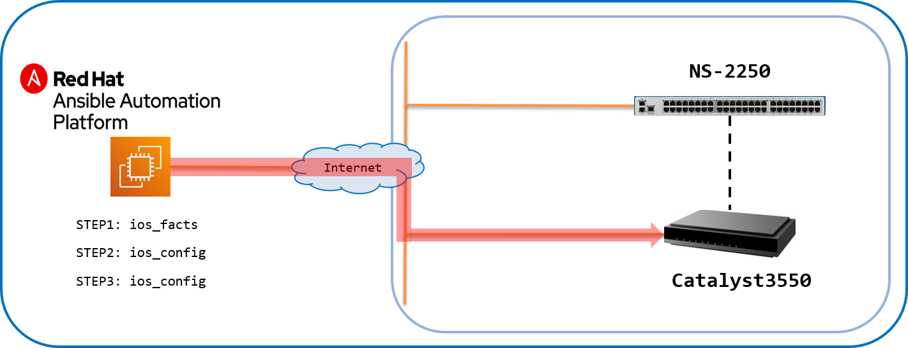
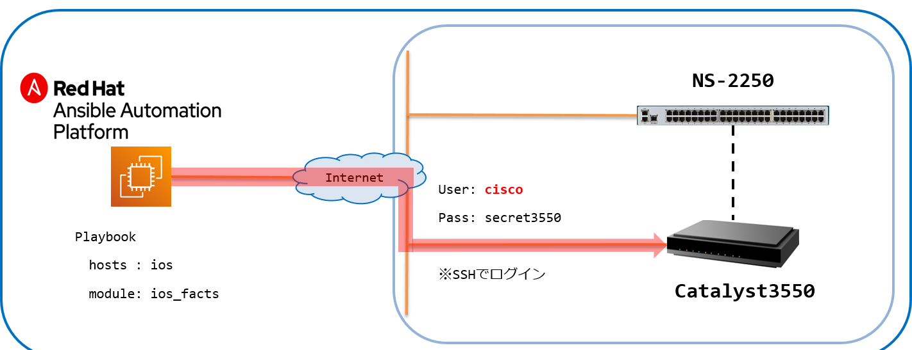
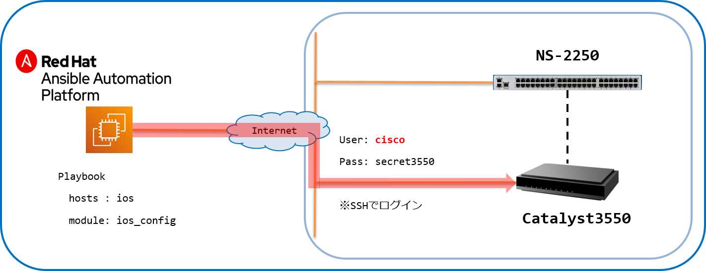

[↑目次に戻る](./README.md)
<br>
# 演習3.2　IOS装置に追加設定を行う

演習3.2では、IOS装置への追加設定をSmartCSを介さずにAnsibleから直接行っていきます。<br>
これらの操作を通して、ベンダーモジュール(ios_facts、ios_config)やAnsibleの一般的なモジュール(loop)の<br>
基本的な使い方について理解を深めましょう。

## 目次
本演習では以下を行います。 
- [Step 1. <code>ios_facts</code>を使って、IOS装置にAnsibleからアクセスできる事の確認を行う](./3.2-additional_setup_the_ios_device.md#step-1-ios_factsを使ってIOS装置にAnsibleからアクセスできる事の確認を行う)
- [Step 2. <code>ios_config</code>を使って、IOS装置にVLANの設定を行う](./3.2-additional_setup_the_ios_device.md#step-2-ios_configを使ってIOS装置にVLANの設定を行う)
- [Step 3. <code>ios_config</code>と<code>loop</code>を使って、IOS装置に各種サーバの設定を行う（NTP、SNMP、SYSLOG）](./3.2-additional_setup_the_ios_device.md#step-3-ios_configとloopを使ってIOS装置に各種サーバの設定を行うNTPSNMPSYSLOG)
<br>
<br>

## 演習構成図



<br>
<br>

### Step 1. <code>ios_facts</code>を使って、IOS装置にAnsibleからアクセスできる事の確認を行う

演習3.1でAnsibleからリーチ可能となったIOS機器に対して、<code>ios_facts</code>を使って接続確認を行います。


<br>

■演習環境



<br>
接続確認を行うPlaybookを作成していきます。<br>
次のコマンドを実施し、ファイルを作成しましょう。<br>

```bash
$ vi ios_facts.yml
```
実行すると、ios_facts.ymlというファイルが作成され、エディタ画面が表示されます。<br>
次に、**iキー**を押して **Insertモード** (挿入モード)に変更してください。<br>
モードが変更されたこと確認し(左下にモード名が表示されます)、下記の内容をエディタで記載してください。<br>
> 今回は、コピー＆ペーストでの実施をお勧めします。<br>

■Playbook(ios_facts.yml)
```yaml
---
- name: gathering ios information
  hosts: ios
  gather_facts: no

  tasks:
  - name: ios_facts all
    cisco.ios.ios_facts:
      gather_subset: all
```
入力が終わったら、[esc]キーを押して、Insertモードから抜けてください。<br>
モードが変更されたことを確認し、:wq と入力して（左下に:wqと表示されます。）、[Enter]キーを押してください。<br>
以上で、ファイルを保存し、エディターを終了します。<br>

■Playbook内容の説明  

◇<code>name: ios_facts all</code>

- ios_facts:  
IOS装置の情報を収集する為のモジュールとして<code>ios_facts</code>を利用します。
- gather_subset: all  
オプションに<code>all</code>を指定し、全ての情報を収集します。


■実行例  
```
$ ansible-playbook ios_facts.yml 
```

■実行結果例
```
PLAY [gathering ios information] *************************************************************************

TASK [ios_facts all] *************************************************************************************
ok: [ios]

PLAY RECAP ***********************************************************************************************
ios                        : ok=1    changed=0    unreachable=0    failed=0    skipped=0    rescued=0    ignored=0  
```
Playbookが実行され、演習3.1で初期設定を行ったIOS装置にアクセスする事ができました。  

より詳細な情報を表示して実行する場合、<code>-v</code>オプションを付与する事でコマンド実行後に取得した情報を表示させる事が可能です。

■実行例  
```
$ ansible-playbook -vvv ios_facts.yml 
```

■実行結果例
```
~一部抜粋~
        "ansible_net_model": "WS-C3550-24",
        "ansible_net_neighbors": {},
        "ansible_net_python_version": "3.7.9",
        "ansible_net_serialnum": "CAT0652X0GY",
        "ansible_net_system": "ios",
        "ansible_net_version": "12.2(44)SE6",
        "ansible_network_resources": {}
```

<br>
<br>

### Step 2. <code>ios_config</code>を使って、IOS装置にVLANの設定を行う  

次は<code>ios_config</code>を使って追加の設定を行います。
設定する内容は以下となります。
- インターフェース0/2にVLAN設定を行う。  

<br>

■演習環境



<br>
上記を設定するPlaybookを作成していきます。
次のコマンドを実施し、ファイルを作成しましょう。<br>

```bash
$ vi add_vlan.yml
```
実行すると、add_vlan.ymlというファイルが作成され、エディタ画面が表示されます。<br>
次に、**iキー**を押して **Insertモード** (挿入モード)に変更してください。<br>
モードが変更されたこと確認し(左下にモード名が表示されます)、下記の内容をエディタで記載してください。<br>
> 今回は、コピー＆ペーストでの実施をお勧めします。<br>

■Playbook(add_vlan.yml)  
```yaml
---
- name: add vlan for ios config
  hosts: ios
  gather_facts: no

  vars:
  - ansible_command_timeout: 60

  - vid: '2000'
  - ipaddr: '192.168.0.1'
  - netmask: '255.255.255.0'
  - portif : '0/2'

  tasks:
  - name: configure vlan
    cisco.ios.ios_config:
      lines:
      - vlan {{ vid }}

  - name: configure interface vlan <vid>
    cisco.ios.ios_config:
      lines:
      - ip address {{ ipaddr }} {{ netmask }}
      parents: interface vlan {{ vid }}

  - name: vlan configuration to port
    cisco.ios.ios_config:
      lines:
      - switchport mode trunk
      - switchport trunk allowed vlan add {{ vid }}
      parents: interface GigabitEthernet {{ portif }}
      save_when: modified
```
入力が終わったら、[esc]キーを押して、Insertモードから抜けてください。<br>
モードが変更されたことを確認し、:wq と入力して（左下に:wqと表示されます。）、[Enter]キーを押してください。<br>
以上で、ファイルを保存し、エディターを終了します。<br>

■Playbook内容の説明

◇<code>name: configure vlan</code>

- ios_config:  
IOS装置のコンフィグレーションを設定する為のモジュールとして<code>ios_config</code>を利用します。

- lines:  
vlan {{ vid }}  
VLAN設定のコンフィグレーションリストを設定しています。  
VLAN番号はvarsで定義した変数(vid)を参照しています。  
<br>

◇<code>name: configure interface vlan <vid></code>
  
- lines:  
ip address {{ ipaddr }} {{ netmask }}  
ネットワーク装置にIPアドレスとサブネットマスクを設定しています。  
ipaddrとnetmaskはvarsで定義した変数(ipaddr, netmask)を参照しています。  

- parents: "interface vlan {{ vid }}"  
linesオプションで設定したコンフィグレーションリストを設定する階層のリストを設定します。  
IPアドレスとサブネットマスクを設定する階層として、interface vlan {{ vid }}を設定しています。  
VLAN番号はvarsで定義した変数(vid)を参照しています。  
<br>

◇<code>name: vlan configuration to port</code>

- lines:  
switchport mode trunk  
インタフェースをトランクモードに設定しています。  
switchport trunk allowed vlan add {{ vid }}  
トランクポートにVLANを追加しています。  
追加するVLANのVLAN番号はvarsで定義した変数(vid)を参照しています。  

- parents: interface gigabitethernet {{ portif }}  
トランクモードの設定やVLANを追加する階層として、interface gigabitethernet {{ portif }}を指定しています。  
ポート番号はvarsで定義した変数(portif)参照しています。  

- save_when: modified  
コンフィグレーションの保存方式を指定するオプションです。  
modifiedを指定した場合、ランニングコンフィグとスタートアップコンフィグを比較して差分があるときにコンフィグレーションを保存します。  


■実行例  
```
$ ansible-playbook add_vlan.yml
```


■実行結果例  
```
PLAY [add vlan] *******************************************************************************************************************************

TASK [configure vlan] *************************************************************************************************************************
changed: [ios]

TASK [configure interface vlan <vid>] *********************************************************************************************************
changed: [ios]

TASK [vlan configuration to port] *************************************************************************************************************
changed: [ios]

PLAY RECAP ************************************************************************************************************************************
ios                         : ok=3    changed=3    unreachable=0    failed=0    skipped=0    rescued=0    ignored=0   

$ 
```
VLANの設定を行うことができました。


<br>
<br>


### Step 3. <code>ios_config</code>と<code>loop</code>を使って、IOS装置に各種サーバの設定を行う（NTP、SNMP、SYSLOG）  

次は<code>ios_config</code>と<code>loop</code>利用して追加の設定を行います。  
CLIの中で、一部の値（サーバIPなど）のみ異なる設定を複数投入する場合などに有効な手法となります。  
設定する内容は以下となります。
- ホスト名の設定
- NTPサーバの設定  
- SNMPサーバの設定  
- SYSLOGサーバの設定

<br>

■演習環境


<br>


NTPサーバ、SNMPサーバ、SYSLOGサーバの設定について、設定項目のパラメータを定義した変数ファイルを利用します。  
演習3の作業を実施している<code>exercise_3</code>ディレクトリに、<code>host_vars</code>ディレクトリを作成し、IOS装置が所属するグループ名の共通変数ファイルとして<code>ios.yml</code>という設定ファイルを作成します。  
次のコマンドを実施し、ファイルを作成しましょう。<br>
  
```
$ mkdir host_vars
$ cd host_vars
$ vi ios.yml
```
実行すると、ios.ymlというファイルが作成され、エディタ画面が表示されます。<br>
次に、**iキー**を押して **Insertモード** (挿入モード)に変更してください。<br>
モードが変更されたこと確認し(左下にモード名が表示されます)、下記の内容をエディタで記載してください。<br>
> 今回は、コピー＆ペーストでの実施をお勧めします。<br>
  
■グループ変数ファイル(ios.yml)
```
---
ntp:
  server:
    - 192.168.127.2
    - 192.168.127.3

snmp:
  community:
    - name: public
      auth: ro
    - name: secret
      auth: rw

syslog:
  server:
    - 192.168.127.2
    - 192.168.127.3
```
入力が終わったら、[esc]キーを押して、Insertモードから抜けてください。<br>
モードが変更されたことを確認し、:wq と入力して（左下に:wqと表示されます。）、[Enter]キーを押してください。<br>
以上で、ファイルを保存し、エディターを終了します。<br>

<code>host_vars/ios.yml</code>を利用し、各種サーバを設定するPlaybookは以下の内容となります。  
<code>exercise_3</code>ディレクトリに戻り、Playbookを作成して実行します。  
  
次のコマンドを実施し、ファイルを作成しましょう。<br>

```bash
$ vi add_config.yml
```
実行すると、add_config.ymlというファイルが作成され、エディタ画面が表示されます。<br>
次に、**iキー**を押して **Insertモード** (挿入モード)に変更してください。<br>
モードが変更されたこと確認し(左下にモード名が表示されます)、下記の内容をエディタで記載してください。<br>
> 今回は、コピー＆ペーストでの実施をお勧めします。<br>
  
■Playbook(add_config.yml)  
```yaml
---
- name: add hostname and server(ntp, snmp, syslog)
  hosts: ios
  gather_facts: no

  tasks:
  - name: configure hostname
    ios_config:
      lines:
        - hostname Cat3550
      save_when: changed

  - name: configure ntp server
    ios_config:
      lines:
        - ntp server {{ item }}
      save_when: changed
    loop: '{{ ntp.server }}'

  - name: configure snmp community
    ios_config:
      lines:
        - snmp-server community {{ item.name }} {{ item.auth }}
      save_when: changed
    loop: '{{ snmp.community }}'

  - name: configure syslog server
    ios_config:
      lines:
        - logging host {{ item }}
      save_when: changed
    loop: '{{ syslog.server }}'
```
入力が終わったら、[esc]キーを押して、Insertモードから抜けてください。<br>
モードが変更されたことを確認し、:wq と入力して（左下に:wqと表示されます。）、[Enter]キーを押してください。<br>
以上で、ファイルを保存し、エディターを終了します。<br>
  
■Playbook内容の説明  
- loop:  
<code>host_vars/ios.yml</code>で定義した内容の中で定義した、ループ処理する要素を指定します。  

- save_when: changed  
Playbookの実行前後で、コンフィグに差分がある場合 設定を保存します。

■実行例  
```
$ ansible-playbook add_config.yml
```

■実行結果例    
```
PLAY [add hostname and server(ntp, snmp, syslog)] **********************************************

TASK [configure hostname] **********************************************************************
changed: [ios]

TASK [configure ntp server] ********************************************************************
changed: [ios] => (item=192.168.127.2)
changed: [ios] => (item=192.168.127.3)

TASK [configure snmp community] ****************************************************************
changed: [ios] => (item={'name': 'public', 'auth': 'ro'})
changed: [ios] => (item={'name': 'secret', 'auth': 'rw'})

TASK [configure syslog server] *****************************************************************
changed: [ios] => (item=192.168.127.2)
changed: [ios] => (item=192.168.127.3)

PLAY RECAP *************************************************************************************
ios                        : ok=4    changed=4    unreachable=0    failed=0    skipped=0    rescued=0    ignored=0   
```
ホスト名と各サーバの設定を行うことができました。  

<br>
<br>

#### 参考：グループ変数を使わず、Playbook内にvarsで定義する場合  

STEP3のPlaybookは、<code>host_vars/ios.yml</code>に設定する内容を記載していますが、１つのPlaybookにまとめる事もできます。  
その場合、varsに以下の変数を記載します。
```
  vars: 
  - ntp:
      server:
        - 192.168.127.2
        - 192.168.127.3
  - snmp:
      community:
        - name: public
          auth: ro
        - name: secret
          auth: rw
  - syslog:
      server:
        - 192.168.127.2
        - 192.168.127.3
```

1つのPlaybookに変数をまとめる事も上記のように定義する事で可能となります。  
ただできればSTEP3のように変数定義のファイルを分けておく方が、各パラメータに変更が発生した際にPlaybookの修正量が少なくなります。  

<br>
<br>

[→演習3.3 IOS装置の設定情報を取得する](./3.3-get_ios_device_information.md)    
[←演習3.1 IOS装置にSmartCS経由で初期設定を行う](./3.1-initial_setup_the_ios_device_via_smartcs.md)    
[↑目次に戻る](./README.md)  

