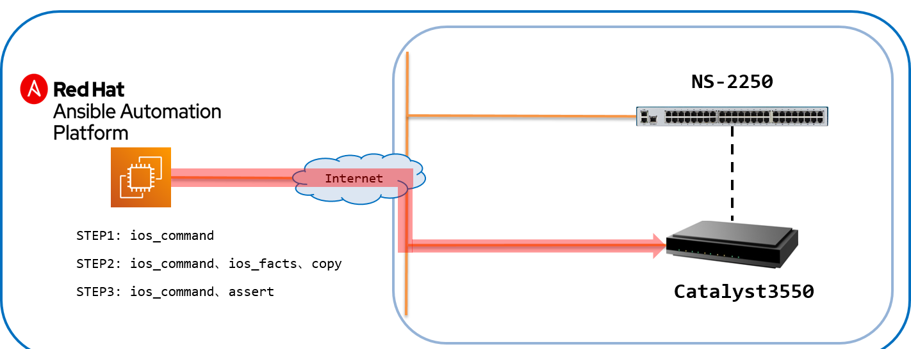
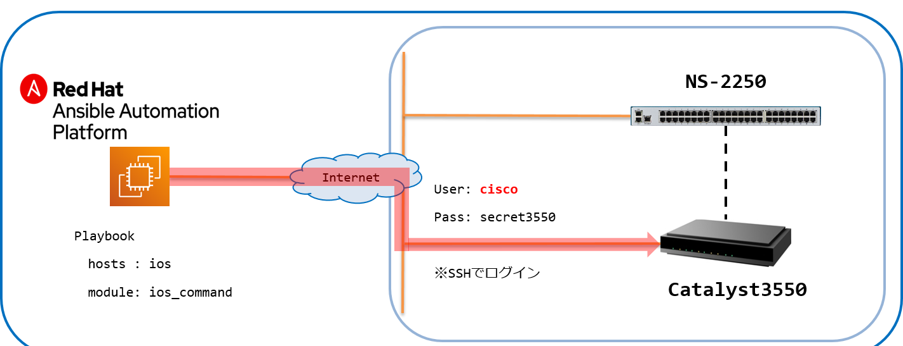
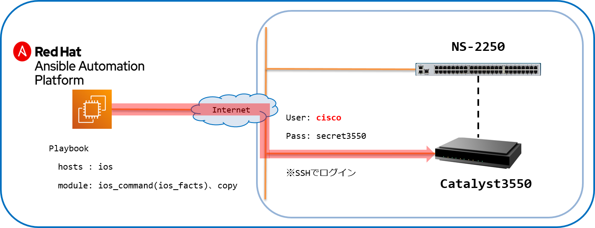
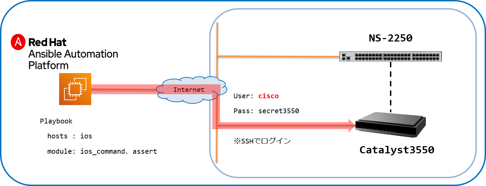

[↑目次に戻る](./README.md)
<br>
# 演習3.3　IOS装置の設定情報を取得する

## 目次
本演習では以下を行います。 
- [Step 1. <code>ios_command</code>を使ってIOS装置の設定情報を取得する](./3.3-get_ios_device_information.md#step-1-ios_commandを使ってIOS装置の設定情報を取得する)
- [Step 2. <code>copy</code>モジュールを利用して取得した情報をファイルとして保存する](./3.3-get_ios_device_information.md#step-2-copyモジュールを利用して取得した情報をファイルとして保存する)
- [Step 3. <code>assert</code>モジュールを利用した情報の確認](./3.3-get_ios_device_information.md#step-3-assertモジュールを利用した情報の確認)

<br>
<br>

## 演習構成図



<br>
<br>

### Step 1. <code>ios_command</code>を使ってIOS装置の設定情報を取得する

演習3.2で設定した情報を<code>ios_command</code>を使って取得します。
設定情報を取得するPlaybookは以下の内容となります。

■演習環境



<br>
次のコマンドを実施し、ファイルを作成しましょう。<br>

```bash
$ vi ios_commands.yml
```
実行すると、ios_commands.ymlというファイルが作成され、エディタ画面が表示されます。<br>
次に、**iキー**を押して **Insertモード** (挿入モード)に変更してください。<br>
モードが変更されたこと確認し(左下にモード名が表示されます)、下記の内容をエディタで記載してください。<br>
> 今回は、コピー＆ペーストでの実施をお勧めします。<br>

■Playbook(ios_commands.yml)
```yaml
---
- name: ios show commands
  hosts: ios
  gather_facts: no

  vars:
  - ansible_command_timeout: 60

  tasks:
  - name: execute show commands
    cisco.ios.ios_command:
      commands:
        - show version
        - show interfaces gigabitethernet 0/1
        - show ip interface
        - show port
        - show vlan 
        - show running-config
```
入力が終わったら、[esc]キーを押して、Insertモードから抜けてください。<br>
モードが変更されたことを確認し、:wq と入力して（左下に:wqと表示されます。）、[Enter]キーを押してください。<br>
以上で、ファイルを保存し、エディターを終了します。<br>

■Playbook内容の説明

◇<code>name: execute show commands</code>

- ios_command:  
IOS装置でコマンドを実行し、その結果を取得する為のモジュールとなります。

- commands:  
実行するコマンドをリスト形式で指定します。


■実行例  
```
$ ansible-playbook ios_commands.yml -vvv
```
実行結果を詳細に表示する為、`-vvv`オプションを付与します。


■実行結果例  
```
PLAYBOOK: ios_commands.yml ******************************************************************************
1 plays in ios_commands.yml

PLAY [ios show commands] ********************************************************************************
META: ran handlers

TASK [execute show commands] ****************************************************************************

～抜粋～

    "stdout_lines": [
        [
            "Cisco IOS Software, C3550 Software (C3550-IPSERVICESK9-M), Version 12.2(44)SE, RELEASE SOFTWARE (fc1)",
            "Copyright (c) 1986-2008 by Cisco Systems, Inc.",
            "Compiled Sat 05-Jan-08 01:02 by weiliu",
            "Image text-base: 0x00003000, data-base: 0x012A10A8",
            "",

～抜粋～
PLAY RECAP **********************************************************************************************
ios                         : ok=1    changed=0    unreachable=0    failed=0    skipped=0    rescued=0    ignored=0  
```
commandsで指定したCLIが実行され、その結果が取得できました。

<br>
<br>

### Step 2. `copy`モジュールを利用して取得した情報をファイルとして保存する

STEP1で実行したコマンド結果について、<code>copy</code>モジュールを利用してローカルにファイルとして保存します。  
<code>commands</code>で指定しているコマンドの中で、<code>show running-config</code>の実行結果を保存してみます。  

STEP1で作成した<code>ios_commands.yml</code>に一部追記した、下記のPlaybookを作成します。  

<br>

■演習環境



<br>
次のコマンドを実施し、ファイルを作成しましょう。<br>

```bash
$ vi save_show-commands.yml
```
実行すると、save_show-commands.ymlというファイルが作成され、エディタ画面が表示されます。<br>
次に、**iキー**を押して **Insertモード** (挿入モード)に変更してください。<br>
モードが変更されたこと確認し(左下にモード名が表示されます)、下記の内容をエディタで記載してください。<br>
> 今回は、コピー＆ペーストでの実施をお勧めします。<br>
■Playbook(save_show-commands.yml)
```yaml
---
- name: ios show commands
  hosts: ios
  gather_facts: no

  vars:
  - ansible_command_timeout: 60

  tasks:
  - name: execute show commands
    cisco.ios.ios_command:
      commands:
        - show version
        - show interfaces gigabitethernet 0/1
        - show ip interface
        - show port
        - show vlan
        - show running-config
    register: result
  
  - name: save to localfile
    copy:
      content:  "{{ result.stdout_lines[5] | join('\n') }}"
      dest: ./ios_commands.txt
```
入力が終わったら、[esc]キーを押して、Insertモードから抜けてください。<br>
モードが変更されたことを確認し、:wq と入力して（左下に:wqと表示されます。）、[Enter]キーを押してください。<br>
以上で、ファイルを保存し、エディターを終了します。<br>

■Playbook内容の説明

◇`name: execute show commands`
- regiseter: result  
ios_commandモジュールで指定した各コマンドの実行結果を、resultという変数に格納します。  

◇`name: save to localfile`
- [copy](https://docs.ansible.com/ansible/2.8/modules/copy_module.html)  
ファイルのコピーを行うモジュールとなります。
- content  
ファイル内容を指定します。  
`show running-config`を指定する為、Playbook実行結果として格納される`stdout_lines[8]`を指定します。
- dest  
コピー先（保存先）のファイル名を指定します。


■実行例
```
$ ansible-playbook save_show-commands.yml 
```

■実行結果例
```
PLAY [save show commands output to localfile] ******************************************************************

TASK [execute show commands] ***********************************************************************************
ok: [ios]

TASK [save to localfile] ***************************************************************************************
changed: [ios]

PLAY RECAP *****************************************************************************************************
ax                         : ok=2    changed=1    unreachable=0    failed=0    skipped=0    rescued=0    ignored=0   
```

`dest`で指定した出力先に、コマンドの実行結果が格納されている事を確認します。
```
$ cat ios_commands.txt
Building configuration...

Current configuration : 4528 bytes
!
version 12.2
no service pad
service timestamps debug datetime msec
service timestamps log datetime msec
service password-encryption
!
 ～抜粋～
!
line con 0
line vty 0 4
 password 7 1511021F0725
 login local
 transport input ssh
line vty 5 15
 password 7 14141B180F0B
 login local
 transport input ssh
!
```

#### 参考：コンフィグ情報の保存

STEP2の演習で行った通り、`copy`モジュールを使う事でAnsible経由で取得した情報をローカルにファイルとして保存する事ができます。  
ほぼ同様の手順となりますが、`show running-config`の情報を時刻付きのファイル名で保存する方法を参考として以下に記載します。
<br>
STEP2で作成した<code>save_show-commands.yml</code>のtasksを書き換えた、下記のPlaybookを作成します。  
次のコマンドを実施し、ファイルを作成しましょう。<br>

```bash
$ vi save_running-config.yml
```
実行すると、save_running-config.ymlというファイルが作成され、エディタ画面が表示されます。<br>
次に、**iキー**を押して **Insertモード** (挿入モード)に変更してください。<br>
モードが変更されたこと確認し(左下にモード名が表示されます)、下記の内容をエディタで記載してください。<br>
> 今回は、コピー＆ペーストでの実施をお勧めします。<br>
> 
■Playbook(save_running-config.yml)
```yaml
---
- name: ios show commands
  hosts: ios
  gather_facts: no

  vars:
  - ansible_command_timeout: 60
  
  tasks:
  - name: gather ios facts all
    cisco.ios.ios_facts:
      gather_subset: all
  
  - name: save running-config to localfile
    copy:
      content:  "{{ ansible_net_config }}"
      dest: "./config_{{ ansible_net_hostname }}_{{ now(False, '%Y%m%d_%H%M%S') }}.txt"
```
入力が終わったら、[esc]キーを押して、Insertモードから抜けてください。<br>
モードが変更されたことを確認し、:wq と入力して（左下に:wqと表示されます。）、[Enter]キーを押してください。<br>
以上で、ファイルを保存し、エディターを終了します。<br>

■Playbook内容の説明

◇`name: gather ios facts all`
- gather_subset: all  
オプションに<code>all</code>を指定し、全ての情報を収集します。

◇`name: save running-config to localfile`
- content:  "{{ ansible_net_config }}"  
ファイル内容として、`ios_facts`で取得できる`ansible_net_config`を指定します。
- dest: './config_{{ ansible_net_hostname }}_{{ now(False, "%Y%m%d_%H%M%S") }}.txt'  
コピー先のファイル名として、  
`ansible_net_hostname`でホスト名を指定し、  
`now(False, "%Y%m%d_%H%M%S")`で現在の時刻情報を指定しています。


■Playbook実行後

Playbookを実行したディレクトリに、`config_<axのホスト名>_時刻情報.txt`というファイルができています。  
catコマンドなどで内容を確認して下さい。
```
$ ls -l
～抜粋～
-rw-rw-r-- 1 ec2-user ec2-user  4526 Jun 11 04:19 config_Cat3550_20210611_041927.txt
$
$ cat config_Cat3550_20210611_041927.txt
```

<br>
<br>

### Step 3. <code>assert</code>モジュールを利用した情報の確認

最後に、`ios_command`で取得したコマンド実行結果について、期待した値が含まれているかどうかを`assert`モジュールを使って確認する演習を行います。  
`show version`コマンドの実行結果内に、期待する文字列`2.9`が含まれているかを確認します。

<br>

■演習環境



<br>
次のコマンドを実施し、ファイルを作成しましょう。<br>

```bash
$ vi version_check.yml
```
実行すると、version_check.ymlというファイルが作成され、エディタ画面が表示されます。<br>
次に、**iキー**を押して **Insertモード** (挿入モード)に変更してください。<br>
モードが変更されたこと確認し(左下にモード名が表示されます)、下記の内容をエディタで記載してください。<br>
> 今回は、コピー＆ペーストでの実施をお勧めします。<br>

■Playbook(version_check.yml)
```yaml
---
- name: checking s/w version using assert
  hosts: ios
  gather_facts: no

  vars:
  - os_version: "12.2"

  tasks:
  - name: execute show commands
    cisco.ios.ios_command:
      commands:
        - show version
    register: result
  
  - name: check s/w version
    assert:
      that: "'{{ os_version }}' in '{{ result.stdout_lines[0][0] }}'"
      fail_msg: "ios Software Version is not '{{ os_version }}'"
```
入力が終わったら、[esc]キーを押して、Insertモードから抜けてください。<br>
モードが変更されたことを確認し、:wq と入力して（左下に:wqと表示されます。）、[Enter]キーを押してください。<br>
以上で、ファイルを保存し、エディターを終了します。<br>

■Playbook内容の説明

◇`name: check S/W version`  
- that: "'{{ os_version }}' in '{{ result.stdout_lines[0][0] }}'"
`show version`コマンドの実行結果の1行目`Version 12.2(44)SE`に、  
`vars`で指定した値`12.2`が含まれているかどうかを判定しています。
- fail_msg: "ios Software Version is not '{{ os_version }}'"
`that`で指定した条件を満たさなかった場合に出力するエラー文を指定しています。


■実行例
```
$ ansible-playbook version_check.yml 
```

■実行結果例
```
PLAY [checking s/w version using assert] ***********************************************************************

TASK [execute show version] ************************************************************************************
ok: [ios]

TASK [assert] **************************************************************************************************
ok: [ios] => {
    "changed": false,
    "msg": "All assertions passed"
}

PLAY RECAP *****************************************************************************************************
ios                        : ok=2    changed=0    unreachable=0    failed=0    skipped=0    rescued=0    ignored=0   
```

`show version`コマンドの実行結果の3行目にvarsで指定した`os_verion`が含まれている為、実行結果はOKとなりました。  
試しに実行結果に含まれていない`os_version`を指定してみます。

■実行例
```
$ ansible-playbook version_check.yml --extra-vars "os_version=12.0"
```
`--extra-vars`オプションを指定して、Playbook内の変数をansibleコマンドから指定しています。

■実行結果例
```
PLAY [checking s/w version using assert] ***********************************************************************

TASK [execute show version] ************************************************************************************
ok: [ax]

TASK [check s/w version] ***************************************************************************************
fatal: [ios]: FAILED! => {
    "assertion": "'12.0' in 'Cisco IOS Software, C3550 Software (C3550-IPSERVICESK9-M), Version 12.2(44)SE, RELEASE SOFTWARE (fc1)'",
    "changed": false,
    "evaluated_to": false,
    "msg": "ios Software Version is not '12.0'"
}

PLAY RECAP *****************************************************************************************************
ios                        : ok=1    changed=0    unreachable=0    failed=1    skipped=0    rescued=0    ignored=0   
```

今度は、`2.8`が`show version`コマンドの実行結果に含まれていない為、実行結果がNGとなりました。  

このように、`assert`モジュールを使う事でコマンドの実行結果の確認をすることができます。

<br>
<br>


[→演習3.4 IOS装置の設定情報をSmartCS経由で取得する](./3.4-setting_of_ios_device_via_smartcs.md)  
[←演習3.2 IOS装置に追加設定を行う](./3.2-additional_setup_the_ios_device.md)    
[↑目次に戻る](./README.md)
