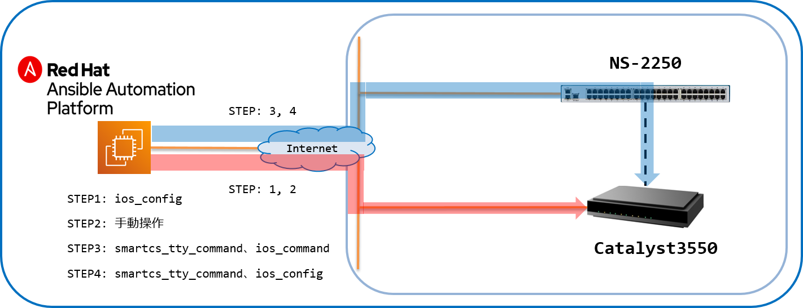
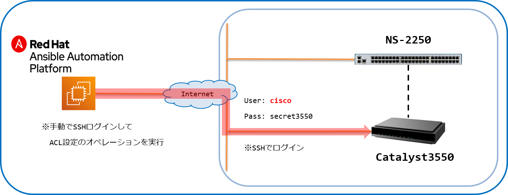
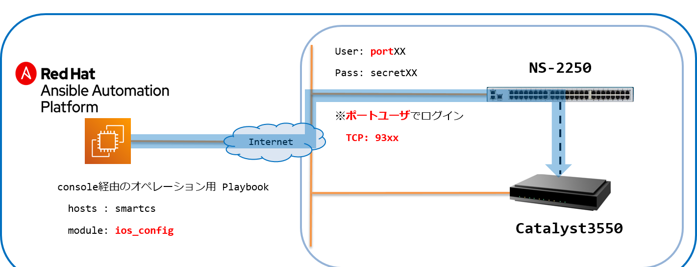

[↑目次に戻る](./README.md)
<br>

# 演習4

演習4ではAnsible、SmartCS、IOS装置を連携した実際のユースケースについての演習を行います。


# 演習4.1　オペミスからの復旧自動化

演習4.1はIOS装置に対してアクセスリストを設定後、オペレーションミスでIPリーチができなくなってしまった場合の復旧作業の演習を行います。

## 目次
本演習では以下を行います。  
- [Step 1. アクセスリストの設定を行う](./4.1-automation_of_operation_error_recovery.md#step-1-アクセスリストの設定を行う)
- [Step 2. 手動でオペレーションミスを起こす](./4.1-automation_of_operation_error_recovery.md#step-2-手動でオペレーションミスを起こす)
- [Step 3. コンソール（SmartCS）経由で設定情報を取得する](./4.1-automation_of_operation_error_recovery.md#step-3-コンソールSmartCS経由で設定情報を取得する)
- [Step 4. コンソール（SmartCS）経由で設定を復旧させる](./4.1-automation_of_operation_error_recovery.md#step-4-コンソールSmartCS経由で設定を復旧させる)

<br>
<br>

## 演習構成図



<br>
<br>

### Step 1. アクセスリストの設定を行う

まずは、演習4.1～4.4で使用するPlaybookを作成し、実行するための<code>exercise_4</code>ディレクトリを作成します。
```
$ mkdir exercise_4
```

STEP1では、IOS装置に対してアクセスリストの設定を行います。  
設定を行うPlaybook例を以下に記載します。

<br>

■演習環境


<br>
<br>

■(add_acl.yml)    
```yaml
---
- name: add acl configration
  hosts: ios
  gather_facts: no

  vars:
  - EC2_Global_ipaddr: "{{ hostvars['ansible']['ansible_host'] }}"

  tasks:
  - name: configure access list
    cisco.ios.ios_config:
      lines:
        - 10 permit host {{ EC2_Global_ipaddr }}
        - 20 deny any
      parents: ip access-list standard access_ansible_host_only
      save_when: changed


  - name: set access-list to intarface
    cisco.ios.ios_config:
      lines:
        - ip access-group access_ansible_host_only in
      parents: interface vlan 1
      save_when: changed
```

■Playbook内容の説明  
<configre access list>
<code>"access ansible host only"</code>というアクセスリストのグループを作成し、接続を許可するIPホストを定義します。  
[Ansibleホスト]((./1.1-preparing_for_the_exercise.md#rhel--ansible-controller-))以外からの接続を受け付けない設定を投入しています。
  
<set access-list to intarface>
作成したアクセスリストのグループ<code>"access ansible host only"</code>をインターフェース（<code>vlan 1</code>）に設定しています。


■実行例  
```
$ ansible-playbook add_acl.yml 
```


■実行結果例
```

PLAY [add acl configration] ***************************************************************************************************

TASK [configure access list] **************************************************************************************************
changed: [ios]

TASK [set access-list to intarface] *******************************************************************************************
changed: [ios]

PLAY RECAP ********************************************************************************************************************
ios                        : ok=2    changed=2    unreachable=0    failed=0    skipped=0    rescued=0    ignored=0

```
これでIOS装置にACL設定が投入されました。


<br>
<br>

### Step 2. 手動でオペレーションミスを起こす 

手動でオペレーションミスを起こします。  

<br>

■演習環境



<br>


SSHでIOS装置にアクセスして、先ほど設定したACLを手動で変更します。  
```
$ ssh cisco@cisco
cisco@cisco's password:

Cat3550>enable
Password:
Cat3550#show access-list
Standard IP access list access_ansible_host_only
    10 permit XXX.XXX.XXX.XXX (410 matches)
    20 deny   any
Cat3550#configure terminal
Enter configuration commands, one per line.  End with CNTL/Z.
Cat3550(config)#ip access-list standard access_ansible_host_only
Cat3550(config-std-nacl)# ?
  deny    Specify packets to reject
  exit    Exit from access-list configuration mode
  permit  Specify packets to forward

Cat3550(config-std-nacl)#no 10
Cat3550(config-std-nacl)#Connection to cisco closed.
$
```

誤って設定中のアクセスリストに対して、許可されていたホストを削除してしまいました。  
その為、<code>no 10</code>を投入後、SSHアクセスした端末から操作ができなくなります。

※"~."を入力することでSSH接続を強制終了します。

```
$ ping cisco
PING cisco (192.168.128.2) 56(84) bytes of data.
From cisco (192.168.128.2) icmp_seq=1 Packet filtered
From cisco (192.168.128.2) icmp_seq=2 Packet filtered
From cisco (192.168.128.2) icmp_seq=3 Packet filtered
From cisco (192.168.128.2) icmp_seq=4 Packet filtered
From cisco (192.168.128.2) icmp_seq=5 Packet filtered

  省略
 
From cisco (192.168.128.2) icmp_seq=33 Packet filtered
From cisco (192.168.128.2) icmp_seq=34 Packet filtered
From cisco (192.168.128.2) icmp_seq=35 Packet filtered
^C
--- cisco ping statistics ---
35 packets transmitted, 0 received, +35 errors, 100% packet loss, time 34050ms

$
$ ssh cisco@cisco
ssh: connect to host cisco port 22: No route to host
$
$ ansible-playbook add_acl.yml 
 
PLAY [add acl configration] *********************************************************************************************************************************

TASK [configure access list] ********************************************************************************************************************************
fatal: [ios]: FAILED! => {"changed": false, "msg": "[Errno None] Unable to connect to port 22 on 192.168.128.2"}

PLAY RECAP **************************************************************************************************************************************************
ios                        : ok=0    changed=0    unreachable=0    failed=1    skipped=0    rescued=0    ignored=0

$
```

pingも応答せず、SSHアクセスも行えない為、IOS装置に対してIPリーチできない状態となりました。  
AnsibleからのアクセスもSSHを利用する為、アクセスすることができない状態です。

<br>
<br>

### Step 3. コンソール（SmartCS）経由で設定情報を取得する

IPリーチでIOS装置にアクセスできない状態ですが、コンソール経由であればアクセスが可能です。
演習3.4のように<code>ios_command</code>をSmartCS経由で実行し、関連する設定情報を取得します。  

まずは、演習3.4のSTEP1で作成したログイン用、ログアウト用のPlaybookを作業用ディレクトリにコピーします。  

```
$ cp ../exercise_3/console_login.yml .
$ cp ../exercise_3/console_logout.yml .
```

続いて以下のPlaybookを作成します。  

<br>

■演習環境


<br>

■Playbook  
(console_gathering_config.yml)
```yaml
---
- name: gathering configration from console using SmartCS
  hosts: ios_sshxpt
  gather_facts: no

  tasks:
  - name: show commands
    cisco.ios.ios_command:
      commands:
        - show ip interface
        - show vlan
        - show access-list
        - show running-config
```


(gathering_config.yml)
```yaml
---
- name: login by console
  import_playbook: console_login.yml

- name: gathering config
  import_playbook: console_gathering_config.yml  

- name: logout by console
  import_playbook: console_logout.yml
```

■実行例
```
$ ansible-playbook gathering_config.yml -vvv
```

■実行結果例
```
show access-list 抜粋

        [
            "Standard IP access list access_ansible_host_only",
            "    20 deny   any"
        ],
```

コンソール経由で<code>ios_command</code>を使い、IOS装置にIPリーチできない状態で設定情報を取得する事ができました。  

<br>
<br>

### Step 4. コンソール（SmartCS）経由で設定を復旧させる

最後に設定の復旧を行います。  
STEP1で作成した`add_acl.yml`をコンソール経由で実行していきます。  

■演習環境



<br>

■Playbook  
(console_add_acl.yml)  
```yaml
---
- name: add acl configration
  hosts: ios_sshxpt
  gather_facts: no

  vars:
  - EC2_Global_ipaddr: "{{ hostvars['ansible']['ansible_host'] }}"

  tasks:
  - name: configure access list
    cisco.ios.ios_config:
      lines:
        - 10 permit host {{ EC2_Global_ipaddr }}
      parents: ip access-list standard access_ansible_host_only
      save_when: changed

  - name: set access-list to intarface
    cisco.ios.ios_config:
      lines:
        - ip access-group access_ansible_host_only in
      parents: interface vlan 1
      save_when: changed
```

(recover_acl.yml)
```yaml
---
- name: login by console
  import_playbook: console_login.yml

- name: add acl configration
  import_playbook: console_add_acl.yml

- name: logout by console
  import_playbook: console_logout.yml
```

■実行例
```
$ ansible-playbook recover_acl.yml
```

■実行結果例
```

PLAY [Login from Console using SmartCS] *****************************************************************************

TASK [login cat3550] ************************************************************************************************
ok: [smartcs]

PLAY [add acl configration] *****************************************************************************************

TASK [configure access list] ****************************************************************************************
changed: [ios_sshxpt]

TASK [set access-list to intarface] *********************************************************************************
changed: [ios_sshxpt]

PLAY [Logout from Console using SmartCS] ****************************************************************************

TASK [logout cat3550] ***********************************************************************************************
ok: [smartcs]

PLAY RECAP **********************************************************************************************************
ios_sshxpt                 : ok=2    changed=2    unreachable=0    failed=0    skipped=0    rescued=0    ignored=0
smartcs                    : ok=2    changed=0    unreachable=0    failed=0    skipped=0    rescued=0    ignored=0

$
```
`configure access list`のタスクがchangedとなり、STEP1で投入した設定と同じ状態にもどりました。  
IOS装置にログインできるかどうかを認してみます。
```
$ ping -c 3 cisco
PING cisco (192.168.128.2) 56(84) bytes of data.
64 bytes from cisco (192.168.128.2): icmp_seq=1 ttl=253 time=70.8 ms
64 bytes from cisco (192.168.128.2): icmp_seq=2 ttl=253 time=73.1 ms
64 bytes from cisco (192.168.128.2): icmp_seq=3 ttl=253 time=70.7 ms

--- cisco ping statistics ---
3 packets transmitted, 3 received, 0% packet loss, time 2002ms
rtt min/avg/max/mdev = 70.755/71.602/73.163/1.126 ms
$
$ ssh cisco@cisco
cisco@cisco's password:

Cat3550> 
```

無事アクセスできるようになりました。

<br>
<br>

## 演習4.1のまとめ

- 万が一オペレーションミスによって設定を変更してしまった場合でも、設定時のPlaybookがあれば、SmartCSと組み合わせることによってIPリーチできない状態でも設定を復旧させることができます。
- SmartCS経由で使う場合でも、Playbookの一部パラメータを変更するだけで冪等性の担保があるベンダー製モジュールを利用することができます。

<br>
<br>

[→演習4.2 通信障害からの復旧自動化](./4.2-automation_of_recovery_from_network_communication_failures.md)  
[←演習3.4 IOS装置の設定情報をSmartCS経由で取得する](./3.4-setting_of_ios_device_via_smartcs.md)   
[↑目次に戻る](./README.md)
