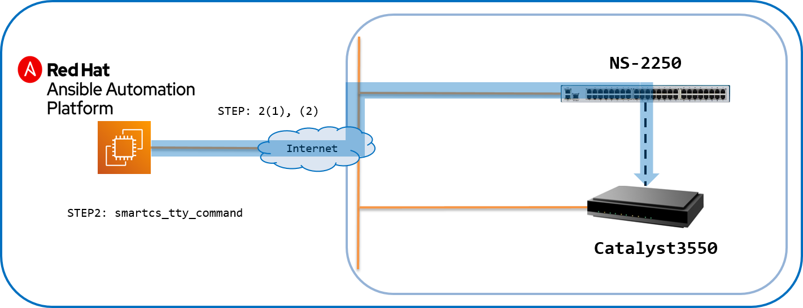
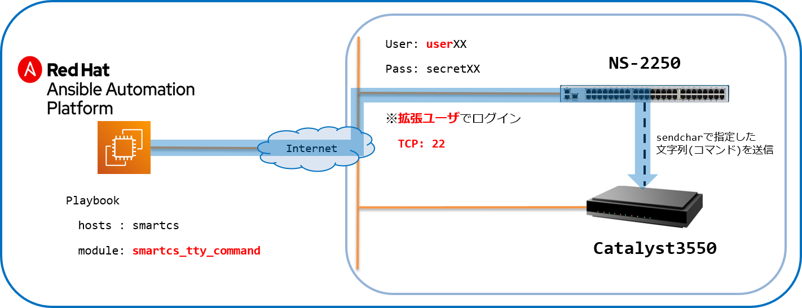

[↑目次に戻る](./README.md)
<br>
# 演習4.4　初期化の自動化

演習4.4ではSmartCSに接続されているIOS装置の初期化を行う演習となります。  
初期化作業のオペレーションもバージョンアップ作業と同様にSSH経由では作業しにくい内容となりますが、  
コンソール（SmartCS）経由の場合は、遠隔からも行うことが可能となります。  

<br>
<br>

## 目次
本演習では以下を行います。  
- [Step 1. IOS装置の初期化作業手順を確認する](./4.4-automation_of_initialization.md#step-1-IOS装置の初期化作業手順を確認する)
- [Step 2. AnsibleとSmartCSを連携して、IOS装置の初期化作業を行う](./4.4-automation_of_initialization.md#step-2-AnsibleとSmartCSを連携してIOS装置の初期化作業を行う)

<br>
<br>

## 演習構成図



<br>
<br>

### Step 1. IOS装置の初期化作業手順を確認する

演習で使用しているIOS装置（Catalyst3550）を初期化します。  

手順１．  
まずはstartup-configを削除します。

```
Password:
Cat3550>enable
Password:
Cat3550#write erase
Erasing the nvram filesystem will remove all configuration files! Continue? [confirm]
[OK]
Erase of nvram: complete
Cat3550#
```

手順２．  
続いてvlan.datファイルを削除し、再起動を行います。

```
Cat3550#delete flash:vlan.dat
Delete filename [vlan.dat]?
Delete flash:vlan.dat? [confirm]
Cat3550#reload
System configuration has been modified. Save? [yes/no]:yes
Building configuration...
[OK]
Proceed with reload? [confirm]

Xmodem file system is available.
The password-recovery mechanism is enabled.
Initializing Flash...
flashfs[0]: 317 files, 6 directories
flashfs[0]: 0 orphaned files, 0 orphaned directories
flashfs[0]: Total bytes: 15998976
flashfs[0]: Bytes used: 11501056
flashfs[0]: Bytes available: 4497920
flashfs[0]: flashfs fsck took 18 seconds.
...done Initializing Flash.
～抜粋～
Model revision number: G0
Motherboard revision number: A0
Model number: WS-C3550-24-EMI
System serial number: CAT0652X0GY


Press RETURN to get started!


*Mar  1 00:00:39.559: %SPANTREE-5-EXTENDED_SYSID: Extended SysId enabled for type vlan
*Mar  1 00:00:41.599: %LINEPROTO-5-UPDOWN: Line protocol on Interface Vlan1, changed state to down
*Mar  1 00:00:42.535: %SYS-5-CONFIG_I: Configured from memory by console
*Mar  1 00:00:43.319: %SYS-5-RESTART: System restarted --
Cisco IOS Software, C3550 Software (C3550-IPSERVICESK9-M), Version 12.2(44)SE6, RELEASE SOFTWARE (fc1)
Copyright (c) 1986-2009 by Cisco Systems, Inc.
Compiled Mon 09-Mar-09 20:28 by gereddy
*Mar  1 00:00:43.331: %SSH-5-ENABLED: SSH 2.0 has been enabled
*Mar  1 00:00:43.335: %CRYPTO-6-ISAKMP_ON_OFF: ISAKMP is OFF
*Mar  1 00:00:43.335: %CRYPTO-6-ISAKMP_ON_OFF: ISAKMP is OFF
*Mar  1 00:00:44.579: %SYS-6-LOGGINGHOST_STARTSTOP: Logging to host 192.168.127.2 Port 514 started - CLI initiated
*Mar  1 00:00:46.139: %LINK-3-UPDOWN: Interface FastEthernet0/1, changed state to up
*Mar  1 00:00:47.139: %LINEPROTO-5-UPDOWN: Line protocol on Interface FastEthernet0/1, changed state to up
*Mar  1 00:00:47.583: %SYS-6-LOGGINGHOST_STARTSTOP: Logging to host 192.168.127.3 Port 514 started - CLI initiated
*Mar  1 00:01:00.115: %PKI-6-AUTOSAVE: Running configuration saved to NVRAM

User Access Verification

Password:
```

初期化の手順は以上となります。

<br>
<br>

### Step 2. AnsibleとSmartCSを連携して、IOS装置の初期化作業を行う。

STEP1の手順をPlaybook化します。  
手順の途中に再起動処理が含まれている為、<code>smartcs_tty_command</code>を使用します。

| 手順 | 使用するモジュール |
|:---|:---|
| (1)startup-configの初期化を行う | smartcs_tty_command | 
| (2)vlan.datを削除し、再起動を行う | smartcs_tty_command |

■演習環境



<br>
次のコマンドを実施し、ファイルを作成しましょう。<br>

```bash
$ vi initializing.yml
```
実行すると、initializing.ymlというファイルが作成され、エディタ画面が表示されます。<br>
次に、**iキー**を押して **Insertモード** (挿入モード)に変更してください。<br>
モードが変更されたこと確認し(左下にモード名が表示されます)、下記の内容をエディタで記載してください。<br>
> 今回は、コピー＆ペーストでの実施をお勧めします。<br>

■Playbook  
(initializing.yml)
```yaml
---
- name: initializing settings
  hosts: smartcs
  gather_facts: no
  
  vars:
  - tty_no: "{{ hostvars['ios']['smartcs_tty'] }}" 
  - ios_password: "{{ hostvars['ios']['ansible_password'] }}"
  
  tasks:
  - name: "smartcs_tty_command"
    seiko.smartcs.smartcs_tty_command:
      tty: '{{ tty_no }}'
      custom_response: on
      custom_response_delete_nl: on
      recvchar:
      - "Cat3550>"
      - "Cat3550#"
      - "Password: "
      - "Erasing the nvram filesystem will remove all configuration files! Continue? [confirm]"
      - "Delete filename [vlan.dat]?"
      - "Delete flash:vlan.dat? [confirm]"
      - "Proceed with reload? [confirm]"
      sendchar:
      - __NL__
      - "{{ ios_password }}"
      - enable
      - "{{ ios_password }}"
      - write erase
      - __NL__
      - delete flash:vlan.dat
      - __NL__
      - __NL__
      - reload
      - __NL____NOWAIT__
```
入力が終わったら、[esc]キーを押して、Insertモードから抜けてください。<br>
モードが変更されたことを確認し、:wq と入力して（左下に:wqと表示されます。）、[Enter]キーを押してください。<br>
以上で、ファイルを保存し、エディターを終了します。<br>

■Playbook内容の説明  
IOS装置の初期化で必要な投入コマンドのうち、今回の演習環境で実行可能なコマンドを記載した手順となります。


■実行例  
```
$ ansible-playbook initializing.yml
```

■実行結果例  
```
PLAY [initializing settings] *************************************************************************

TASK [smartcs_tty_command] ***************************************************************************
ok: [smartcs]

PLAY RECAP *******************************************************************************************
smartcs                    : ok=1    changed=0    unreachable=0    failed=0    skipped=0    rescued=0    ignored=0 
```
上記実行結果は、(ansible-playbook initializingl.yml )の実行例となります。


■初期化の確認

初期化用のPlaybookを実行した後、3～5分程度でcatalystの再起動が完了します。<br>
コンフィグが初期化されているかを手動で確認してみましょう。

|接続先 |IP |TCPPort |Login |備考 | 
|:---|:---|:---|:---|:---|
|SmartCS |192.168.129.X |83XX |portXX/secretXX|ポートユーザでログイン|

AnsibleホストのSSHコマンドで、TCP Port: 83XXを指定してSmartCSへSSH接続します。  
※ユーザ#2の場合はTCP Port: 8302となります。  

認証には、ポートユーザのユーザ、パスワードを入力してログインします。  
※ユーザ#2の場合はport02/secret02となります。  
※演習1.1に記載の[環境情報](./1.1-preparing_for_the_exercise.md#コンソールサーバ--smartcs-)を参考にしてポートユーザのID/パスワードを入力してください。  

```
$ ssh port02@192.168.129.2 -p 8302
Console Server Authentication.
port02@192.168.129.2's password:
```

ログインに成功すると、以下のようなポートサーバーメニューが表示されます。  
3を選択してシリアルセッションを開始します。

```
-- RW1 ------------------------
Host  : "NS-2250_Ansible_1"
Label : "cat3550_1"
-------------------------------
1  : display Port Log
2  : display Port Log (LAST)
3  : start tty connection
4  : close telnet/ssh session
5  : show all commands
tty-1:rw>3
Press "CTRL-A" to return this MENU.
Start tty connection
```

IOS装置に接続するとsetupモードが起動していますので、noを入力して中断します。<br>
その後、showコマンドで装置の設定が初期化されていることを確認します。

```
Would you like to enter the initial configuration dialog? [yes/no]: no

Would you like to terminate autoinstall? [yes]:no

Press RETURN to get started!

Switch>enable
Switch#show run
Switch#terminal length 0
Switch#show running-config
Building configuration...

Current configuration : 2123 bytes
!
version 12.2
no service pad
service timestamps debug datetime msec
service timestamps log datetime msec
no service password-encryption
!
～抜粋～
!
line con 0
line vty 5 15
!
end

Switch#
```

設定が初期化されている事を確認できました。


[←演習4.3 ファームウェアアップデートの自動化](./4.3-automation_of_firmware_update.md)  
[↑目次に戻る](./README.md)
