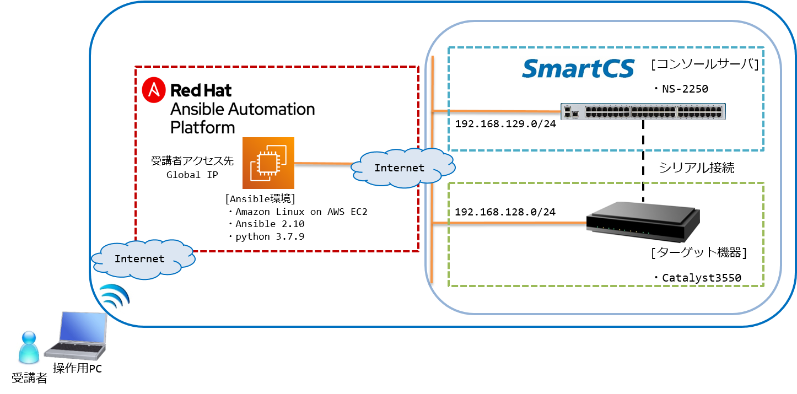

# SmartCS x IOS x Ansible ハンズオン  

## 本ドキュメントについて

本ドキュメントは、Ansibleハンズオンセミナー  
SmartCS x IOS x Ansible で使用するコンテンツとなります。  

本ワークショップのトレーニングは以下を目的としています。  
- ネットワーク運用の自動化におけるAnsibleの使い方
- コンソールサーバ SmartCSの使い方
- Ansible、SmartCS、IOS製品を連携させたネットワーク運用の自動化

## ハンズオン環境

### 構成図

## ハンズオン資料

- [Ansibleとネットワーク自動化の概要](./contents/pdf/2021_smartcs_webinar_ansible_intro.pdf)
ハンズオンの座学パート(Ansible、ネットワーク自動化編)で使用する資料となります。

- [SmartCS、SmartCS×Ansible連携の概要](./contents/pdf/Ansible_handson_smartcs-ios.pdf)  
ハンズオンの座学パート(SmartCS、SmartCS×Ansible編)で使用する資料となります。

## ハンズオン内容

### Section.1 - 演習に向けて

 - [[**演習1.1** 演習環境の確認]](1.1-preparing_for_the_exercise.md)

### Section.2 - SmartCS基礎演習

 - [[**演習2.1** SmartCSを介してIOS装置へコンソールアクセスする]](2.1-serial_connection_to_ios_via_smartcs.md)
 - [[**演習2.2** SmartCSを介したIOS装置へのコンソールアクセスを、別セッションでミラーリングする]](2.2-mirroring_operation_of_smartcs.md)
 - [[**演習2.3** SmartCSを介したシリアルセッション情報を確認する]](2.3-checking_serial_session_information_of_smartcs.md)

### Section.3 - Ansible × SmartCS × IOS の連携演習基礎

 - [[**演習3.1** IOS装置にSmartCS経由で初期設定を行う]](3.1-initial_setup_the_ios_device_via_smartcs.md)
 - [[**演習3.2** IOS装置に追加設定を行う]](3.2-additional_setup_the_ios_device.md)
 - [[**演習3.3** IOS装置の設定情報を取得する]](3.3-get_ios_device_information.md)
 - [[**演習3.4** IOS装置の設定情報をSmartCS経由で取得する]](3.4-setting_of_ios_device_via_smartcs.md)

### Section.4 - Ansible × SmartCS × IOS の連携演習応用(ユースケース)

 - [[**演習4.1** オペミスからの復旧自動化]](4.1-automation_of_operation_error_recovery.md)
 - [[**演習4.2** 通信障害からの復旧自動化]](4.2-automation_of_recovery_from_network_communication_failures.md)
 - [[**演習4.3** 初期化の自動化]](4.3-automation_of_initialization.md)
  
